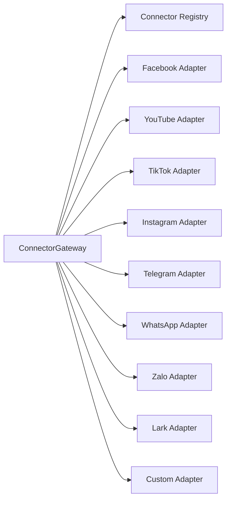
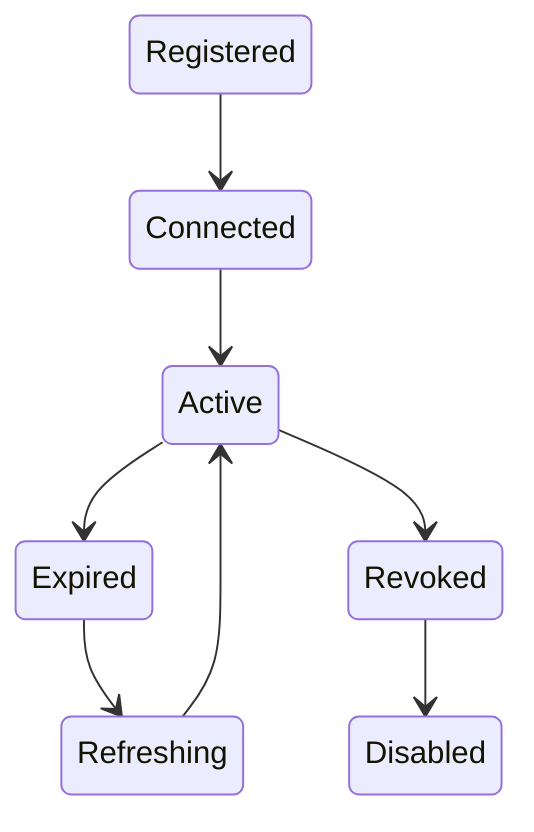
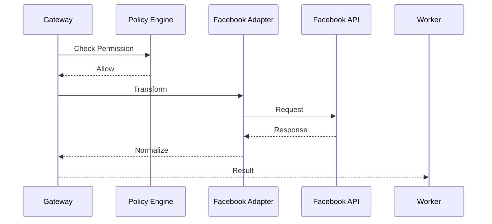
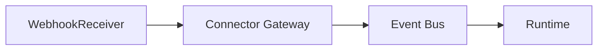
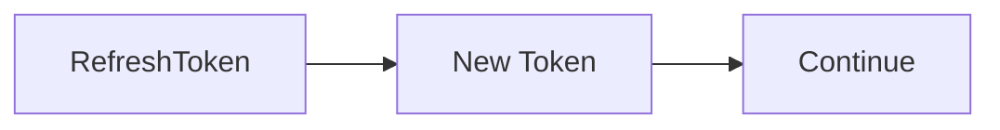
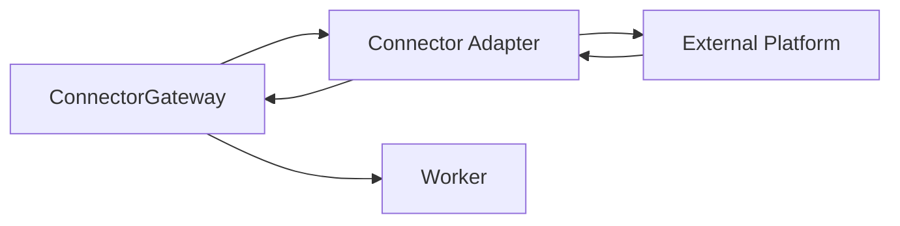

# Connector Gateway

> AI Social OS Runtime Layer

Version: 2.0.0

Status: Draft

Last Updated: 2026-07-25

---

# Table of Contents

- Overview
- Why Connector Gateway
- Responsibilities
- Architecture
- Connector Lifecycle
- Connector Registry
- Connector Types
- Authentication
- Connector Session
- Request Pipeline
- Response Normalization
- Rate Limiting
- Retry & Recovery
- Webhook Support
- Design Decisions

---

# Overview

Connector Gateway là lớp trung gian giữa Runtime và tất cả dịch vụ bên ngoài.

Runtime và Worker không được phép gọi trực tiếp:

- Facebook Graph API
- YouTube Data API
- TikTok API
- Instagram Graph API
- WhatsApp Business API
- Telegram Bot API
- Zalo API
- Lark Open Platform
- Notion API
- Gmail API
- Google Drive API

Thay vào đó.

```mermaid
flowchart LR
```

Connector Gateway đóng vai trò tương tự Provider Gateway nhưng dành cho các hệ thống ngoài AI.

---

# Why Connector Gateway

Nếu Worker gọi trực tiếp API.

```mermaid
flowchart LR
```

thì:

- khó thay đổi API Version
- khó Retry
- khó Refresh Token
- khó quản lý OAuth
- khó Audit
- khó theo dõi Rate Limit

Connector Gateway giải quyết toàn bộ các vấn đề này.

---

# Responsibilities

Connector Gateway chịu trách nhiệm:

- Connector Discovery
- Authentication
- OAuth Management
- API Invocation
- Response Normalization
- Retry
- Rate Limiting
- Webhook Management
- Token Refresh
- Connector Metrics
- Audit Logging

---

# Architecture



---

# Connector Lifecycle



---

# Connector Registry

Mỗi Connector được đăng ký.

```yaml
connector:

facebook

version:

22.0

oauth:

true

webhook:

true

status:

active

permissions:

pages_manage_posts

pages_read_engagement
```

---

# Supported Connectors

## Social Media

- Facebook
- Messenger
- Instagram
- Threads
- TikTok
- YouTube
- Telegram
- WhatsApp
- Zalo
- LinkedIn
- X (Twitter)
- Discord

---

## Collaboration

- Lark
- Slack
- Microsoft Teams

---

## Productivity

- Notion
- Google Drive
- Google Sheets
- Google Docs
- Airtable
- Trello
- Asana

---

## Communication

- Gmail
- Outlook
- SMTP
- Twilio

---

## Storage

- Amazon S3
- Cloudflare R2
- MinIO

---

# Authentication

Connector Gateway hỗ trợ:

- OAuth2
- API Key
- Bearer Token
- Basic Auth
- JWT
- Service Account

Secrets được lưu trong Secret Manager.

Worker không truy cập trực tiếp Token.

---

# Connector Session

Mỗi Workspace có Session riêng.

```mermaid
flowchart LR
```

Session được tự động Refresh khi gần hết hạn.

---

# Request Pipeline



---

# Unified Connector Request

```typescript
ConnectorRequest

├── connector

├── action

├── accountId

├── payload

├── attachments

├── metadata
```

Ví dụ.

```yaml
connector:

facebook

action:

publish_post
```

---

# Unified Connector Response

```typescript
ConnectorResponse

├── success

├── status

├── data

├── metadata

├── latency

└── requestId
```

Worker luôn nhận cùng một Response Model.

---

# Connector Actions

Ví dụ.

Facebook.

- Publish Post
- Publish Reel
- Upload Image
- Upload Video
- Reply Comment
- Delete Post
- Get Insights

---

YouTube.

- Upload Video
- Update Metadata
- Create Playlist
- Reply Comment
- Read Analytics

---

Telegram.

- Send Message
- Send Photo
- Send Document
- Edit Message
- Delete Message

---

Lark.

- Send Message
- Send Card
- Create Calendar Event
- Create Task
- Upload File

---

# Webhook Support

Connector Gateway nhận Webhook từ các nền tảng.



Ví dụ.

```mermaid
flowchart LR
```

---

# Token Refresh

Nếu Access Token hết hạn.



Worker không biết quá trình này.

---

# Rate Limiting

Gateway theo dõi.

- Requests per Minute
- Daily Quota
- Concurrent Requests

Nếu vượt giới hạn.

Gateway có thể.

- Delay
- Retry
- Queue
- Reject

---

# Retry Strategy

Retry áp dụng cho lỗi tạm thời.

Ví dụ.

```mermaid
flowchart LR
```

Không Retry với.

```
401 Unauthorized
```

trừ khi Token vừa được Refresh.

---

# Error Mapping

Ví dụ.

Facebook.

```
(#190)

Invalid OAuth

```
```mermaid
flowchart LR
```

```
Authentication Failed
```

YouTube.

```
quotaExceeded

```
```mermaid
flowchart LR
```

```
Rate Limit Exceeded
```

---

# Multi-Account Support

Một Workspace có thể kết nối nhiều tài khoản.

```text
Workspace

├── Facebook Page A

├── Facebook Page B

├── YouTube Channel

├── TikTok Account

├── Telegram Bot

└── Lark Workspace
```

Worker chỉ cần Account ID.

---

# Connector Metrics

Theo dõi.

- API Calls
- Success Rate
- Error Rate
- Token Refresh Count
- Webhook Events
- Average Latency
- Upload Size

---

# Connector Events

Ví dụ.

- ConnectorConnected
- ConnectorDisconnected
- TokenRefreshed
- PublishSucceeded
- PublishFailed
- WebhookReceived
- ConnectorRateLimited

---

# Security

Connector Gateway hỗ trợ.

- Secret Encryption
- OAuth Token Rotation
- Permission Validation
- Workspace Isolation
- Audit Logging
- IP Allowlist (Optional)

---

# Design Decisions

| Decision | Reason |
|-----------|--------|
| Adapter Pattern | Dễ thêm Connector mới |
| Unified Request/Response | Worker không phụ thuộc API |
| Token tập trung | Tăng bảo mật |
| Auto Refresh | Trải nghiệm liền mạch |
| Webhook Native | Event-Driven |
| Multi-Account | Hỗ trợ Team và Agency |
| Registry | Discovery nhanh |

---

# Runtime Flow



---

# Summary

Connector Gateway là lớp tích hợp thống nhất giữa AI Social OS và các nền tảng bên ngoài như Facebook, YouTube, TikTok, Telegram, Lark, WhatsApp, Zalo và nhiều dịch vụ khác.

Gateway chịu trách nhiệm quản lý Authentication, OAuth, API Version, Retry, Rate Limiting, Webhook và chuẩn hóa toàn bộ Request/Response để Worker không phụ thuộc vào từng API cụ thể.

Thiết kế này giúp hệ thống dễ mở rộng Connector mới, hỗ trợ nhiều tài khoản trong cùng một Workspace và đảm bảo khả năng vận hành ổn định khi tích hợp với hàng chục nền tảng khác nhau.