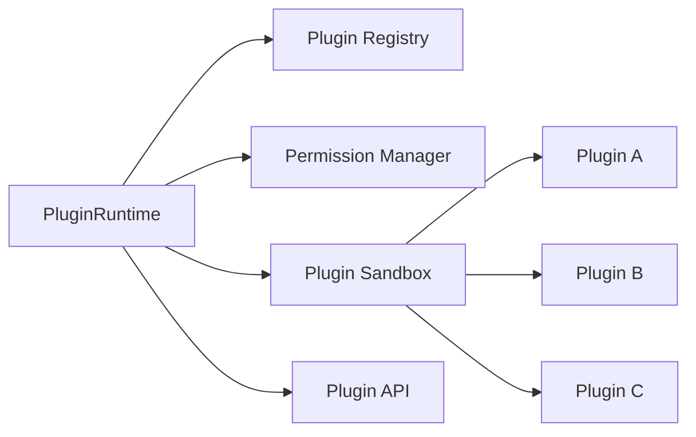
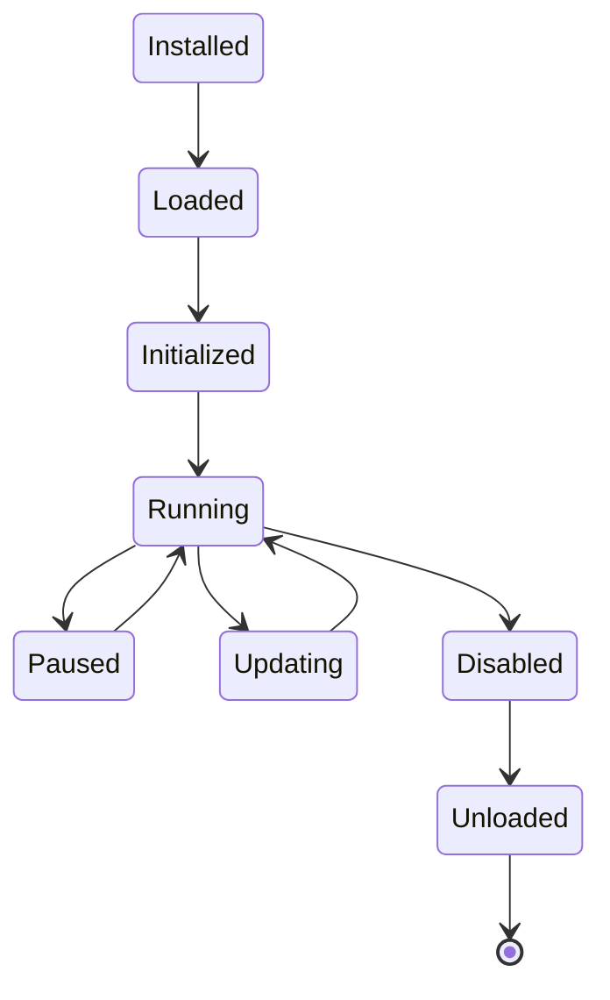
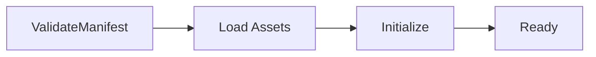
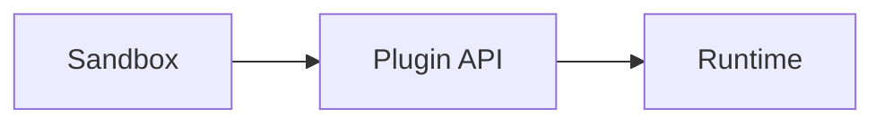
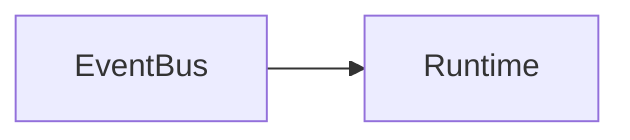
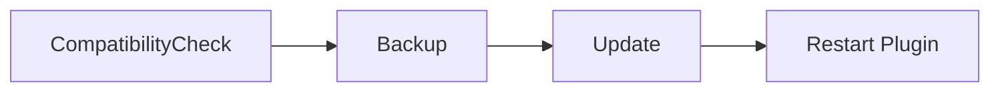
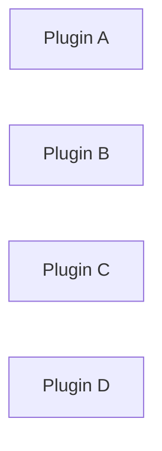

# Plugin Runtime

> AI Social OS Runtime Layer

Version: 2.0.0

Status: Draft

Last Updated: 2026-07-25

---

# Table of Contents

- Overview
- Why Plugin Runtime
- Design Principles
- Responsibilities
- Architecture
- Plugin Lifecycle
- Plugin Manifest
- Plugin Loading
- Plugin Sandbox
- Plugin API
- Plugin Hooks
- Plugin Permissions
- Plugin Communication
- Plugin Versioning
- Plugin Updates
- Plugin Isolation
- Plugin Security
- Plugin Metrics
- Design Decisions

---

# Overview

Plugin Runtime là môi trường thực thi dành cho Plugin của AI Social OS.

Plugin cho phép mở rộng hệ thống mà không cần sửa đổi Runtime hoặc Kernel.

Plugin Runtime chịu trách nhiệm:

- tải Plugin
- khởi tạo Plugin
- quản lý vòng đời
- thực thi Plugin
- cô lập Plugin
- cấp quyền truy cập API

Plugin Runtime không chứa Business Logic.

---

# Why Plugin Runtime

Nếu Plugin được chạy trực tiếp trong Runtime.

```mermaid
flowchart LR
```

Plugin có thể:

- Crash Runtime
- Truy cập trái phép Memory
- Gây Memory Leak
- Chiếm CPU
- Gọi API không được phép

Do đó cần một Runtime riêng.

```mermaid
flowchart LR
```

---

# Design Principles

Plugin Runtime được xây dựng theo các nguyên tắc:

- Sandboxed
- Secure by Default
- Capability-based
- Event Driven
- Versioned
- Observable
- Hot Reloadable
- Backward Compatible

---

# Responsibilities

Plugin Runtime chịu trách nhiệm:

- Plugin Discovery
- Plugin Loading
- Plugin Execution
- Permission Validation
- Hook Registration
- Resource Isolation
- Plugin Messaging
- Plugin Metrics
- Plugin Shutdown

---

# Architecture



---

# Plugin Lifecycle



---

# Plugin Structure

```
plugin/

├── manifest.json
├── index.ts
├── assets/
├── config/
├── permissions.json
└── package.json
```

---

# Plugin Manifest

Ví dụ.

```json
{
  "id": "facebook-auto-reply",
  "name": "Facebook Auto Reply",
  "version": "1.0.0",
  "author": "AI Social OS",
  "runtime": "^2.0.0",
  "entry": "index.js"
}
```

Manifest là điểm vào của Plugin.

---

# Plugin Loading



Nếu Manifest không hợp lệ.

Plugin sẽ không được Load.

---

# Plugin Registry

Registry lưu thông tin.

```text
Plugin Registry

├── Plugin ID

├── Name

├── Version

├── Status

├── Permissions

├── Runtime Version

└── Metadata
```

---

# Plugin Sandbox

Plugin luôn chạy trong Sandbox.

Plugin không thể:

- truy cập Runtime Memory
- truy cập Database
- gọi Internal API
- đọc Secret

trừ khi được cấp Permission.

---

# Sandbox Architecture



Plugin chỉ giao tiếp qua Plugin API.

---

# Plugin API

Plugin Runtime cung cấp API.

Ví dụ.

```
log()

emit()

subscribe()

storage()

fetch()

config()

notify()

memory.search()

connector.invoke()
```

Plugin không được truy cập trực tiếp Internal Service.

---

# Plugin Hooks

Plugin có thể đăng ký Hook.

Ví dụ.

```text
BeforeExecution

AfterExecution

BeforePublish

AfterPublish

TaskStarted

TaskCompleted

CommentReceived

WebhookReceived
```

Runtime sẽ gọi Plugin khi Hook được kích hoạt.

---

# Plugin Communication

Plugin giao tiếp với Runtime thông qua Event Bus.



Plugin không được gọi trực tiếp Plugin khác.

---

# Plugin Permissions

Plugin phải khai báo Permission.

Ví dụ.

```json
{
  "permissions": [
    "memory.read",
    "connector.facebook.publish",
    "event.subscribe",
    "storage.write"
  ]
}
```

Permission được kiểm tra trước khi Plugin chạy.

---

# Permission Categories

Ví dụ.

- Memory
- Connector
- Provider
- Event
- Storage
- Notification
- Scheduler
- Analytics

Plugin chỉ truy cập các Capability đã được cấp.

---

# Plugin Configuration

Plugin có thể có Config riêng.

```yaml
facebook_page:

123456

language:

vi

reply_delay:

5s
```

Config được lưu theo Workspace.

---

# Plugin Storage

Plugin có Storage riêng.

```mermaid
flowchart LR
```

Plugin không chia sẻ Storage với Plugin khác.

---

# Plugin Versioning

Plugin tuân theo Semantic Versioning.

Ví dụ.

```
1.0.0

1.1.0

2.0.0
```

Runtime kiểm tra Compatibility trước khi Load.

---

# Plugin Update



Nếu Update thất bại.

Runtime sẽ Rollback.

---

# Plugin Isolation



Crash của Plugin A không ảnh hưởng Plugin khác.

---

# Plugin Security

Plugin Runtime hỗ trợ.

- Sandbox
- Permission Validation
- Resource Quota
- CPU Limit
- Memory Limit
- Audit Logging
- Signature Verification (Optional)

---

# Plugin Metrics

Theo dõi.

- Plugin Load Time
- Execution Count
- Error Rate
- Memory Usage
- CPU Usage
- Hook Count
- Event Count

---

# Plugin Events

Ví dụ.

- PluginInstalled
- PluginLoaded
- PluginStarted
- PluginPaused
- PluginUpdated
- PluginFailed
- PluginDisabled
- PluginRemoved

---

# Runtime Flow


---

# Design Decisions

| Decision | Reason |
|-----------|--------|
| Sandbox bắt buộc | Tăng bảo mật |
| Plugin API duy nhất | Giảm Coupling |
| Hook-based | Dễ mở rộng |
| Permission theo Capability | Least Privilege |
| Storage riêng | Cô lập dữ liệu |
| Semantic Versioning | Dễ nâng cấp |
| Hot Reload | Không cần Restart Runtime |

---

# Summary

Plugin Runtime là môi trường thực thi dành riêng cho các Plugin của AI Social OS.

Thông qua cơ chế Sandbox, Permission, Hook và Plugin API, hệ thống cho phép mở rộng tính năng một cách an toàn mà không làm ảnh hưởng đến Runtime hoặc Kernel.

Kiến trúc này giúp AI Social OS hỗ trợ Marketplace Plugin, Plugin nội bộ và Plugin của bên thứ ba với khả năng cài đặt, cập nhật, vô hiệu hóa và quản lý vòng đời một cách độc lập, bảo mật và có khả năng mở rộng lâu dài.