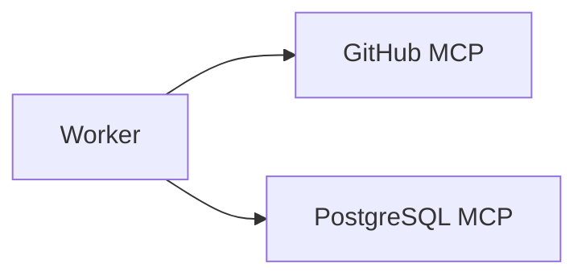
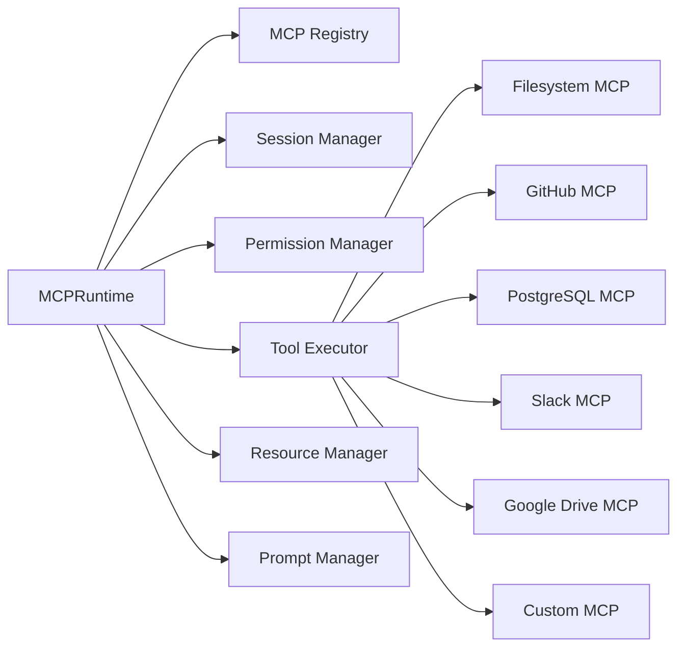
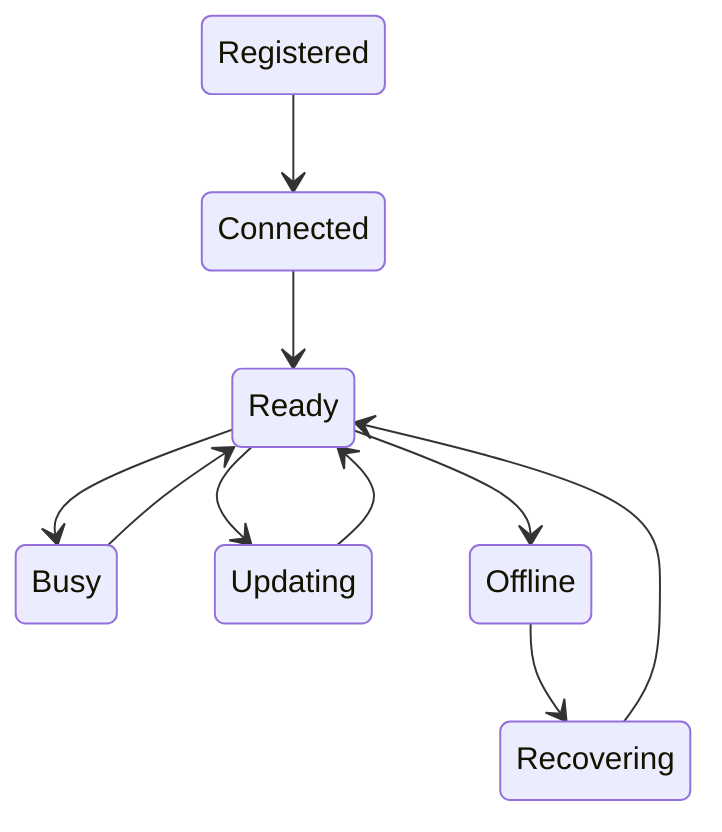
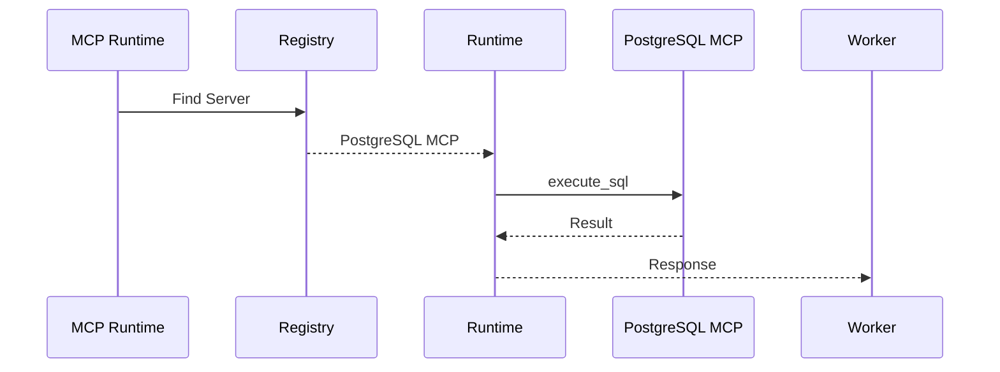
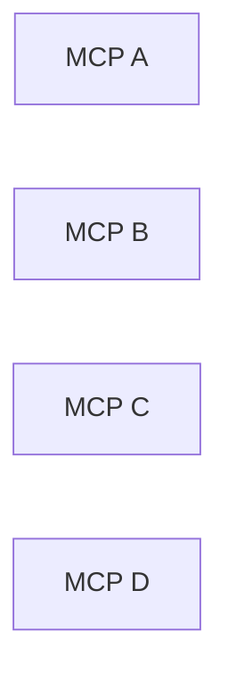
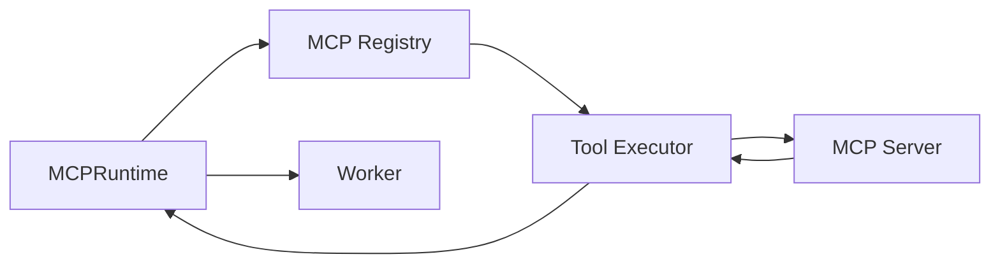

# MCP Runtime

> AI Social OS Runtime Layer

Version: 2.0.0

Status: Draft

Last Updated: 2026-07-25

---

# Table of Contents

- Overview
- Why MCP Runtime
- Design Principles
- Responsibilities
- Architecture
- MCP Lifecycle
- MCP Registry
- MCP Discovery
- Tool Invocation
- Resource Access
- Prompt Templates
- Session Management
- Security
- Sandboxing
- Monitoring
- Design Decisions

---

# Overview

MCP Runtime là thành phần chịu trách nhiệm quản lý và thực thi tất cả MCP (Model Context Protocol) Server trong AI Social OS.

MCP Runtime cho phép Runtime sử dụng các công cụ (Tools), tài nguyên (Resources) và Prompt từ các MCP Server theo một giao thức thống nhất.

Runtime không giao tiếp trực tiếp với MCP Server.

```mermaid
flowchart LR
```

Điều này giúp toàn bộ hệ thống độc lập với cách triển khai của từng MCP Server.

---

# Why MCP Runtime

Nếu Worker gọi trực tiếp MCP Server.



thì:

- khó quản lý Session
- khó xác thực
- khó Retry
- khó Monitoring
- khó Cache
- khó thay đổi MCP Server

Do đó cần một lớp Runtime chuyên biệt.

---

# Design Principles

MCP Runtime được thiết kế theo các nguyên tắc:

- MCP Native
- Provider Independent
- Secure by Default
- Event Driven
- Session Aware
- Observable
- Extensible
- Fault Tolerant

---

# Responsibilities

MCP Runtime chịu trách nhiệm:

- MCP Discovery
- MCP Registration
- Session Management
- Tool Invocation
- Resource Access
- Prompt Access
- Authentication
- Retry
- Timeout
- Metrics
- Audit Logging

---

# Architecture



---

# MCP Lifecycle



---

# MCP Registry

Tất cả MCP Server được đăng ký trong Registry.

```text
MCP Registry

├── Server ID

├── Name

├── Version

├── Protocol Version

├── Endpoint

├── Authentication

├── Status

└── Metadata
```

---

# Supported MCP Servers

Ví dụ.

- Filesystem MCP
- GitHub MCP
- PostgreSQL MCP
- SQLite MCP
- Redis MCP
- Slack MCP
- Google Drive MCP
- Notion MCP
- Jira MCP
- Linear MCP
- Figma MCP
- Browser MCP
- Docker MCP
- Kubernetes MCP

Runtime có thể mở rộng không giới hạn số lượng MCP Server.

---

# MCP Discovery

Khi MCP Runtime khởi động.


---

# MCP Capability Discovery

Mỗi MCP Server công bố Capability.

Ví dụ.

```yaml
tools:

- execute_sql
- list_tables
- query

resources:

- schema
- database

prompts:

- sql_generator
```

Runtime lưu toàn bộ Capability vào Registry.

---

# Tool Invocation



Worker không biết Tool thuộc Server nào.

---

# Unified Tool Request

```typescript
ToolRequest

├── tool

├── arguments

├── sessionId

├── timeout

├── metadata
```

Ví dụ.

```yaml
tool:

execute_sql

arguments:

query: SELECT * FROM users
```

---

# Unified Tool Response

```typescript
ToolResponse

├── success

├── result

├── metadata

├── latency

├── logs
```

Runtime chuẩn hóa phản hồi từ tất cả MCP Server.

---

# Resource Access

Worker có thể yêu cầu Resource.

Ví dụ.

```
filesystem://README.md

github://repository

postgres://schema
```

MCP Runtime sẽ tự định tuyến đến đúng MCP Server.

---

# Prompt Templates

MCP Runtime hỗ trợ Prompt từ MCP.

Ví dụ.

```mermaid
flowchart LR
```

Prompt được quản lý tập trung và có thể tái sử dụng.

---

# Session Management

Một số MCP Server yêu cầu Session.


Session bao gồm.

- Authentication
- Context
- Cache
- Workspace

---

# Timeout

Mỗi Tool có Timeout riêng.

Ví dụ.

```yaml
timeout:

30s
```

Nếu quá thời gian.

```mermaid
flowchart LR
```

---

# Retry

MCP Runtime chỉ Retry với lỗi tạm thời.

Ví dụ.

- Network Timeout
- Connection Reset
- Temporary Unavailable

Không Retry với.

- Permission Denied
- Invalid Arguments
- Resource Not Found

---

# Security

MCP Runtime hỗ trợ.

- Workspace Isolation
- Tool Permission
- Resource Permission
- Secret Manager
- TLS
- Audit Logging

Mỗi Workspace chỉ nhìn thấy MCP được cấp quyền.

---

# Sandboxing

MCP Server hoạt động độc lập.



Nếu một MCP Server bị lỗi.

Các MCP khác vẫn hoạt động.

---

# Monitoring

Theo dõi.

- Connected Servers
- Active Sessions
- Tool Calls
- Error Rate
- Retry Count
- Average Latency
- Offline Servers

---

# Events

Ví dụ.

- MCPRegistered
- MCPConnected
- MCPDisconnected
- ToolInvoked
- ToolCompleted
- ToolFailed
- SessionCreated
- SessionExpired

---

# Design Decisions

| Decision | Reason |
|-----------|--------|
| Registry tập trung | Discovery nhanh |
| Unified Tool Model | Worker độc lập MCP |
| Session Manager | Hỗ trợ Context |
| Runtime riêng | Giảm Coupling |
| Tool Routing | Không phụ thuộc Server |
| Sandboxing | Tăng độ ổn định |
| Capability Discovery | Tự động mở rộng |

---

# Runtime Flow



---

# Summary

MCP Runtime là lớp trung gian giữa Runtime và toàn bộ hệ sinh thái MCP Server.

Thành phần này chịu trách nhiệm quản lý Discovery, Registry, Session, Tool Invocation, Resource Access và Prompt Template theo chuẩn Model Context Protocol, đồng thời cung cấp một giao diện thống nhất để Worker sử dụng công cụ mà không phụ thuộc vào từng MCP Server cụ thể.

Kiến trúc này giúp AI Social OS tích hợp dễ dàng với hệ sinh thái MCP hiện tại và trong tương lai, đồng thời đảm bảo khả năng mở rộng, bảo mật và quan sát khi số lượng MCP Server ngày càng lớn.