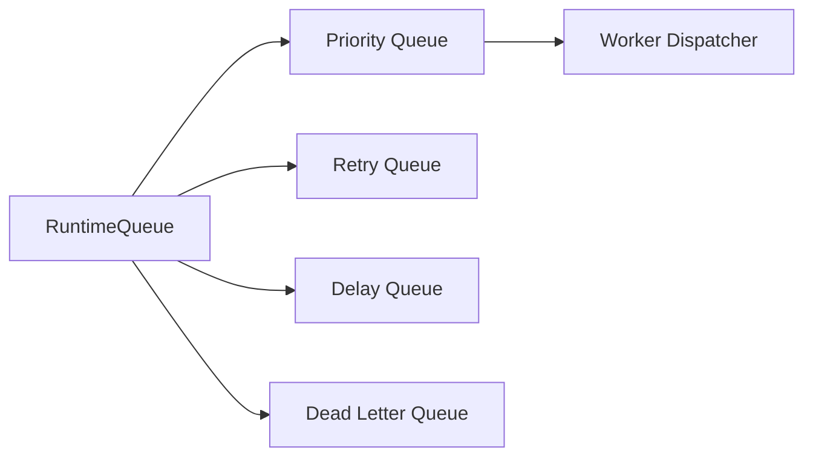
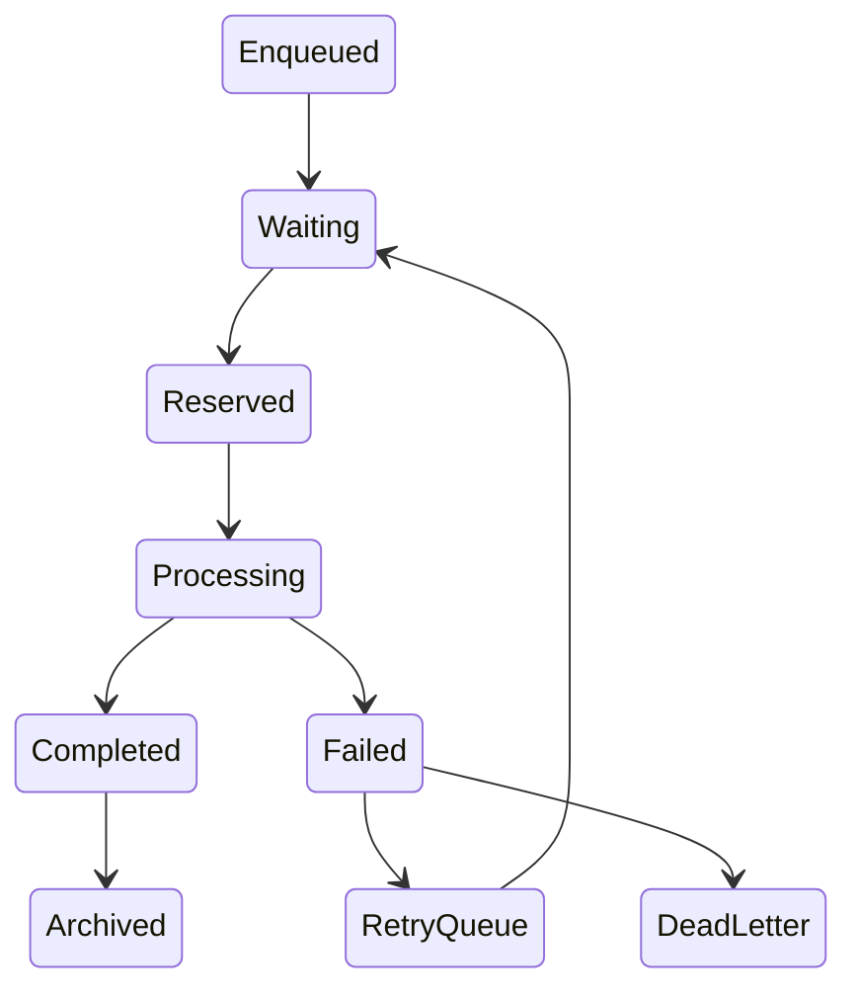
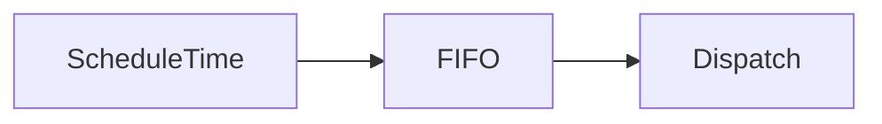
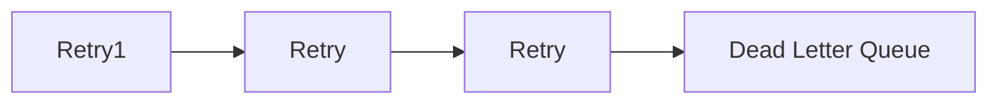
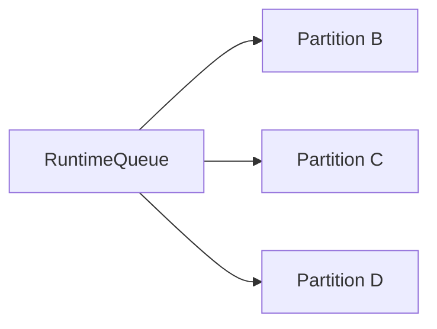
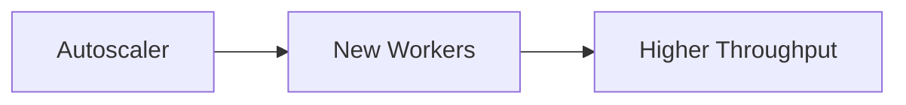
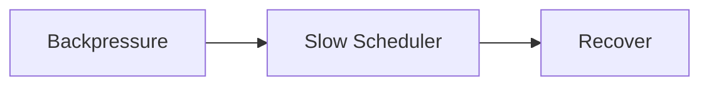
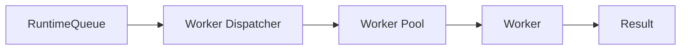

# Runtime Queue

> AI Social OS Runtime Layer

Version: 2.0.0

Status: Draft

Last Updated: 2026-07-25

---

# Table of Contents

- Overview
- Why Runtime Queue
- Design Principles
- Responsibilities
- Queue Architecture
- Queue Lifecycle
- Queue Types
- Queue Priorities
- Scheduling Strategy
- Queue Partitioning
- Dead Letter Queue
- Retry Queue
- Delayed Queue
- Queue Scaling
- Monitoring
- Design Decisions

---

# Overview

Runtime Queue là thành phần chịu trách nhiệm lưu trữ và điều phối tất cả Task đang chờ thực thi trong Runtime.

Queue đóng vai trò là lớp đệm (Buffer) giữa:

- Runtime Scheduler
- Worker Dispatcher
- Worker Pool

Nhờ Queue, Runtime có thể xử lý hàng triệu Task mà không bị phụ thuộc vào số lượng Worker hiện có.

---

# Why Runtime Queue

Nếu Scheduler gửi Task trực tiếp đến Worker.

```mermaid
flowchart LR
```

Khi Worker bận.

Task sẽ:

- bị mất
- bị từ chối
- hoặc Scheduler phải chờ

Điều này làm giảm Throughput.

Thay vào đó.

```mermaid
flowchart LR
```

Scheduler và Worker được tách rời hoàn toàn.

---

# Design Principles

Runtime Queue được xây dựng theo các nguyên tắc:

- Event Driven
- Durable
- Ordered
- Scalable
- Observable
- Retry Friendly
- Fault Tolerant
- Priority Aware

---

# Responsibilities

Runtime Queue chịu trách nhiệm:

- Store Tasks
- Prioritize Tasks
- Deliver Tasks
- Retry Failed Tasks
- Delay Tasks
- Route Tasks
- Track Queue Metrics
- Persist Queue State

---

# Queue Architecture



---

# Queue Lifecycle



---

# Queue Types

Runtime sử dụng nhiều Queue chuyên biệt.

```
Priority Queue

Retry Queue

Delay Queue

Dead Letter Queue

System Queue

Notification Queue

Analytics Queue
```

Mỗi Queue có mục đích riêng.

---

# Priority Queue

Task được xếp theo Priority.

Ví dụ.

```
CRITICAL

HIGH

NORMAL

LOW

BACKGROUND
```

Dispatcher luôn lấy Task có Priority cao hơn trước.

---

# Queue Priorities

| Priority | Description |
|----------|-------------|
| CRITICAL | Thực thi ngay |
| HIGH | Quan trọng |
| NORMAL | Mặc định |
| LOW | Ít ưu tiên |
| BACKGROUND | Chạy nền |

---

# Scheduling Strategy

Dispatcher lấy Task theo:

1. Priority
2. Scheduled Time
3. FIFO

Ví dụ.



---

# Retry Queue

Task lỗi sẽ không quay lại Queue chính ngay lập tức.

```mermaid
flowchart LR
```

Điều này tránh Retry liên tục gây quá tải.

---

# Delay Queue

Một số Task cần chạy sau.

Ví dụ.

```mermaid
flowchart LR
```

Delay Queue lưu Task đến đúng thời điểm.

---

# Dead Letter Queue

Task không thể thực thi sau tất cả Retry.



Administrator có thể:

- Replay
- Inspect
- Delete
- Export

---

# Queue Partitioning

Để Scale.

Queue có thể chia Partition.



Mỗi Partition có Worker riêng.

---

# Queue Reservation

Dispatcher có thể Reserve Task.

```mermaid
flowchart LR
```

Nếu Worker mất kết nối.

Reservation sẽ hết hạn.

---

# Queue Persistence

Queue không lưu trong Memory.

Queue State được lưu trên hệ thống lưu trữ bền vững.

Ví dụ.

- Redis Streams
- Kafka
- RabbitMQ
- NATS JetStream
- PostgreSQL Queue

Tùy theo kiến trúc triển khai.

---

# Queue Scaling



Queue là điểm đo chính để Autoscaler quyết định mở rộng Worker.

---

# Queue Metrics

Theo dõi.

- Queue Length
- Waiting Tasks
- Reserved Tasks
- Processing Tasks
- Retry Tasks
- Dead Letter Count
- Dispatch Rate
- Queue Latency

---

# Queue Events

Ví dụ.

- TaskEnqueued
- TaskDequeued
- TaskReserved
- TaskReleased
- RetryScheduled
- DeadLetterCreated
- QueueOverflow

---

# Queue Monitoring

Runtime theo dõi.

- Queue Health
- Consumer Lag
- Processing Rate
- Throughput
- Backpressure
- Queue Saturation

Nếu Queue quá tải.

Runtime có thể:

- Scale Worker
- Throttle Requests
- Delay Scheduling

---

# Queue Backpressure



Backpressure giúp Runtime tránh sụp đổ khi lượng Task tăng đột biến.

---

# Queue Ordering

Runtime đảm bảo thứ tự trong cùng một Partition.

```mermaid
flowchart LR
```

Các Partition khác có thể xử lý song song.

---

# Design Decisions

| Decision | Reason |
|-----------|--------|
| Queue tách khỏi Scheduler | Giảm Coupling |
| Priority Queue | Xử lý Task quan trọng trước |
| Retry Queue riêng | Tránh Retry Storm |
| Delay Queue | Hỗ trợ Scheduling |
| Dead Letter Queue | Không mất Task |
| Persistent Queue | Chống mất dữ liệu |
| Partition | Horizontal Scaling |

---

# Runtime Flow



---

# Summary

Runtime Queue là lớp điều phối trung tâm giữa Scheduler và Worker trong AI Social OS Runtime.

Queue chịu trách nhiệm lưu trữ, ưu tiên, phân phối và theo dõi toàn bộ Task, đồng thời hỗ trợ Retry, Delay, Dead Letter và Backpressure để đảm bảo hệ thống có thể xử lý khối lượng công việc lớn một cách ổn định.

Kiến trúc Queue giúp Runtime đạt khả năng mở rộng theo chiều ngang, tăng Throughput và đảm bảo không mất Task ngay cả khi Worker hoặc một phần hệ thống gặp sự cố.