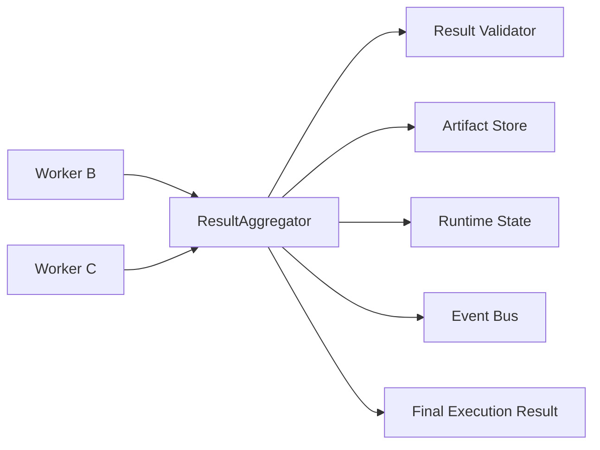
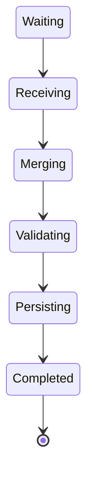
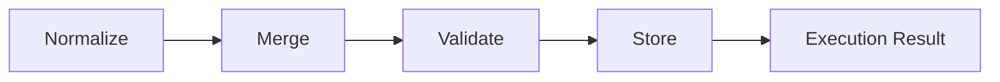
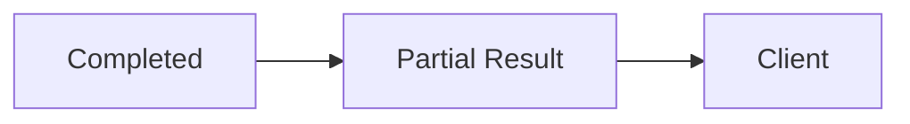
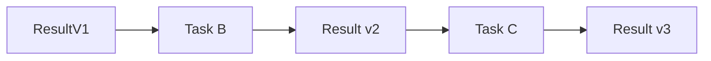
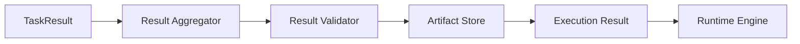

# Result Aggregator

> AI Social OS Runtime Layer

Version: 2.0.0

Status: Draft

Last Updated: 2026-07-25

---

# Table of Contents

- Overview
- Why Result Aggregator
- Design Principles
- Responsibilities
- Architecture
- Aggregation Lifecycle
- Result Model
- Artifact Management
- Dependency Resolution
- Result Composition
- Partial Results
- Validation
- Persistence
- Monitoring
- Design Decisions

---

# Overview

Result Aggregator là thành phần chịu trách nhiệm thu thập, hợp nhất và chuẩn hóa toàn bộ kết quả sinh ra trong quá trình thực thi Execution.

Trong một Execution, nhiều Worker có thể chạy song song.

Ví dụ.

```mermaid
flowchart LR
```

```mermaid
flowchart LR
```

```mermaid
flowchart LR
```

Result Aggregator sẽ hợp nhất tất cả Output thành một Execution Result thống nhất.

---

# Why Result Aggregator

Nếu Runtime lấy kết quả trực tiếp từ từng Worker.

```mermaid
flowchart LR
```

```mermaid
flowchart LR
```

```mermaid
flowchart LR
```

Runtime sẽ phải:

- theo dõi trạng thái từng Worker
- ghép Output
- xử lý Dependency
- kiểm tra thiếu dữ liệu

Điều này làm Runtime Engine trở nên phức tạp.

Result Aggregator tách riêng toàn bộ trách nhiệm này.

---

# Design Principles

Result Aggregator được xây dựng theo các nguyên tắc:

- Deterministic
- Immutable Result
- Dependency Aware
- Event Driven
- Observable
- Idempotent
- Extensible

---

# Responsibilities

Result Aggregator chịu trách nhiệm:

- Collect Results
- Merge Outputs
- Validate Results
- Resolve Dependencies
- Store Artifacts
- Build Execution Output
- Publish Completion Events

---

# Architecture



---

# Aggregation Lifecycle



---

# Result Model

```typescript
ExecutionResult

├── executionId

├── status

├── outputs

├── artifacts

├── metrics

├── logs

├── metadata

└── completedAt
```

---

# Task Result

Mỗi Worker trả về một Task Result.

```typescript
TaskResult

├── taskId

├── output

├── artifacts

├── variables

├── metrics

├── logs

└── status
```

Aggregator sẽ ghép các Task Result thành Execution Result.

---

# Aggregation Flow



---

# Dependency Resolution

Một Task có thể phụ thuộc vào Output của Task khác.

Ví dụ.

```mermaid
flowchart LR
```

Aggregator chỉ đánh dấu Execution hoàn thành khi toàn bộ Dependency đã được giải quyết.

---

# Result Composition

Execution Result bao gồm.

```text
Execution Result

├── Variables

├── Text Outputs

├── Images

├── Videos

├── Files

├── URLs

├── Metrics

├── Logs

└── Metadata
```

---

# Artifact Management

Artifact là các tệp sinh ra trong quá trình thực thi.

Ví dụ.

- Image
- Video
- PDF
- Markdown
- CSV
- Excel
- Audio

Aggregator lưu Metadata thay vì lưu trực tiếp nội dung.

```yaml
artifact:

image.png

storage:

s3://...

size:

2.4MB
```

---

# Partial Results

Trong quá trình Execution.

Aggregator có thể trả Partial Result.



Điều này hỗ trợ UI Realtime.

---

# Result Validation

Aggregator kiểm tra.

- Required Outputs
- Missing Variables
- Invalid Artifacts
- Invalid Schema

Ví dụ.

```mermaid
flowchart LR
```

---

# Result Normalization

Output từ các Worker khác nhau sẽ được chuẩn hóa.

Ví dụ.

```mermaid
flowchart LR
```

```mermaid
flowchart LR
```

Các tầng phía trên luôn nhận cùng định dạng.

---

# Result Persistence

Sau khi hợp nhất.

Execution Result được lưu vào.

- Database
- Object Storage
- Search Index
- Analytics

Tùy theo cấu hình Workspace.

---

# Result Versioning

Execution Result có Version.

```yaml
execution:

ex-001

version:

3
```

Giúp:

- Replay
- Audit
- Rollback

---

# Incremental Update

Aggregator hỗ trợ cập nhật từng phần.



Client luôn nhận phiên bản mới nhất.

---

# Metrics

Theo dõi.

- Result Size
- Aggregation Time
- Validation Errors
- Artifact Count
- Merge Count
- Partial Updates
- Finalization Time

---

# Events

Ví dụ.

- ResultReceived
- ResultMerged
- ResultValidated
- ArtifactStored
- PartialResultPublished
- ExecutionResultCompleted

---

# Design Decisions

| Decision | Reason |
|-----------|--------|
| Aggregator riêng | Giảm tải Runtime Engine |
| Unified Result Model | Chuẩn hóa Output |
| Artifact Metadata | Giảm kích thước Database |
| Partial Result | Hỗ trợ UI Realtime |
| Result Versioning | Audit & Replay |
| Validation trước Persist | Đảm bảo tính nhất quán |

---

# Runtime Flow



---

# Summary

Result Aggregator là thành phần chịu trách nhiệm thu thập, chuẩn hóa và hợp nhất toàn bộ kết quả từ các Worker trong một Execution.

Thông qua việc quản lý Dependency, Validation, Artifact và Result Versioning, Aggregator đảm bảo Runtime luôn tạo ra một Execution Result nhất quán, có thể kiểm toán, hỗ trợ cập nhật theo thời gian thực và dễ dàng mở rộng khi số lượng Task cũng như Worker tăng lên.