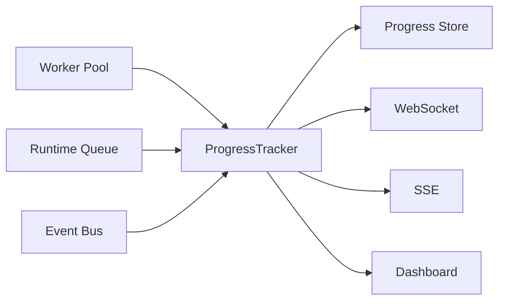
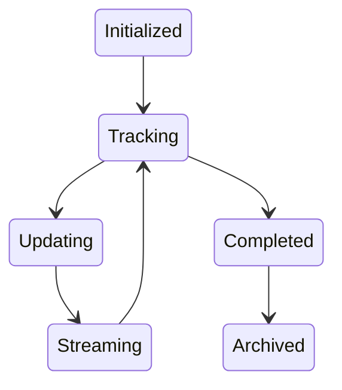
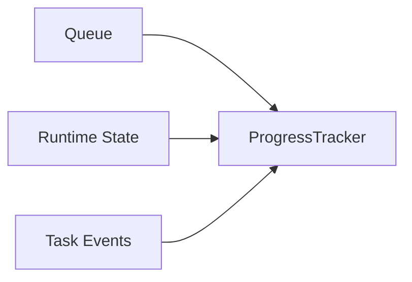
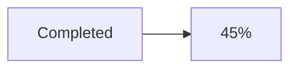
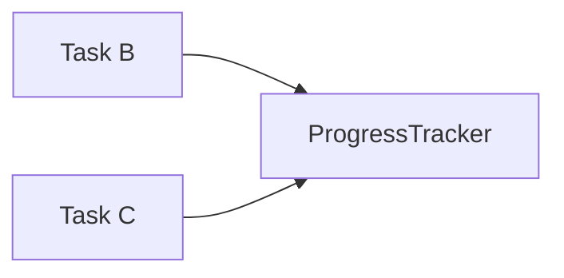
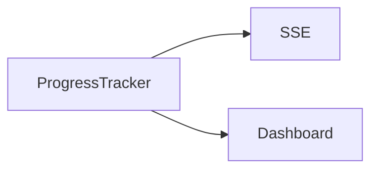
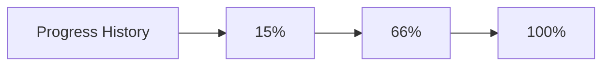
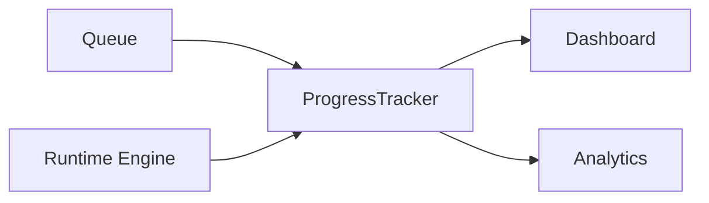

# Progress Tracker

> AI Social OS Runtime Layer

Version: 2.0.0

Status: Draft

Last Updated: 2026-07-25

---

# Table of Contents

- Overview
- Why Progress Tracker
- Design Principles
- Responsibilities
- Architecture
- Progress Lifecycle
- Progress Model
- Progress Calculation
- Execution Progress
- Task Progress
- Worker Progress
- ETA Estimation
- Streaming Updates
- Persistence
- Monitoring
- Design Decisions

---

# Overview

Progress Tracker là thành phần chịu trách nhiệm theo dõi và cập nhật tiến độ của toàn bộ Runtime.

Progress không chỉ đơn giản là:

```
Completed Tasks / Total Tasks
```

mà còn phản ánh:

- trạng thái Execution
- tiến độ từng Task
- tiến độ từng Worker
- Artifact đã tạo
- ETA
- Throughput
- Blocking Dependency

Progress Tracker là nguồn dữ liệu duy nhất cho mọi giao diện hiển thị tiến độ.

---

# Why Progress Tracker

Nếu Runtime Engine tự tính Progress.

```mermaid
flowchart LR
```

Runtime sẽ phải:

- theo dõi Worker
- theo dõi Queue
- theo dõi Task
- tính ETA
- gửi Update

Điều này làm Runtime Engine quá phức tạp.

Do đó Progress được tách thành một thành phần độc lập.

---

# Design Principles

Progress Tracker được xây dựng theo các nguyên tắc:

- Event Driven
- Realtime
- Eventually Consistent
- Observable
- Immutable History
- Scalable
- Streaming Friendly

---

# Responsibilities

Progress Tracker chịu trách nhiệm:

- Track Execution
- Track Task
- Track Worker
- Calculate Progress
- Estimate ETA
- Publish Progress Events
- Stream Progress
- Persist Progress History

---

# Architecture



---

# Progress Lifecycle



---

# Progress Model

```typescript
ExecutionProgress

├── executionId

├── status

├── percentage

├── completedTasks

├── totalTasks

├── runningTasks

├── failedTasks

├── waitingTasks

├── eta

├── throughput

└── updatedAt
```

---

# Progress Sources

Progress được tính từ nhiều nguồn.



---

# Execution Progress

Ví dụ.



Tuy nhiên Progress Tracker còn xét đến trọng số của từng Task.

---

# Weighted Progress

Không phải mọi Task đều có giá trị như nhau.

Ví dụ.

| Task | Weight |
|------|--------|
| Generate Article | 20 |
| Generate Image | 10 |
| Publish Facebook | 5 |
| Notify Team | 1 |

Progress sẽ dựa trên tổng Weight thay vì số lượng Task.

---

# Task Progress

Task có thể báo Progress.

Ví dụ.

```mermaid
flowchart LR
```

Progress Tracker sẽ cập nhật ngay lập tức.

---

# Worker Progress

Worker gửi Heartbeat.

Ví dụ.

```yaml
worker:

media-01

task:

video-render

progress:

72%
```

Progress Tracker hợp nhất vào Execution Progress.

---

# Parallel Execution

Ví dụ.



Progress được tính từ tất cả Task đang chạy song song.

---

# Dependency Awareness

Nếu Task B phụ thuộc Task A.

```mermaid
flowchart LR
```

Progress không tăng cho đến khi Dependency được hoàn thành.

---

# ETA Estimation

ETA được tính dựa trên.

- Historical Runtime
- Average Task Duration
- Queue Length
- Worker Availability
- Current Throughput

Ví dụ.

```yaml
progress:

62%

eta:

3m 12s
```

ETA sẽ được cập nhật liên tục.

---

# Throughput

Progress Tracker tính.

```
Tasks / Minute

Artifacts / Minute

Tokens / Minute
```

Giúp Dashboard theo dõi hiệu năng Runtime.

---

# Streaming Updates

Progress được gửi theo thời gian thực.



Client không cần Polling.

---

# Progress History

Mỗi lần cập nhật đều được lưu.



Có thể dùng để:

- Audit
- Replay
- Analytics

---

# Persistence

Progress được lưu vào.

- Runtime Store
- Analytics
- Event Store

History không bị mất khi Runtime Restart.

---

# Metrics

Theo dõi.

- Average Progress Rate
- ETA Accuracy
- Update Frequency
- Progress Latency
- Streaming Connections
- Completion Rate

---

# Progress Events

Ví dụ.

- ExecutionStarted
- ProgressUpdated
- ETAUpdated
- TaskCompleted
- ExecutionCompleted

---

# Dashboard Example

```text
Execution

Generate Weekly Marketing Report

Status

Running

Progress

68%

Completed

17 / 25 Tasks

ETA

2m 45s

Workers

5 Active
```

---

# Design Decisions

| Decision | Reason |
|-----------|--------|
| Thành phần riêng | Tách khỏi Runtime Engine |
| Weighted Progress | Phản ánh đúng khối lượng |
| Event Driven | Cập nhật Realtime |
| ETA động | Chính xác hơn |
| Progress History | Audit & Analytics |
| Streaming Native | UI mượt hơn |

---

# Runtime Flow



---

# Summary

Progress Tracker là thành phần chịu trách nhiệm theo dõi và tính toán tiến độ của toàn bộ Execution trong AI Social OS Runtime.

Thay vì chỉ dựa trên số lượng Task hoàn thành, Progress Tracker kết hợp thông tin từ Worker, Queue, Runtime State và Event để cung cấp Progress, ETA và Throughput theo thời gian thực.

Kiến trúc này giúp Dashboard, CLI và API luôn hiển thị trạng thái thực thi chính xác, hỗ trợ Streaming, Audit và Analytics mà không làm tăng độ phức tạp của Runtime Engine.