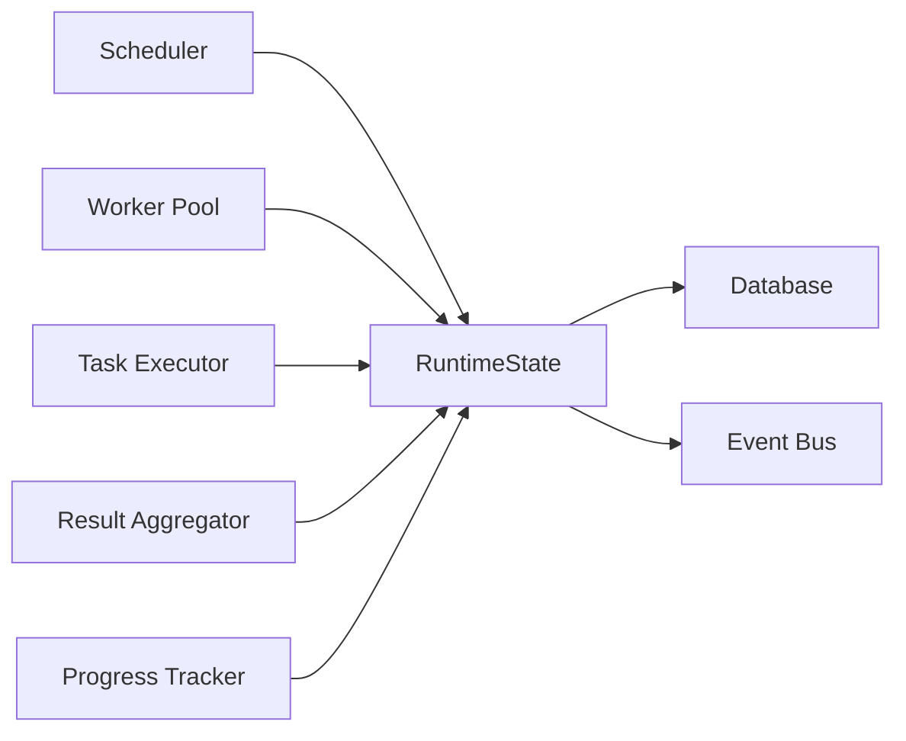
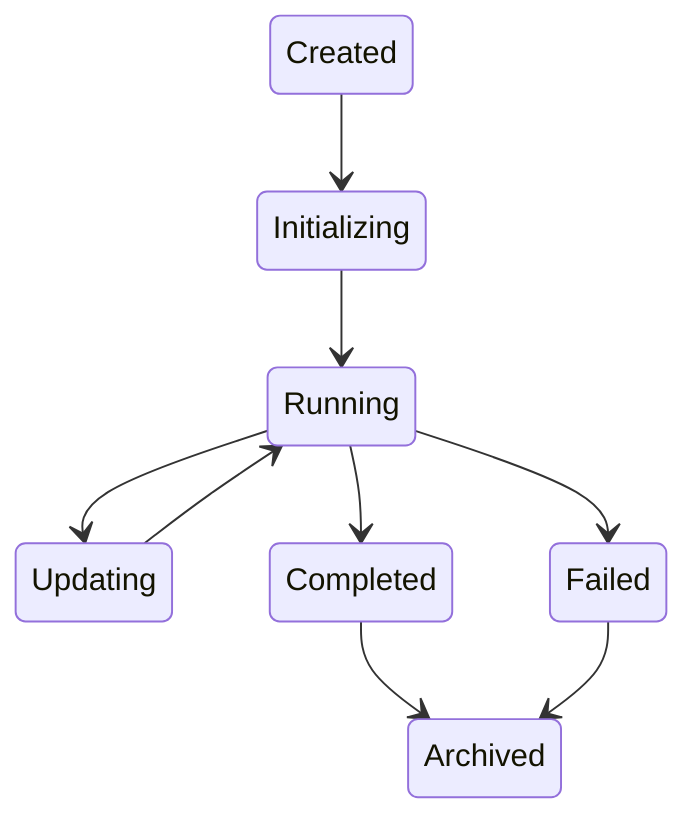
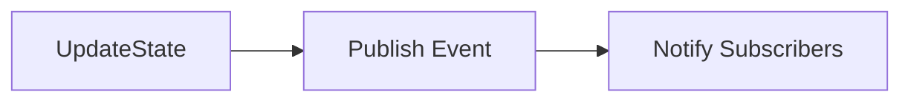
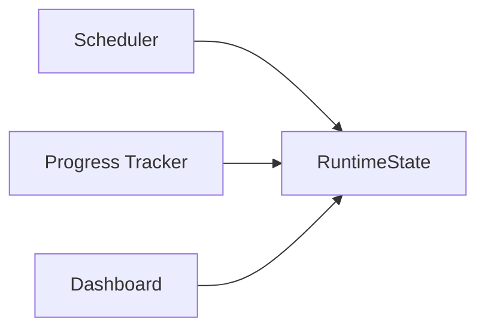
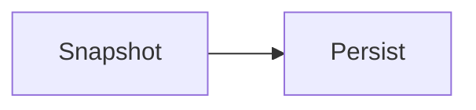
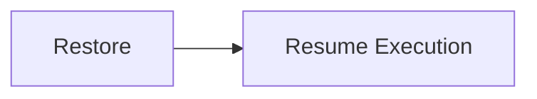
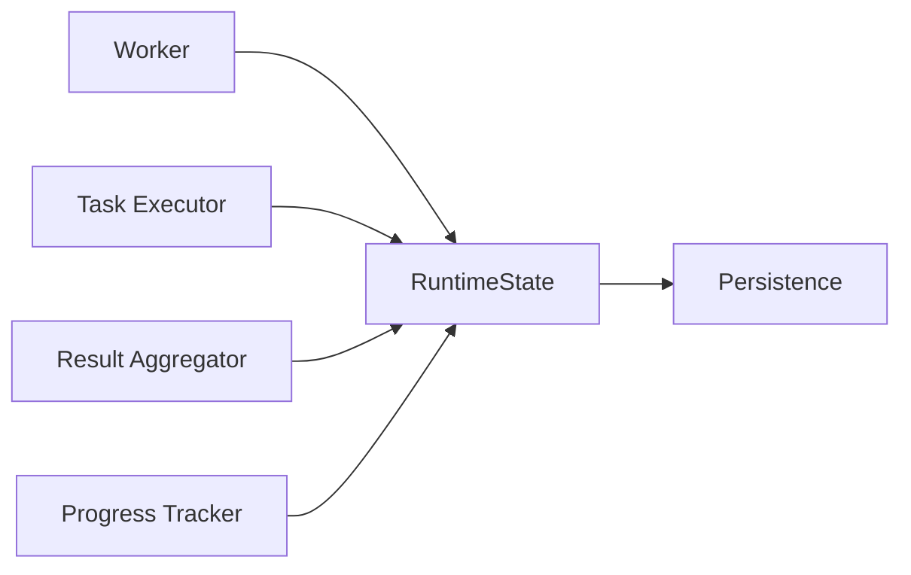

# Runtime State

> AI Social OS Runtime Layer

Version: 2.0.0

Status: Draft

Last Updated: 2026-07-25

---

# Table of Contents

- Overview
- Why Runtime State
- Design Principles
- Responsibilities
- Architecture
- State Lifecycle
- State Model
- State Hierarchy
- State Transitions
- State Persistence
- State Synchronization
- State Recovery
- Snapshot
- Versioning
- Monitoring
- Design Decisions

---

# Overview

Runtime State là nguồn dữ liệu trung tâm phản ánh trạng thái hiện tại của một Execution trong AI Social OS Runtime.

Runtime State không chỉ lưu trạng thái của Execution mà còn quản lý:

- Task State
- Worker State
- Variables
- Context
- Outputs
- Checkpoints
- Runtime Metadata

Mọi thành phần trong Runtime đều đọc hoặc cập nhật thông qua Runtime State.

---

# Why Runtime State

Nếu mỗi thành phần lưu trạng thái riêng.

```mermaid
flowchart LR
```

```mermaid
flowchart LR
```

```mermaid
flowchart LR
```

thì sẽ xảy ra:

- dữ liệu không đồng bộ
- khó Recovery
- khó Debug
- khó Audit
- khó Replay

Do đó Runtime chỉ có một nguồn State thống nhất.

---

# Design Principles

Runtime State được xây dựng theo các nguyên tắc:

- Single Source of Truth
- Immutable History
- Event Driven
- Versioned
- Recoverable
- Observable
- Eventually Consistent
- Workspace Isolated

---

# Responsibilities

Runtime State chịu trách nhiệm:

- Store Execution State
- Store Task State
- Store Runtime Variables
- Track Outputs
- Manage Checkpoints
- Support Recovery
- Publish State Changes

---

# Architecture



---

# State Lifecycle



---

# Runtime State Model

```typescript
RuntimeState

├── executionId

├── status

├── tasks

├── workers

├── variables

├── outputs

├── checkpoints

├── metadata

├── timestamps

└── version
```

---

# State Hierarchy

```text
Runtime State

├── Execution

├── Task States

├── Worker States

├── Runtime Variables

├── Outputs

├── Checkpoints

├── Metrics

└── Metadata
```

---

# Execution State

Execution có các trạng thái.

| State | Description |
|--------|-------------|
| CREATED | Mới tạo |
| INITIALIZING | Đang khởi tạo |
| RUNNING | Đang thực thi |
| PAUSED | Tạm dừng |
| COMPLETED | Hoàn thành |
| FAILED | Thất bại |
| CANCELLED | Đã hủy |

---

# Task State

Mỗi Task có State riêng.

```mermaid
flowchart LR
```

Hoặc.

```mermaid
flowchart LR
```

---

# Worker State

Runtime lưu trạng thái Worker.

```yaml
worker:

media-01

status:

busy

task:

render-video

heartbeat:

2026-07-25T10:30:00Z
```

---

# Runtime Variables

Variables được sinh trong quá trình thực thi.

Ví dụ.

```yaml
article_title:

Top AI Trends 2026

cover_image:

image-01.png

video_url:

video.mp4

hashtags:

#AI #Marketing
```

Các Task phía sau có thể sử dụng lại.

---

# Outputs

Runtime State lưu Metadata của Output.

```text
Outputs

├── Markdown

├── Images

├── Videos

├── Audio

├── Documents

└── URLs
```

Nội dung lớn sẽ được lưu tại Artifact Store.

---

# State Transition



Mọi thay đổi State đều đi qua Runtime State.

---

# State Synchronization

Các thành phần không đồng bộ trực tiếp với nhau.



Runtime State đóng vai trò đồng bộ hóa.

---

# Checkpoints

Runtime State lưu Checkpoint định kỳ.

```text
Checkpoint

├── Variables

├── Task Status

├── Outputs

├── Runtime Context

└── Timestamp
```

Checkpoint hỗ trợ Resume Execution.

---

# Snapshot

Snapshot phản ánh toàn bộ Execution tại một thời điểm.



Snapshot được tạo:

- theo chu kỳ
- trước khi Shutdown
- sau khi hoàn thành Execution

---

# Versioning

Mỗi lần thay đổi State sẽ tăng Version.

```yaml
version:

27
```

Ví dụ.

```mermaid
flowchart LR
```

Version hỗ trợ:

- Replay
- Audit
- Conflict Detection

---

# Recovery

Nếu Runtime gặp sự cố.



Execution tiếp tục từ Checkpoint gần nhất.

---

# Persistence

Runtime State được lưu trong:

- PostgreSQL
- Redis (Cache)
- Event Store

Tùy thuộc vào kiến trúc triển khai.

---

# Monitoring

Theo dõi.

- Active Executions
- State Updates
- Checkpoint Frequency
- Snapshot Size
- Recovery Count
- Version Growth

---

# State Events

Ví dụ.

- StateCreated
- StateUpdated
- VariableUpdated
- OutputStored
- CheckpointCreated
- SnapshotCreated
- ExecutionRecovered

---

# Design Decisions

| Decision | Reason |
|-----------|--------|
| Single Source of Truth | Đồng bộ toàn hệ thống |
| Versioned State | Audit & Replay |
| Snapshot định kỳ | Recovery nhanh |
| Artifact tách riêng | Giảm kích thước State |
| Event Driven | Dễ mở rộng |
| Workspace Isolation | Bảo mật dữ liệu |

---

# Runtime Flow



---

# Summary

Runtime State là trung tâm quản lý trạng thái của toàn bộ AI Social OS Runtime.

Thành phần này lưu trữ và đồng bộ trạng thái của Execution, Task, Worker, Variables, Outputs và Checkpoints, đồng thời cung cấp cơ chế Snapshot, Versioning và Recovery để đảm bảo hệ thống luôn có thể khôi phục, kiểm toán và tiếp tục thực thi một cách an toàn khi xảy ra sự cố.