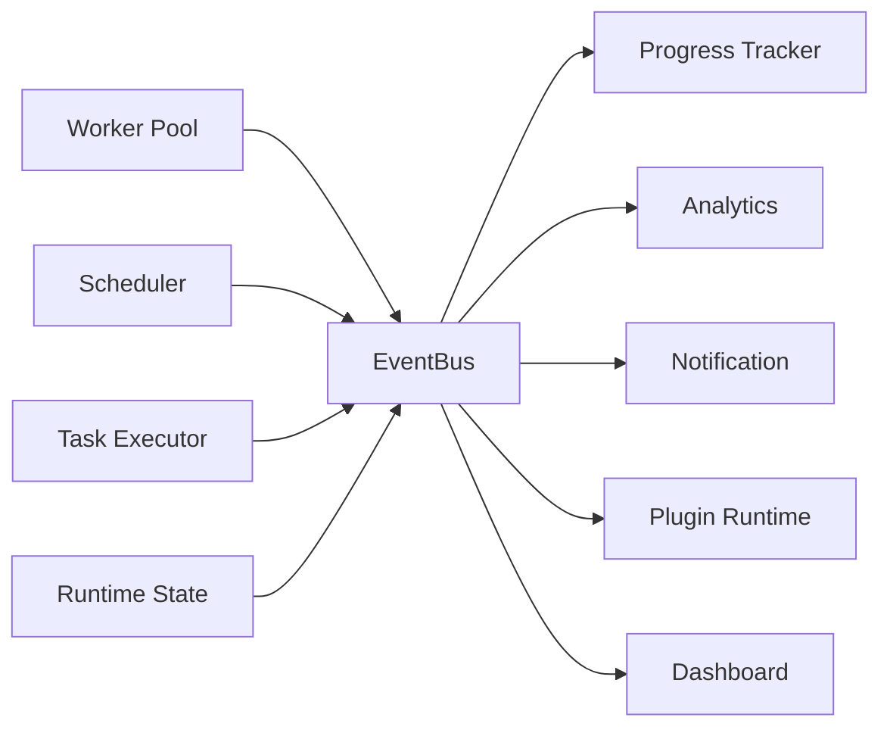
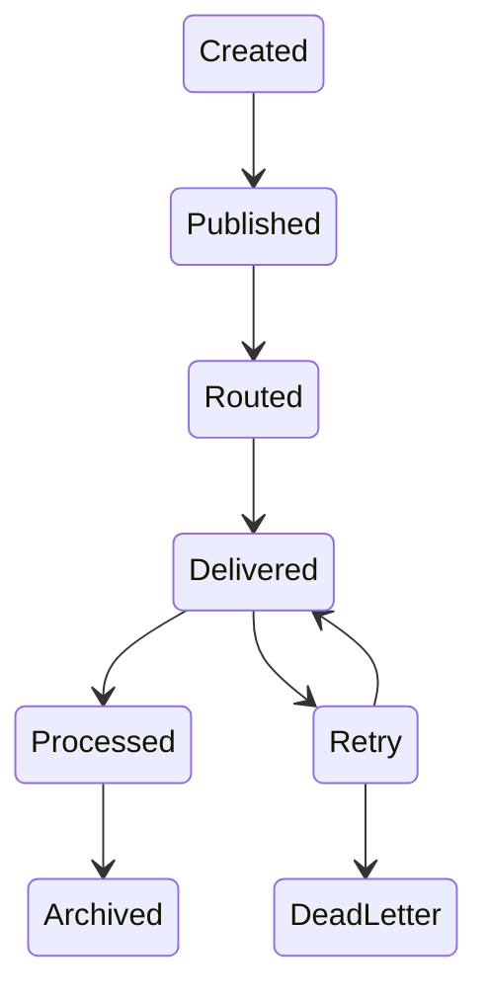
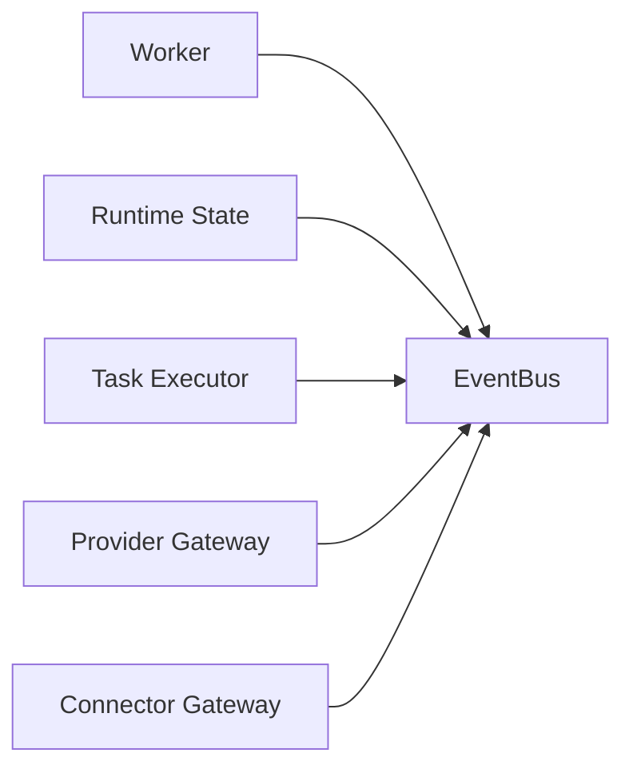
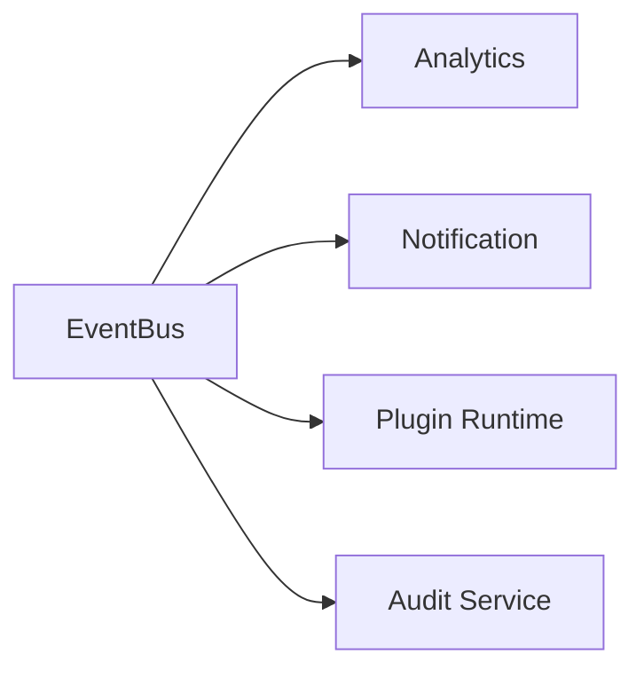
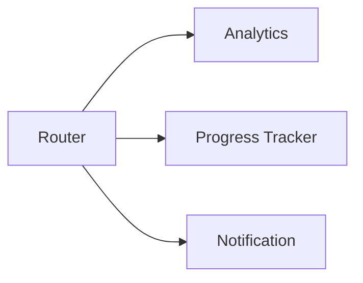
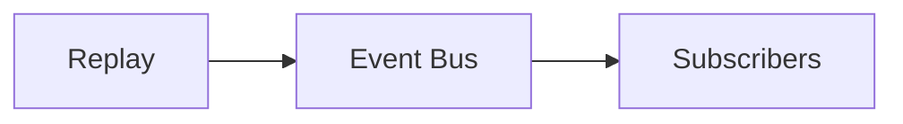
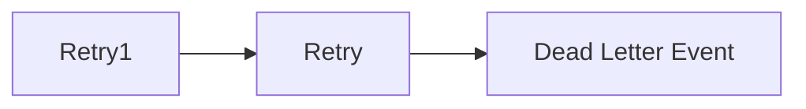
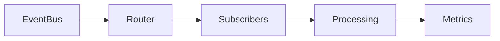

# Event Bus

> AI Social OS Runtime Layer

Version: 2.0.0

Status: Draft

Last Updated: 2026-07-25

---

# Table of Contents

- Overview
- Why Event Bus
- Design Principles
- Responsibilities
- Architecture
- Event Lifecycle
- Event Model
- Event Categories
- Publishers
- Subscribers
- Event Routing
- Event Persistence
- Event Replay
- Dead Letter Events
- Monitoring
- Design Decisions

---

# Overview

Event Bus là hạ tầng giao tiếp bất đồng bộ (Asynchronous Communication) giữa các thành phần trong AI Social OS Runtime.

Thay vì các thành phần gọi trực tiếp lẫn nhau, mọi thay đổi trạng thái và hành động quan trọng đều được phát dưới dạng Event.

```mermaid
flowchart LR
```

Event Bus giúp Runtime trở thành một hệ thống Event-Driven, giảm Coupling giữa các thành phần và tăng khả năng mở rộng.

---

# Why Event Bus

Nếu các thành phần gọi trực tiếp nhau.

```mermaid
flowchart LR
```

thì:

- Coupling cao
- khó mở rộng
- khó thêm chức năng
- khó Retry
- khó Monitoring

Thay vào đó.

```mermaid
flowchart LR
```

Mỗi thành phần chỉ cần phát hoặc lắng nghe Event.

---

# Design Principles

Event Bus được xây dựng theo các nguyên tắc:

- Event Driven
- Loose Coupling
- Asynchronous
- Durable
- Replayable
- Observable
- Scalable
- Ordered

---

# Responsibilities

Event Bus chịu trách nhiệm:

- Publish Events
- Route Events
- Deliver Events
- Persist Events
- Replay Events
- Retry Delivery
- Dead Letter Handling
- Event Metrics

---

# Architecture



---

# Event Lifecycle



---

# Event Model

```typescript
RuntimeEvent

├── id

├── type

├── source

├── timestamp

├── executionId

├── payload

├── metadata

└── version
```

---

# Event Categories

Runtime sử dụng nhiều nhóm Event.

```
Execution Events

Task Events

Worker Events

Queue Events

Provider Events

Connector Events

Plugin Events

MCP Events

Analytics Events

System Events
```

---

# Execution Events

Ví dụ.

- ExecutionCreated
- ExecutionStarted
- ExecutionPaused
- ExecutionResumed
- ExecutionCompleted
- ExecutionFailed
- ExecutionCancelled

---

# Task Events

Ví dụ.

- TaskCreated
- TaskQueued
- TaskStarted
- TaskCompleted
- TaskFailed
- TaskRetried
- TaskCancelled

---

# Worker Events

Ví dụ.

- WorkerRegistered
- WorkerReady
- WorkerBusy
- WorkerRecovered
- WorkerFailed
- WorkerShutdown

---

# Publishers

Các thành phần có thể phát Event.



---

# Subscribers

Các thành phần đăng ký lắng nghe Event.



Một Event có thể có nhiều Subscriber.

---

# Event Routing

Event Bus định tuyến Event theo Type.



Subscriber chỉ nhận Event đã đăng ký.

---

# Event Filtering

Subscriber có thể lọc Event.

Ví dụ.

```yaml
type:

TaskCompleted

executionId:

execution-001

workspace:

marketing
```

Giúp giảm lưu lượng Event không cần thiết.

---

# Event Ordering

Trong cùng một Execution.

```mermaid
flowchart LR
```

Runtime đảm bảo thứ tự xử lý trong cùng một luồng Event.

---

# Event Persistence

Event được lưu trong Event Store.

```text
Event Store

├── Execution Events

├── Task Events

├── Worker Events

├── Plugin Events

└── System Events
```

Event History phục vụ Audit và Replay.

---

# Event Replay

Có thể phát lại Event.



Replay phục vụ:

- Debug
- Recovery
- Testing
- Analytics

---

# Dead Letter Events

Nếu Event không được xử lý sau nhiều lần Retry.



Administrator có thể:

- Replay
- Inspect
- Delete

---

# Event Versioning

Event hỗ trợ Version.

```yaml
type:

TaskCompleted

version:

2
```

Giúp Runtime tương thích khi Schema thay đổi.

---

# Event Metrics

Theo dõi.

- Published Events
- Delivered Events
- Failed Deliveries
- Retry Count
- Replay Count
- Dead Letter Count
- Delivery Latency

---

# Monitoring

Runtime theo dõi.

- Event Throughput
- Consumer Lag
- Delivery Success Rate
- Processing Time
- Subscriber Health

Nếu Subscriber chậm.

Event Bus sẽ áp dụng Backpressure hoặc Retry.

---

# Design Decisions

| Decision | Reason |
|-----------|--------|
| Event Driven | Giảm Coupling |
| Durable Events | Không mất dữ liệu |
| Replay Support | Debug & Recovery |
| Dead Letter Queue | Xử lý lỗi an toàn |
| Versioned Events | Dễ nâng cấp |
| Multiple Subscribers | Mở rộng linh hoạt |
| Event Store | Audit đầy đủ |

---

# Runtime Flow



---

# Summary

Event Bus là hạ tầng giao tiếp bất đồng bộ của AI Social OS Runtime.

Thông qua cơ chế Publish/Subscribe, Event Bus kết nối các thành phần như Scheduler, Worker Pool, Runtime State, Progress Tracker, Analytics và Plugin Runtime mà không tạo ra sự phụ thuộc trực tiếp.

Kiến trúc này giúp hệ thống mở rộng dễ dàng, hỗ trợ Replay, Audit, Monitoring và đảm bảo mọi thay đổi trong Runtime đều được ghi nhận và truyền tải một cách nhất quán.