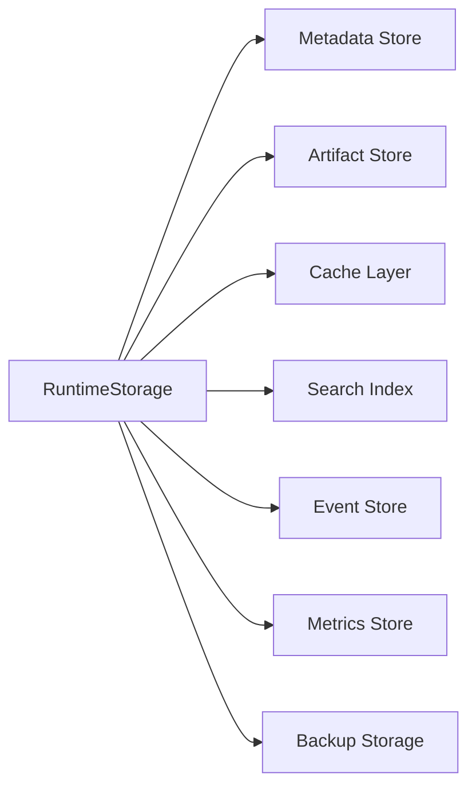
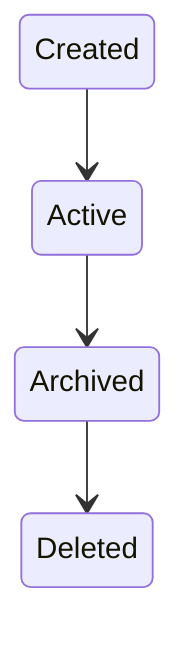
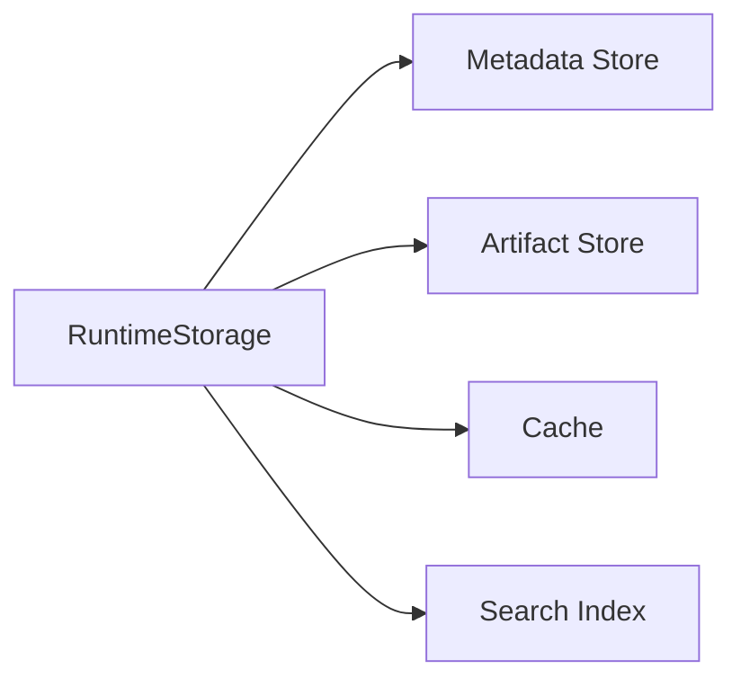
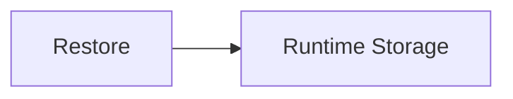
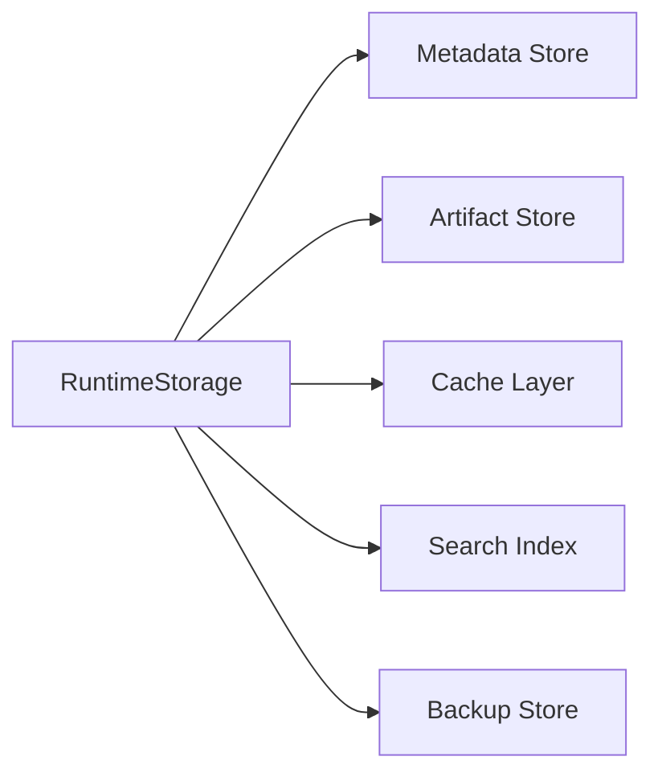

# Runtime Storage

> AI Social OS Runtime Layer

Version: 2.0.0

Status: Draft

Last Updated: 2026-07-25

---

# Table of Contents

- Overview
- Why Runtime Storage
- Design Principles
- Responsibilities
- Architecture
- Storage Layers
- Data Classification
- Storage Lifecycle
- Artifact Storage
- Metadata Storage
- Cache Layer
- Search Index
- Backup & Recovery
- Monitoring
- Design Decisions

---

# Overview

Runtime Storage là tầng lưu trữ thống nhất của AI Social OS Runtime.

Thành phần này chịu trách nhiệm lưu trữ toàn bộ dữ liệu được tạo ra trong quá trình thực thi, bao gồm:

- Runtime State
- Execution Metadata
- Task Metadata
- Variables
- Artifacts
- Logs
- Events
- Metrics
- Snapshots

Runtime Storage không phải là một Database duy nhất mà là tập hợp nhiều Storage Engine chuyên biệt.

---

# Why Runtime Storage

Nếu tất cả dữ liệu được lưu vào một Database.

```mermaid
flowchart LR
```

sẽ gặp các vấn đề:

- lưu file lớn không hiệu quả
- truy vấn log chậm
- tìm kiếm nội dung khó
- khó Scale
- chi phí cao

Do đó Runtime Storage sử dụng nhiều lớp lưu trữ khác nhau.

---

# Design Principles

Runtime Storage được xây dựng theo các nguyên tắc:

- Polyglot Persistence
- Separation of Concerns
- Scalable
- Durable
- Versioned
- Secure
- Observable
- Backup Friendly

---

# Responsibilities

Runtime Storage chịu trách nhiệm:

- Persist Runtime Data
- Store Artifacts
- Store Metadata
- Cache Frequently Used Data
- Index Searchable Content
- Backup Data
- Restore Data
- Manage Data Lifecycle

---

# Architecture



---

# Storage Layers

Runtime Storage gồm nhiều tầng.

```text
Runtime Storage

├── Metadata Store

├── Artifact Store

├── Cache Layer

├── Event Store

├── Search Index

├── Metrics Store

└── Backup Store
```

Mỗi tầng phục vụ một loại dữ liệu riêng.

---

# Metadata Store

Lưu trữ dữ liệu có cấu trúc.

Ví dụ.

- Execution
- Task
- Worker
- Workspace
- Configuration
- Runtime Variables

Thông thường sử dụng.

- PostgreSQL
- MySQL

---

# Artifact Store

Lưu trữ dữ liệu kích thước lớn.

Ví dụ.

- Images
- Videos
- Audio
- PDF
- Markdown
- ZIP
- CSV

Thông thường sử dụng.

- Amazon S3
- Cloudflare R2
- MinIO

Runtime chỉ lưu Metadata của Artifact.

---

# Cache Layer

Cache phục vụ truy cập tốc độ cao.

Ví dụ.

- Runtime Context
- Session
- Token Cache
- Frequently Used Variables

Thông thường sử dụng.

- Redis

---

# Event Store

Lưu toàn bộ Event.

Ví dụ.

- TaskCompleted
- WorkerStarted
- ExecutionFailed

Phục vụ.

- Replay
- Audit
- Analytics

---

# Search Index

Lưu dữ liệu phục vụ tìm kiếm.

Ví dụ.

- Documents
- Articles
- Prompt History
- Conversation

Thông thường sử dụng.

- Elasticsearch
- OpenSearch
- Meilisearch

---

# Metrics Store

Lưu dữ liệu Time Series.

Ví dụ.

- CPU Usage
- Memory
- Queue Length
- Throughput
- Latency

Thông thường sử dụng.

- Prometheus
- VictoriaMetrics

---

# Data Classification

```mermaid
flowchart LR
```

```mermaid
flowchart LR
```

```mermaid
flowchart LR
```

```mermaid
flowchart LR
```

```mermaid
flowchart LR
```

---

# Storage Lifecycle



---

# Data Flow



---

# Versioning

Các đối tượng quan trọng hỗ trợ Version.

Ví dụ.

```yaml
execution:

ex-001

version:

5
```

Version giúp:

- Audit
- Rollback
- Replay

---

# Backup Strategy

Runtime Storage hỗ trợ.

- Full Backup
- Incremental Backup
- Snapshot Backup


---

# Recovery

Khi xảy ra sự cố.



Sau khi khôi phục.

Runtime tiếp tục từ Snapshot gần nhất.

---

# Retention Policy

Mỗi loại dữ liệu có thời gian lưu khác nhau.

Ví dụ.

| Data | Retention |
|------|-----------|
| Runtime Cache | Vài phút đến vài giờ |
| Logs | 30 ngày |
| Events | 90 ngày |
| Metrics | 180 ngày |
| Artifacts | Theo Workspace |
| Snapshots | Theo Policy |

Retention được cấu hình theo Workspace hoặc System.

---

# Data Encryption

Runtime Storage hỗ trợ.

- Encryption at Rest
- Encryption in Transit
- Secret Encryption
- Object Encryption

---

# Monitoring

Theo dõi.

- Storage Size
- Read Latency
- Write Latency
- Cache Hit Rate
- Artifact Count
- Backup Status
- Restore Duration

---

# Storage Events

Ví dụ.

- MetadataStored
- ArtifactUploaded
- ArtifactDeleted
- CacheMiss
- CacheHit
- BackupCreated
- RestoreCompleted

---

# Design Decisions

| Decision | Reason |
|-----------|--------|
| Polyglot Persistence | Mỗi dữ liệu dùng Storage phù hợp |
| Metadata tách Artifact | Database nhỏ và nhanh |
| Cache Layer riêng | Giảm độ trễ |
| Search Index riêng | Tìm kiếm hiệu quả |
| Event Store | Replay & Audit |
| Versioning | Rollback |
| Backup định kỳ | Disaster Recovery |

---

# Runtime Flow



---

# Summary

Runtime Storage là tầng lưu trữ thống nhất của AI Social OS Runtime, được xây dựng theo mô hình Polyglot Persistence nhằm tối ưu cho từng loại dữ liệu khác nhau.

Thông qua việc tách biệt Metadata, Artifact, Cache, Event, Search và Metrics, Runtime Storage đảm bảo khả năng mở rộng, hiệu năng cao, hỗ trợ Backup, Recovery, Audit và Versioning, đồng thời cung cấp nền tảng lưu trữ bền vững cho toàn bộ Runtime.