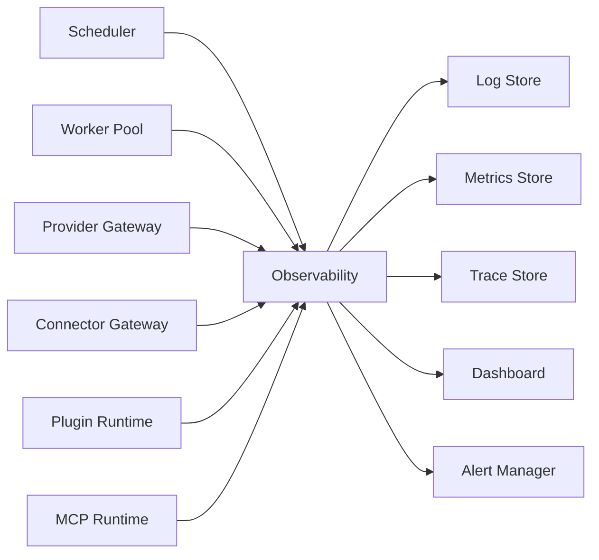
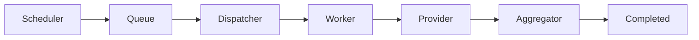
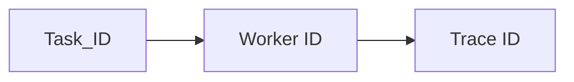
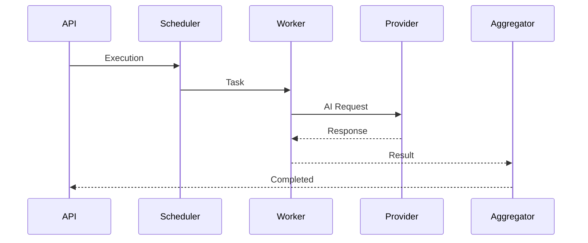
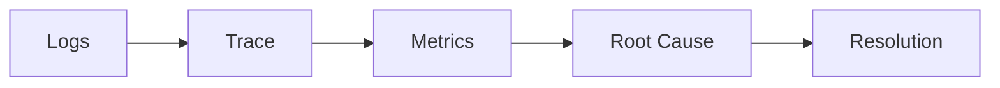
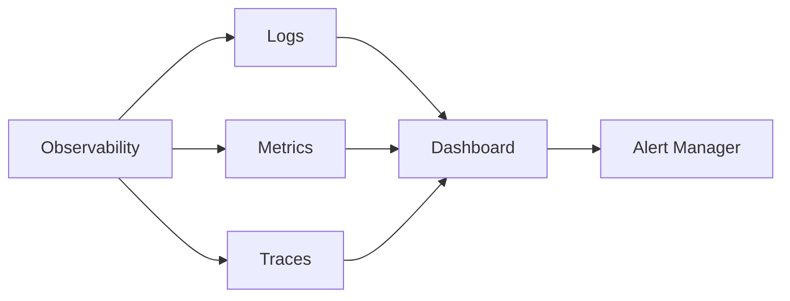

# Observability

> AI Social OS Runtime Layer

Version: 2.0.0

Status: Draft

Last Updated: 2026-07-25

---

# Table of Contents

- Overview
- Why Observability
- Design Principles
- Responsibilities
- Architecture
- Observability Pillars
- Logging
- Metrics
- Tracing
- Correlation IDs
- Alerting
- Health Monitoring
- Dashboards
- Incident Investigation
- Retention
- Design Decisions

---

# Overview

Observability là hệ thống giúp theo dõi, phân tích và chẩn đoán toàn bộ AI Social OS Runtime trong thời gian thực.

Không giống Monitoring truyền thống chỉ hiển thị trạng thái hiện tại, Observability cho phép trả lời các câu hỏi:

- Điều gì đang xảy ra?
- Vì sao xảy ra?
- Thành phần nào gây lỗi?
- Ảnh hưởng đến Execution nào?
- Làm sao tái hiện sự cố?

Observability bao phủ toàn bộ Runtime.

---

# Why Observability

Nếu chỉ xem Log.

```
Worker Failed
```

sẽ rất khó biết:

- Task nào bị ảnh hưởng
- Execution nào bị lỗi
- Worker nào xử lý
- Provider nào được gọi
- Connector nào thất bại

Observability kết nối toàn bộ dữ liệu này lại với nhau.

---

# Design Principles

Observability được xây dựng theo các nguyên tắc:

- Observable by Default
- Structured
- Distributed
- Realtime
- Correlated
- Queryable
- Scalable
- Low Overhead

---

# Responsibilities

Observability chịu trách nhiệm:

- Collect Logs
- Collect Metrics
- Collect Traces
- Correlate Events
- Monitor Health
- Detect Failures
- Generate Alerts
- Support Root Cause Analysis

---

# Architecture



---

# Observability Pillars

Observability gồm ba thành phần chính.

```text
Observability

├── Logs

├── Metrics

└── Traces
```

Ba thành phần này luôn được liên kết với nhau.

---

# Logging

Mọi thành phần trong Runtime đều ghi Log theo cùng một định dạng.

```typescript
RuntimeLog

├── timestamp

├── level

├── service

├── executionId

├── taskId

├── workerId

├── message

└── metadata
```

---

# Log Levels

| Level | Description |
|--------|-------------|
| TRACE | Chi tiết nhất |
| DEBUG | Phục vụ phát triển |
| INFO | Thông tin hoạt động |
| WARN | Cảnh báo |
| ERROR | Lỗi có thể xử lý |
| FATAL | Lỗi nghiêm trọng |

---

# Structured Logging

Ví dụ.

```json
{
  "level": "INFO",
  "executionId": "exec-001",
  "taskId": "task-012",
  "worker": "llm-03",
  "message": "Task completed"
}
```

Runtime không sử dụng Log dạng Text thuần.

---

# Metrics

Metrics phản ánh trạng thái hệ thống theo thời gian.

Ví dụ.

- CPU Usage
- Memory Usage
- Queue Length
- Active Workers
- Success Rate
- Error Rate
- Throughput
- Latency

Metrics được cập nhật liên tục.

---

# Trace

Trace mô tả toàn bộ đường đi của một Execution.



Trace giúp xác định chính xác vị trí xảy ra lỗi.

---

# Correlation IDs

Mọi thành phần đều sử dụng Correlation ID.



Nhờ đó có thể truy vết toàn bộ một Execution từ đầu đến cuối.

---

# Distributed Tracing

Ví dụ.



Toàn bộ chuỗi được lưu thành một Trace duy nhất.

---

# Health Monitoring

Observability theo dõi sức khỏe của từng thành phần.

```text
Runtime

Worker Pool

Queue

Provider Gateway

Connector Gateway

Plugin Runtime

MCP Runtime
```

Mỗi thành phần có Health Score riêng.

---

# Health Status

| Status | Description |
|---------|-------------|
| Healthy | Hoạt động bình thường |
| Degraded | Hiệu năng giảm |
| Unhealthy | Có lỗi |
| Offline | Không phản hồi |

---

# Alerting

Alert được tạo khi vượt ngưỡng.

Ví dụ.

```
CPU > 90%

Queue > 10,000 Tasks

Worker Offline

Provider Timeout

Connector Failed

Memory Leak
```

Alert được gửi đến Notification Service.

---

# Dashboard

Dashboard hiển thị.

- Active Executions
- Queue Status
- Worker Status
- Runtime Health
- Provider Health
- Connector Health
- Throughput
- Error Rate
- Average Latency

---

# Incident Investigation

Quy trình điều tra sự cố.



Observability hỗ trợ phân tích nguyên nhân gốc (Root Cause Analysis).

---

# Retention

Mỗi loại dữ liệu có thời gian lưu khác nhau.

| Data | Retention |
|------|-----------|
| Logs | 30 ngày |
| Metrics | 180 ngày |
| Traces | 30 ngày |
| Alerts | 90 ngày |

Retention được cấu hình theo Workspace hoặc System Policy.

---

# Monitoring Targets

Theo dõi.

- Runtime
- API
- Workers
- Queue
- Database
- Cache
- Storage
- Providers
- Connectors
- MCP Servers
- Plugins

---

# Events

Ví dụ.

- LogCreated
- MetricRecorded
- TraceStarted
- TraceCompleted
- AlertTriggered
- AlertResolved
- HealthChanged

---

# Design Decisions

| Decision | Reason |
|-----------|--------|
| Structured Logging | Dễ tìm kiếm |
| Unified Metrics | Phân tích tập trung |
| Distributed Tracing | Debug nhanh |
| Correlation ID | Truy vết toàn diện |
| Alert theo ngưỡng | Phản ứng sớm |
| Dashboard tập trung | Quan sát hệ thống |
| Retention Policy | Tối ưu chi phí |

---

# Runtime Flow



---

# Summary

Observability là nền tảng giám sát và phân tích của AI Social OS Runtime, cung cấp khả năng thu thập Logs, Metrics và Distributed Traces trên toàn hệ thống.

Thông qua Correlation ID, Dashboard tập trung và cơ chế Alerting, Observability giúp phát hiện sự cố sớm, truy vết nguyên nhân gốc, đánh giá hiệu năng và đảm bảo Runtime luôn có khả năng vận hành ổn định ở quy mô lớn.