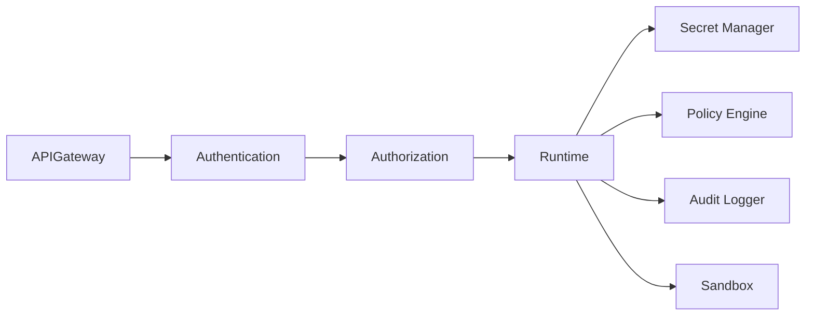
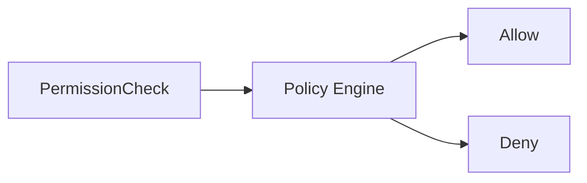
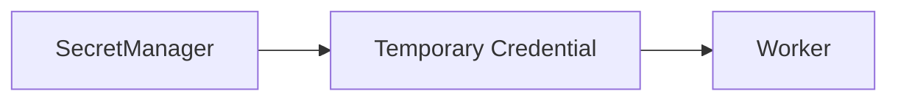
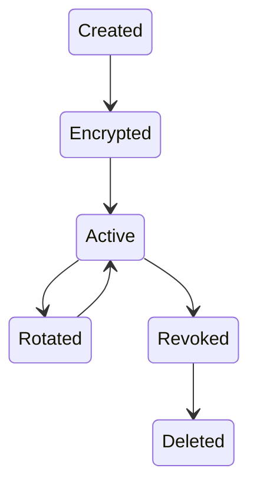
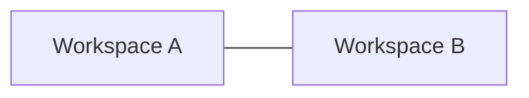
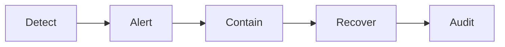
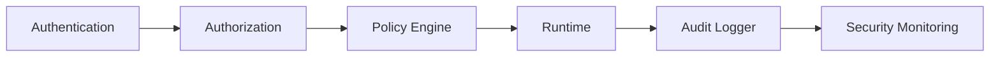

# Runtime Security

> AI Social OS Runtime Layer

Version: 2.0.0

Status: Draft

Last Updated: 2026-07-25

---

# Table of Contents

- Overview
- Why Runtime Security
- Design Principles
- Responsibilities
- Security Architecture
- Authentication
- Authorization
- Identity Model
- Secret Management
- Encryption
- Workspace Isolation
- Runtime Sandbox
- Audit Logging
- Threat Detection
- Security Policies
- Incident Response
- Design Decisions

---

# Overview

Runtime Security là lớp bảo vệ toàn bộ AI Social OS Runtime khỏi các truy cập trái phép, rò rỉ dữ liệu và các hành vi nguy hiểm trong quá trình thực thi.

Security không phải là một thành phần riêng lẻ mà là tập hợp các cơ chế bảo vệ được áp dụng xuyên suốt Runtime.

Mọi thành phần đều phải tuân thủ Security Policy.

---

# Why Runtime Security

Nếu Runtime chỉ kiểm tra quyền tại API.

```mermaid
flowchart LR
```

thì vẫn có thể xảy ra.

- Worker truy cập Secret
- Plugin đọc Memory trái phép
- MCP gọi Tool không được phép
- Connector dùng sai Token
- Execution vượt quyền Workspace

Security phải tồn tại ở mọi tầng.

---

# Design Principles

Runtime Security được xây dựng theo các nguyên tắc:

- Zero Trust
- Least Privilege
- Defense in Depth
- Secure by Default
- Workspace Isolation
- Audit First
- Principle of Explicit Access
- Immutable Audit Trail

---

# Responsibilities

Runtime Security chịu trách nhiệm:

- Authentication
- Authorization
- Secret Protection
- Permission Validation
- Sandbox Enforcement
- Encryption
- Audit Logging
- Threat Detection
- Policy Enforcement

---

# Security Architecture



---

# Authentication

Runtime xác thực danh tính trước khi cho phép thực thi.

Hỗ trợ:

- OAuth 2.0
- OpenID Connect
- JWT
- API Key
- Service Account
- Personal Access Token

Authentication chỉ xác minh danh tính.

Không quyết định quyền truy cập.

---

# Authorization

Sau khi xác thực.

Runtime kiểm tra quyền.



Authorization áp dụng cho:

- API
- Worker
- Plugin
- MCP
- Connector
- Storage

---

# Identity Model

```text
Organization

└── Workspace

    └── User

        └── Session

            └── Execution
```

Mọi Execution đều gắn với một Identity.

---

# Permission Model

Permission được tổ chức theo Capability.

Ví dụ.

```
memory.read

memory.write

connector.facebook.publish

provider.openai.invoke

storage.upload

plugin.install

mcp.invoke
```

Không sử dụng Permission theo Module.

---

# Secret Management

Runtime không lưu Secret trong:

- Worker
- Plugin
- Task
- Execution

Secrets chỉ được lấy thông qua Secret Manager.



Worker không nhìn thấy Secret gốc.

---

# Secret Lifecycle



---

# Encryption

Runtime hỗ trợ.

## Encryption in Transit

- HTTPS
- TLS
- mTLS (Optional)

---

## Encryption at Rest

- Database Encryption
- Object Storage Encryption
- Secret Encryption

---

## Field Encryption

Các trường nhạy cảm.

- Access Token
- Refresh Token
- API Key
- OAuth Secret

được mã hóa riêng.

---

# Workspace Isolation

Mỗi Workspace được cô lập hoàn toàn.



Không có Worker hoặc Plugin nào được truy cập dữ liệu Workspace khác nếu không có quyền rõ ràng.

---

# Runtime Sandbox

Các thành phần chạy trong môi trường cô lập.

Ví dụ.

```mermaid
flowchart LR
```

```mermaid
flowchart LR
```

```mermaid
flowchart LR
```

Sandbox giới hạn.

- CPU
- Memory
- Filesystem
- Network
- Execution Time

---

# Policy Enforcement

Mọi hành động quan trọng đều đi qua Policy Engine.

Ví dụ.

```mermaid
flowchart LR
```

```mermaid
flowchart LR
```

---

# Audit Logging

Mọi hành động bảo mật đều được ghi lại.

Ví dụ.

```json
{
  "user": "user-001",
  "action": "connector.publish",
  "workspace": "marketing",
  "result": "allowed",
  "timestamp": "2026-07-25T10:00:00Z"
}
```

Audit Log không được phép chỉnh sửa.

---

# Threat Detection

Runtime theo dõi.

- Permission Abuse
- Excessive API Calls
- Secret Access Attempts
- Failed Authentication
- Suspicious Plugin Activity
- Abnormal Worker Behavior

Nếu phát hiện bất thường.

Runtime có thể:

- Block
- Suspend
- Alert
- Require Re-authentication

---

# Rate Limiting

Security áp dụng Rate Limit theo.

- User
- Workspace
- API Key
- Connector
- Provider

Giúp giảm nguy cơ lạm dụng và tấn công.

---

# Session Management

Session bao gồm.

```text
Session

├── Identity

├── Workspace

├── Permissions

├── Expiration

└── Metadata
```

Session có thể bị thu hồi bất kỳ lúc nào.

---

# Incident Response

Khi phát hiện sự cố.



Toàn bộ quá trình đều được ghi nhận.

---

# Security Monitoring

Theo dõi.

- Failed Login
- Permission Denied
- Secret Access
- Sandbox Violations
- Policy Violations
- Suspicious Activity

---

# Security Events

Ví dụ.

- AuthenticationSucceeded
- AuthenticationFailed
- AuthorizationDenied
- SecretAccessed
- SecretRotated
- SandboxViolation
- PolicyViolation
- SecurityAlert

---

# Compliance

Runtime hỗ trợ triển khai theo các yêu cầu.

- SOC 2
- ISO 27001
- GDPR
- HIPAA (khi cần)
- Internal Security Policies

Việc đáp ứng các tiêu chuẩn phụ thuộc vào cấu hình và hạ tầng triển khai.

---

# Design Decisions

| Decision | Reason |
|-----------|--------|
| Zero Trust | Không tin cậy mặc định |
| Least Privilege | Giảm phạm vi truy cập |
| Secret Manager riêng | Bảo vệ thông tin nhạy cảm |
| Sandbox | Cô lập mã thực thi |
| Workspace Isolation | Bảo vệ dữ liệu khách hàng |
| Audit bất biến | Hỗ trợ kiểm toán |
| Policy Engine tập trung | Thực thi nhất quán |

---

# Runtime Flow



---

# Summary

Runtime Security là lớp bảo mật xuyên suốt của AI Social OS Runtime, đảm bảo mọi thành phần từ API, Worker, Plugin, MCP đến Connector đều hoạt động theo nguyên tắc Zero Trust và Least Privilege.

Thông qua Authentication, Authorization, Secret Management, Sandbox, Policy Enforcement và Audit Logging, Runtime Security bảo vệ hệ thống khỏi truy cập trái phép, giảm thiểu rủi ro rò rỉ dữ liệu và cung cấp nền tảng bảo mật có thể mở rộng cho môi trường vận hành đa Workspace.