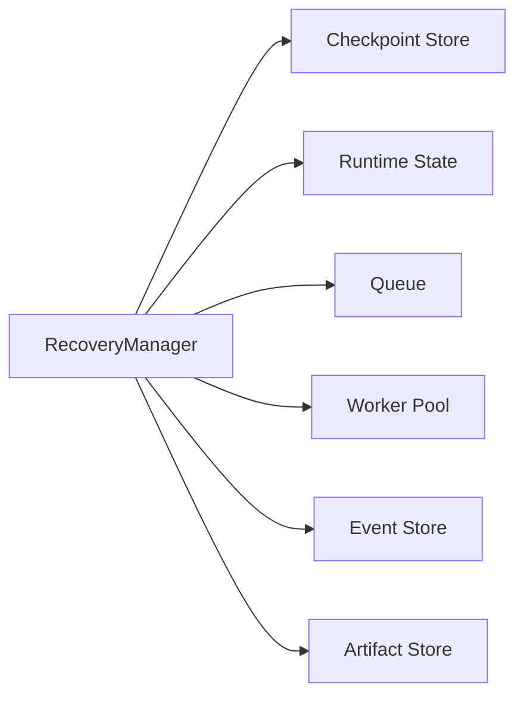
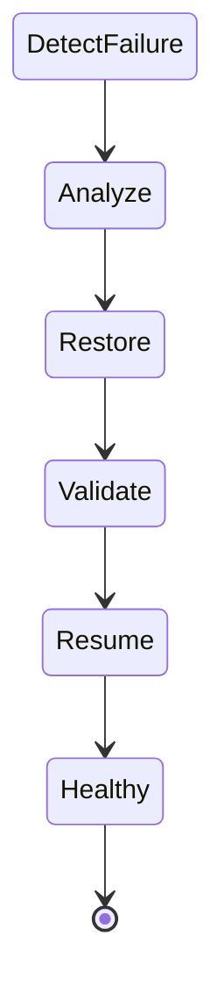
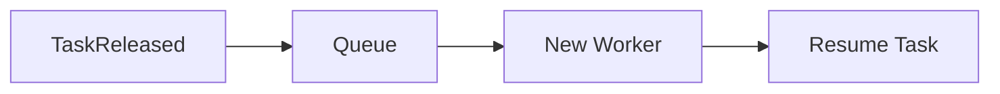
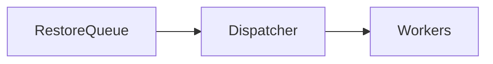
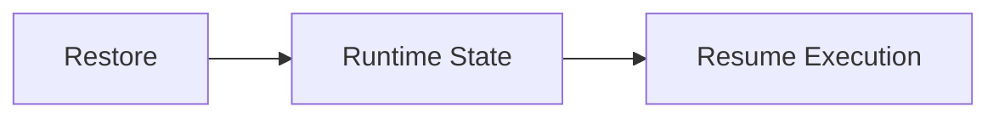
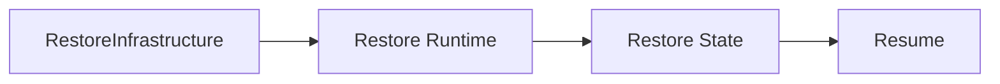
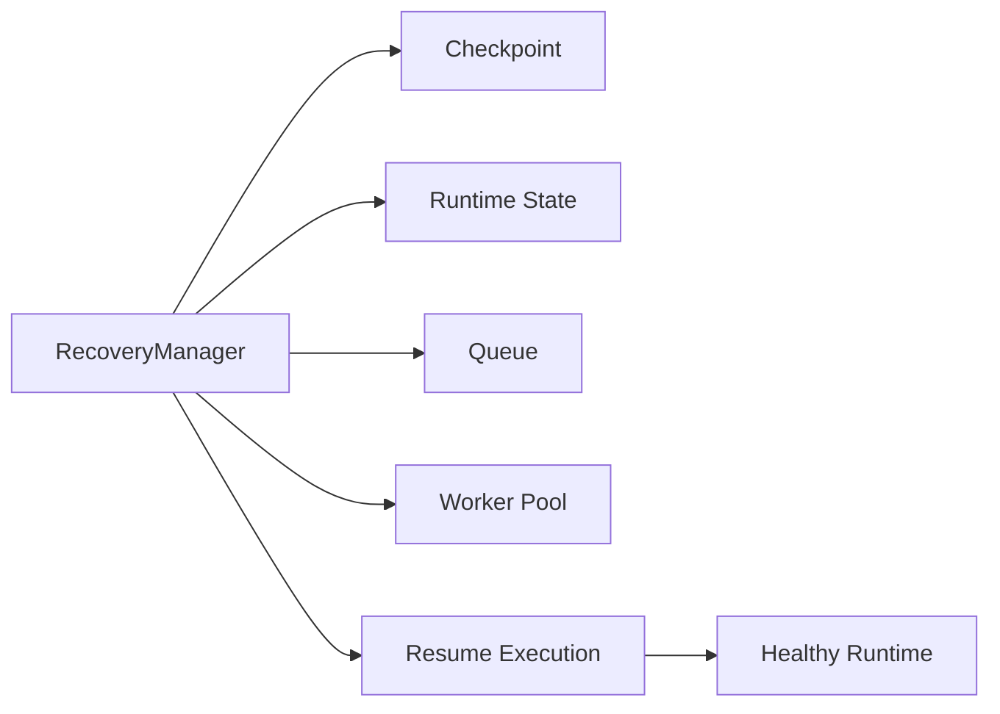

# Runtime Recovery

> AI Social OS Runtime Layer

Version: 2.0.0

Status: Draft

Last Updated: 2026-07-25

---

# Table of Contents

- Overview
- Why Runtime Recovery
- Design Principles
- Responsibilities
- Recovery Architecture
- Failure Types
- Recovery Lifecycle
- Checkpoint Strategy
- Execution Recovery
- Worker Recovery
- Queue Recovery
- State Recovery
- Disaster Recovery
- Monitoring
- Design Decisions

---

# Overview

Runtime Recovery là thành phần chịu trách nhiệm khôi phục hệ thống sau khi xảy ra lỗi mà không làm mất dữ liệu hoặc Execution đang chạy.

Recovery không chỉ xử lý việc khởi động lại Runtime mà còn đảm bảo:

- Execution tiếp tục từ trạng thái gần nhất
- Queue không mất Task
- Worker được thay thế
- Runtime State được đồng bộ
- Artifact không bị mất
- Event không bị thất lạc

Recovery giúp Runtime đạt khả năng High Availability.

---

# Why Runtime Recovery

Nếu Runtime bị dừng đột ngột.

```mermaid
flowchart LR
```

thì có thể xảy ra.

- Task bị mất
- Queue mất dữ liệu
- Execution dở dang
- Worker biến mất
- Progress sai
- State không nhất quán

Recovery đảm bảo Runtime có thể tiếp tục hoạt động thay vì bắt đầu lại từ đầu.

---

# Design Principles

Runtime Recovery được xây dựng theo các nguyên tắc:

- Fail Safe
- Idempotent
- Durable
- Checkpoint Based
- Event Driven
- Eventually Consistent
- Automatic Recovery
- Observable

---

# Responsibilities

Runtime Recovery chịu trách nhiệm:

- Detect Failure
- Restore Runtime State
- Recover Queue
- Recover Workers
- Resume Execution
- Validate Consistency
- Publish Recovery Events
- Support Disaster Recovery

---

# Recovery Architecture



---

# Failure Types

Recovery xử lý nhiều loại lỗi.

```
Worker Crash

Runtime Crash

Database Restart

Queue Failure

Provider Failure

Connector Failure

Storage Failure

Node Failure
```

Mỗi loại lỗi có chiến lược Recovery riêng.

---

# Recovery Lifecycle



---

# Failure Detection

Recovery Manager phát hiện lỗi thông qua.

- Heartbeat Timeout
- Health Check
- Queue Timeout
- Database Health
- Event Bus
- Metrics

Nếu thành phần không phản hồi trong khoảng thời gian cho phép, quá trình Recovery sẽ được kích hoạt.

---

# Checkpoint Strategy

Runtime tạo Checkpoint định kỳ.

```text
Checkpoint

├── Execution State

├── Variables

├── Outputs

├── Queue Position

├── Active Tasks

└── Timestamp
```

Checkpoint giúp giảm lượng công việc cần khôi phục.

---

# Execution Recovery


Execution tiếp tục từ Checkpoint gần nhất thay vì chạy lại toàn bộ.

---

# Worker Recovery

Nếu Worker gặp sự cố.



Task chưa hoàn thành sẽ được đưa trở lại Queue.

---

# Queue Recovery

Queue được lưu trên Persistent Storage.



Task đang chờ sẽ không bị mất sau khi Runtime khởi động lại.

---

# Runtime State Recovery

Runtime State được khôi phục từ Snapshot gần nhất.



Version của State được kiểm tra trước khi Resume.

---

# Event Recovery

Nếu Event Bus dừng hoạt động.


Các Subscriber sẽ nhận lại những Event chưa xử lý.

---

# Artifact Recovery

Artifacts không được lưu trong Runtime Memory.

Runtime chỉ khôi phục Metadata.

```mermaid
flowchart LR
```

Không cần sao chép lại dữ liệu lớn.

---

# Consistency Validation

Sau khi khôi phục.

Recovery Manager kiểm tra.

- Queue Consistency
- Runtime State
- Execution Status
- Task Ownership
- Worker Availability
- Artifact References

Nếu phát hiện sai lệch, Runtime sẽ thực hiện đồng bộ trước khi Resume.

---

# Disaster Recovery

Trong trường hợp mất toàn bộ Node.



Disaster Recovery dựa trên Backup và Snapshot.

---

# Recovery Policies

Ví dụ.

| Failure | Action |
|----------|--------|
| Worker Crash | Reassign Task |
| Queue Failure | Restore Queue |
| Runtime Restart | Restore Snapshot |
| Provider Timeout | Retry |
| Database Restart | Reconnect |
| Storage Failure | Retry Upload |

Policy có thể được cấu hình theo Workspace.

---

# Recovery Metrics

Theo dõi.

- Recovery Count
- Recovery Duration
- Recovery Success Rate
- Mean Time To Recovery
- Checkpoint Restore Time
- Resume Success Rate

---

# Recovery Events

Ví dụ.

- FailureDetected
- RecoveryStarted
- CheckpointLoaded
- StateRestored
- QueueRecovered
- WorkerRecovered
- ExecutionResumed
- RecoveryCompleted

---

# Monitoring

Recovery Manager theo dõi.

- Worker Health
- Queue Health
- Database Health
- Storage Health
- Event Bus Health
- Provider Health

Nếu phát hiện lỗi lặp lại nhiều lần, Runtime sẽ tạo Security hoặc System Alert.

---

# Design Decisions

| Decision | Reason |
|-----------|--------|
| Checkpoint Based Recovery | Giảm thời gian khôi phục |
| Persistent Queue | Không mất Task |
| Event Replay | Khôi phục Subscriber |
| Worker Reassignment | Tăng tính sẵn sàng |
| Snapshot Restore | Resume nhanh |
| Validation sau Recovery | Đảm bảo nhất quán |
| Automatic Recovery | Giảm can thiệp thủ công |

---

# Runtime Flow



---

# Summary

Runtime Recovery là cơ chế đảm bảo AI Social OS Runtime có thể tự động khôi phục sau các sự cố như Worker Crash, Runtime Restart, Queue Failure hoặc Storage Failure mà không làm mất Execution hoặc dữ liệu quan trọng.

Thông qua Checkpoint, Snapshot, Persistent Queue, Event Replay và Validation, Runtime Recovery giúp hệ thống đạt khả năng High Availability, giảm thời gian gián đoạn và đảm bảo các Execution có thể tiếp tục từ trạng thái gần nhất một cách an toàn và nhất quán.