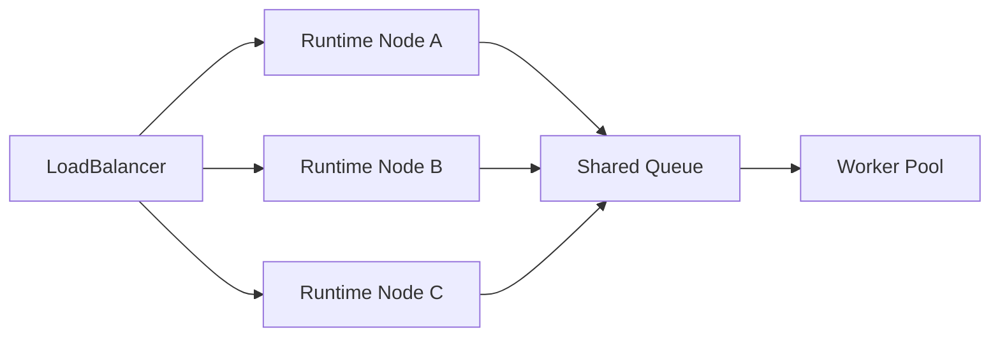
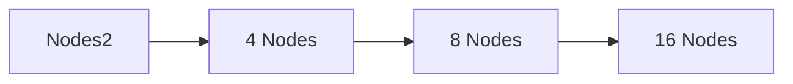
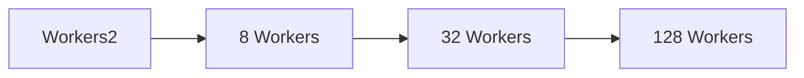
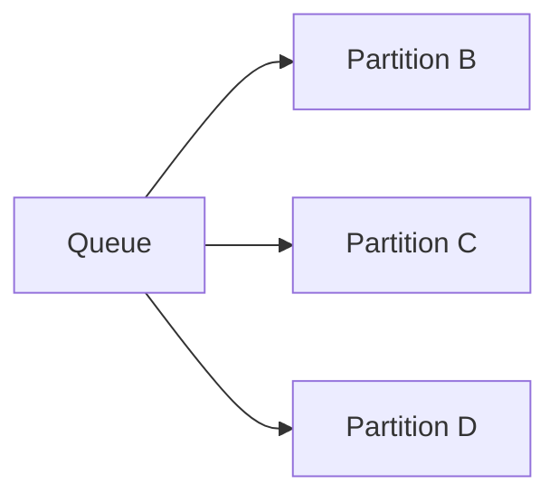
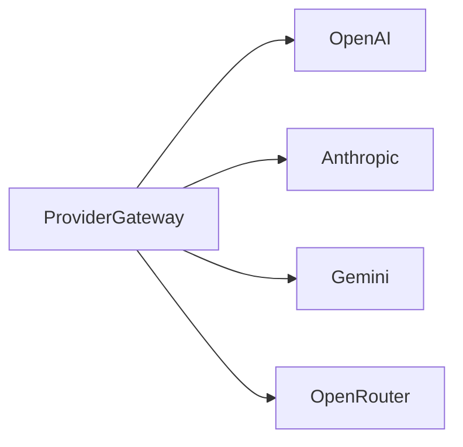
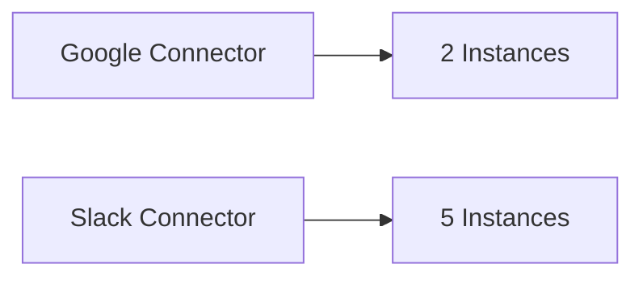
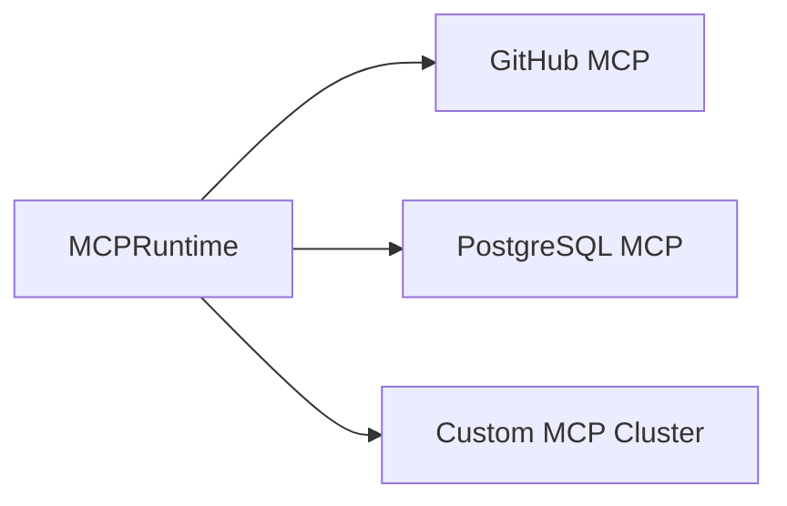
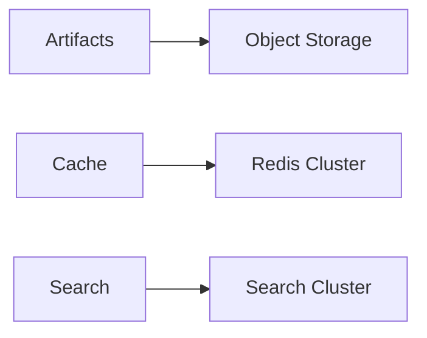
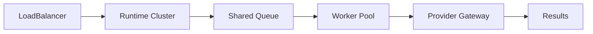

# Runtime Scaling

> AI Social OS Runtime Layer

Version: 2.0.0

Status: Draft

Last Updated: 2026-07-25

---

# Table of Contents

- Overview
- Why Runtime Scaling
- Design Principles
- Responsibilities
- Scaling Architecture
- Horizontal Scaling
- Vertical Scaling
- Worker Scaling
- Queue Scaling
- Provider Scaling
- Storage Scaling
- Autoscaling
- Load Balancing
- Capacity Planning
- Monitoring
- Design Decisions

---

# Overview

Runtime Scaling là cơ chế giúp AI Social OS Runtime mở rộng năng lực xử lý khi khối lượng công việc tăng lên.

Mục tiêu của Runtime Scaling là:

- tăng Throughput
- giảm Latency
- duy trì High Availability
- tối ưu chi phí
- đảm bảo khả năng xử lý hàng triệu Execution

Scaling được thiết kế ngay từ đầu thay vì bổ sung sau này.

---

# Why Runtime Scaling

Nếu Runtime chỉ có một Node.

```mermaid
flowchart LR
```

Khi lượng Execution tăng.

- Queue dài
- Worker quá tải
- Provider Timeout
- Latency tăng
- Throughput giảm

Do đó Runtime cần khả năng mở rộng linh hoạt.

---

# Design Principles

Runtime Scaling được xây dựng theo các nguyên tắc:

- Horizontal First
- Stateless Components
- Elastic
- Event Driven
- Cost Efficient
- Fault Tolerant
- Auto Recovering
- Observable

---

# Responsibilities

Runtime Scaling chịu trách nhiệm:

- Scale Workers
- Scale Runtime Nodes
- Scale Queue Consumers
- Scale Providers
- Balance Load
- Predict Capacity
- Optimize Resource Usage
- Prevent Overload

---

# Scaling Architecture



---

# Horizontal Scaling

Runtime ưu tiên mở rộng theo chiều ngang.



Mỗi Runtime Node hoạt động độc lập nhưng chia sẻ cùng Runtime Storage và Queue.

---

# Vertical Scaling

Trong một số trường hợp.

Có thể tăng:

- CPU
- Memory
- GPU
- Network Bandwidth

Vertical Scaling phù hợp với Worker chuyên biệt như Video Rendering hoặc Large LLM.

---

# Stateless Runtime

Runtime Node không lưu State cục bộ.

```mermaid
flowchart LR
```

Nhờ đó có thể:

- thêm Node
- xóa Node
- thay thế Node

mà không ảnh hưởng Execution.

---

# Worker Scaling

Worker Pool có thể mở rộng độc lập.



Mỗi loại Worker có Autoscaler riêng.

Ví dụ.

- LLM Worker
- Browser Worker
- Image Worker
- Video Worker
- Data Worker

---

# Queue Scaling

Queue được Partition.



Dispatcher có thể đọc song song từ nhiều Partition.

---

# Provider Scaling

Provider Gateway hỗ trợ nhiều Provider cùng lúc.



Gateway có thể:

- Load Balance
- Failover
- Route theo Policy

---

# Connector Scaling

Connector Gateway cũng mở rộng độc lập.



Mỗi Connector có hàng đợi riêng.

---

# MCP Scaling

MCP Runtime hỗ trợ nhiều MCP Server.



Có thể Scale từng MCP Server độc lập.

---

# Storage Scaling

Storage được mở rộng theo từng lớp.



Không cần Scale toàn bộ Storage cùng lúc.

---

# Autoscaling

Autoscaler theo dõi.

- Queue Length
- CPU Usage
- Memory Usage
- Active Workers
- Average Latency
- Task Waiting Time

```mermaid
flowchart LR
```

---

# Scale In

Khi tải giảm.

```mermaid
flowchart LR
```

Scale In phải đảm bảo không dừng Worker đang xử lý Task.

---

# Load Balancing

Runtime sử dụng Load Balancer trước Runtime Nodes.

Các chiến lược phổ biến.

- Round Robin
- Least Connections
- Weighted Routing
- Latency Based Routing

Tùy theo môi trường triển khai.

---

# Capacity Planning

Runtime theo dõi.

- Average Daily Executions
- Peak Concurrent Executions
- Queue Growth
- Provider Usage
- Storage Growth

Các số liệu này được dùng để lập kế hoạch mở rộng.

---

# Scaling Policies

Ví dụ.

| Metric | Action |
|---------|--------|
| Queue > 1,000 | +5 Workers |
| CPU > 80% | +1 Runtime Node |
| Memory > 85% | Scale Runtime |
| Queue Idle | Scale In |
| Provider Rate Limit | Route sang Provider khác |

Policy có thể cấu hình theo Workspace hoặc System.

---

# Monitoring

Theo dõi.

- Active Runtime Nodes
- Worker Count
- Queue Length
- Scaling Events
- Autoscaler Decisions
- Resource Utilization
- Cost Estimation

---

# Scaling Events

Ví dụ.

- ScaleOutStarted
- ScaleOutCompleted
- ScaleInStarted
- ScaleInCompleted
- WorkerAdded
- WorkerRemoved
- RuntimeNodeAdded
- RuntimeNodeRemoved

---

# Design Decisions

| Decision | Reason |
|-----------|--------|
| Horizontal First | Dễ mở rộng |
| Stateless Runtime | Scale linh hoạt |
| Worker Pool riêng | Tối ưu từng loại tác vụ |
| Queue Partitioning | Tăng Throughput |
| Shared Runtime State | Đồng bộ toàn hệ thống |
| Autoscaling | Tự động thích ứng |
| Provider Failover | Tăng độ sẵn sàng |

---

# Runtime Flow



---

# Summary

Runtime Scaling là cơ chế mở rộng của AI Social OS Runtime, cho phép Runtime Node, Worker Pool, Queue, Provider Gateway, Connector Gateway, MCP Runtime và Storage tăng hoặc giảm tài nguyên một cách độc lập.

Thông qua kiến trúc Stateless, Shared Runtime State, Queue Partitioning và Autoscaling, Runtime có thể xử lý lượng lớn Execution với độ trễ thấp, duy trì High Availability và tối ưu chi phí vận hành khi quy mô hệ thống ngày càng tăng.