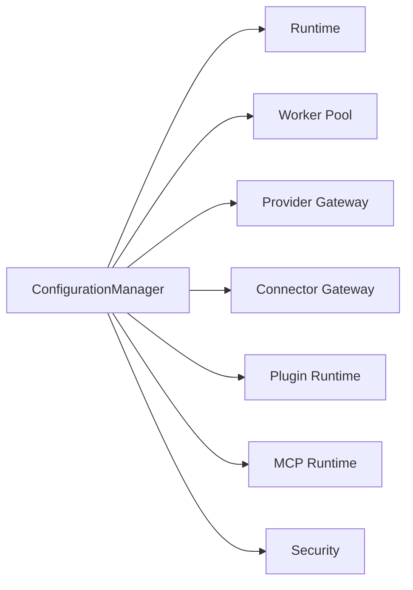
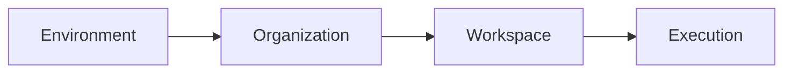
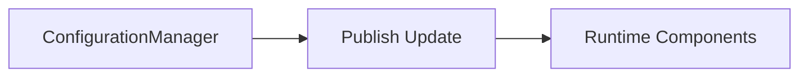
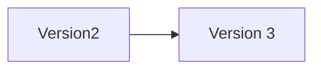
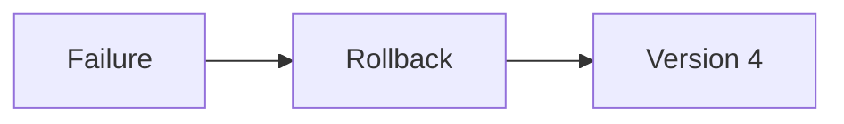
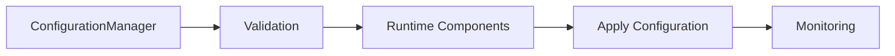

# Runtime Configuration

> AI Social OS Runtime Layer

Version: 2.0.0

Status: Draft

Last Updated: 2026-07-25

---

# Table of Contents

- Overview
- Why Runtime Configuration
- Design Principles
- Responsibilities
- Configuration Architecture
- Configuration Hierarchy
- Configuration Sources
- Runtime Configuration Model
- Dynamic Configuration
- Configuration Validation
- Feature Flags
- Secrets & Sensitive Configuration
- Configuration Versioning
- Monitoring
- Design Decisions

---

# Overview

Runtime Configuration là hệ thống quản lý toàn bộ cấu hình của AI Social OS Runtime.

Thay vì cấu hình được phân tán trong mã nguồn hoặc từng dịch vụ riêng lẻ, Runtime Configuration cung cấp một cơ chế tập trung để quản lý mọi tham số ảnh hưởng đến quá trình vận hành.

Configuration có thể áp dụng cho:

- Runtime
- Worker
- Queue
- Provider
- Connector
- MCP Runtime
- Plugin Runtime
- Storage
- Security
- Workspace

---

# Why Runtime Configuration

Nếu mỗi thành phần tự đọc file cấu hình.

```mermaid
flowchart LR
```

```mermaid
flowchart LR
```

```mermaid
flowchart LR
```

sẽ dẫn đến:

- cấu hình không nhất quán
- khó triển khai
- khó cập nhật
- khó kiểm soát phiên bản
- khó Audit

Runtime Configuration tập trung toàn bộ cấu hình vào một hệ thống thống nhất.

---

# Design Principles

Runtime Configuration được xây dựng theo các nguyên tắc:

- Centralized
- Versioned
- Dynamic
- Validated
- Secure
- Workspace Aware
- Environment Aware
- Observable

---

# Responsibilities

Runtime Configuration chịu trách nhiệm:

- Load Configuration
- Validate Configuration
- Publish Configuration
- Update Configuration
- Track Configuration Changes
- Manage Feature Flags
- Support Environment Profiles
- Support Workspace Overrides

---

# Configuration Architecture



---

# Configuration Hierarchy

Configuration được áp dụng theo thứ tự ưu tiên.



Cấu hình ở cấp thấp hơn có thể ghi đè cấu hình ở cấp cao hơn.

---

# Configuration Sources

Runtime có thể đọc cấu hình từ.

- Configuration Database
- YAML
- JSON
- Environment Variables
- Secret Manager
- Remote Configuration Service

Nguồn cấu hình được hợp nhất trước khi phân phối.

---

# Runtime Configuration Model

```typescript
RuntimeConfiguration

├── runtime

├── workers

├── providers

├── connectors

├── plugins

├── storage

├── security

├── monitoring

└── featureFlags
```

---

# Runtime Configuration

Ví dụ.

```yaml
runtime:

maxConcurrentExecutions: 500

executionTimeout: 30m

heartbeatInterval: 10s

checkpointInterval: 60s
```

---

# Worker Configuration

Ví dụ.

```yaml
workers:

llm:

maxInstances: 20

browser:

maxInstances: 10

image:

maxInstances: 8
```

---

# Queue Configuration

Ví dụ.

```yaml
queue:

retryLimit: 5

visibilityTimeout: 60s

maxQueueLength: 100000

priorityEnabled: true
```

---

# Provider Configuration

Ví dụ.

```yaml
providers:

default: openai

fallback:

- anthropic

- gemini

timeout: 60s

retry: 3
```

---

# Dynamic Configuration

Một số cấu hình có thể thay đổi khi Runtime đang hoạt động.



Không cần khởi động lại hệ thống.

---

# Hot Reload

Các thành phần hỗ trợ Hot Reload.


Các Execution đang chạy không bị ảnh hưởng nếu thay đổi không liên quan trực tiếp.

---

# Configuration Validation

Mọi cấu hình đều được kiểm tra.

- Schema
- Required Fields
- Data Types
- Range Validation
- Dependency Validation

Nếu không hợp lệ.

```
Reject Configuration
```

---

# Feature Flags

Runtime hỗ trợ Feature Flag.

Ví dụ.

```yaml
featureFlags:

enableMemoryV2: true

enableNewScheduler: false

enableExperimentalProvider: true
```

Feature Flag giúp triển khai dần các tính năng mới.

---

# Workspace Override

Workspace có thể ghi đè cấu hình hệ thống.

Ví dụ.

```yaml
workspace:

marketing

provider:

default: anthropic
```

Workspace khác vẫn sử dụng cấu hình mặc định.

---

# Environment Profiles

Ví dụ.

```text
Development

Testing

Staging

Production
```

Mỗi Environment có cấu hình riêng.

---

# Secret Configuration

Các giá trị nhạy cảm không lưu trực tiếp trong Configuration.

Ví dụ.

```yaml
provider:

apiKey:

secret://openai-api-key
```

Runtime lấy giá trị thực từ Secret Manager.

---

# Configuration Versioning

Mỗi lần thay đổi sẽ tạo Version mới.



Version phục vụ.

- Rollback
- Audit
- Change Tracking

---

# Rollback

Nếu cấu hình mới gây lỗi.



Runtime có thể quay về phiên bản ổn định trước đó.

---

# Configuration Events

Ví dụ.

- ConfigurationLoaded
- ConfigurationUpdated
- ConfigurationReloaded
- ValidationFailed
- RollbackCompleted
- FeatureFlagChanged

---

# Monitoring

Theo dõi.

- Configuration Changes
- Reload Count
- Validation Errors
- Rollback Count
- Active Feature Flags
- Configuration Version

---

# Design Decisions

| Decision | Reason |
|-----------|--------|
| Configuration tập trung | Quản lý thống nhất |
| Dynamic Reload | Không cần Restart |
| Versioning | Rollback dễ dàng |
| Feature Flags | Triển khai an toàn |
| Workspace Override | Linh hoạt theo khách hàng |
| Secret Manager | Không lộ thông tin nhạy cảm |
| Schema Validation | Giảm lỗi cấu hình |

---

# Runtime Flow



---

# Summary

Runtime Configuration là hệ thống quản lý cấu hình tập trung của AI Social OS Runtime, cung cấp cơ chế nạp, kiểm tra, phân phối và cập nhật cấu hình cho toàn bộ Runtime Components.

Thông qua Configuration Hierarchy, Dynamic Reload, Feature Flags, Versioning và Secret Integration, Runtime có thể thay đổi hành vi vận hành một cách linh hoạt, an toàn và nhất quán mà không làm gián đoạn các Execution đang chạy.