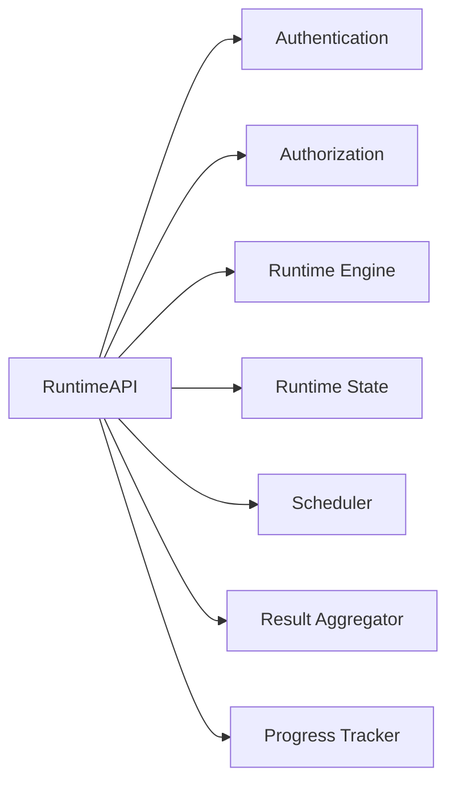
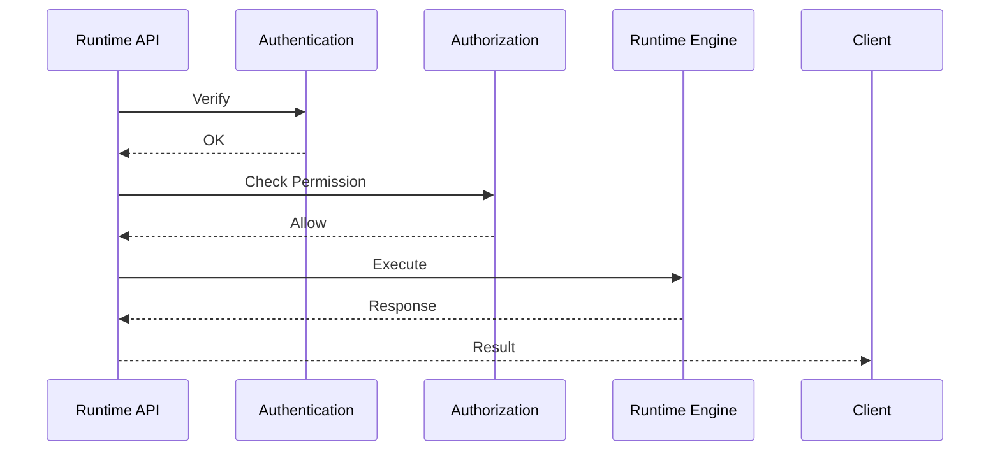
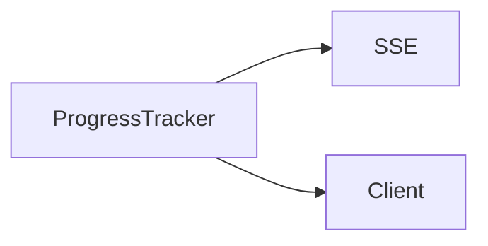
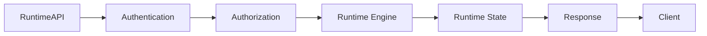

# Runtime API

> AI Social OS Runtime Layer

Version: 2.0.0

Status: Draft

Last Updated: 2026-07-25

---

# Table of Contents

- Overview
- Why Runtime API
- Design Principles
- Responsibilities
- API Architecture
- API Categories
- Authentication
- Request Lifecycle
- Execution APIs
- Task APIs
- Worker APIs
- Queue APIs
- Runtime APIs
- Streaming APIs
- Error Handling
- Versioning
- Monitoring
- Design Decisions

---

# Overview

Runtime API là giao diện chính để các thành phần bên ngoài tương tác với AI Social OS Runtime.

Runtime API cung cấp khả năng:

- tạo Execution
- truy vấn trạng thái
- điều khiển Execution
- theo dõi Progress
- lấy Result
- quản lý Runtime
- quản lý Worker
- quản lý Queue

Runtime API là lớp Public Interface của Runtime.

---

# Why Runtime API

Nếu Frontend hoặc Workflow Engine truy cập trực tiếp Runtime Components.

```mermaid
flowchart LR
```

sẽ dẫn đến:

- Coupling cao
- Khó bảo trì
- Không kiểm soát quyền
- Không thống nhất API

Thay vào đó.

```mermaid
flowchart LR
```

Runtime API đóng vai trò API Gateway nội bộ của Runtime.

---

# Design Principles

Runtime API được xây dựng theo các nguyên tắc:

- REST First
- Streaming Friendly
- Versioned
- Secure
- Stateless
- Observable
- Backward Compatible
- Workspace Aware

---

# Responsibilities

Runtime API chịu trách nhiệm:

- Receive Requests
- Validate Requests
- Authenticate Clients
- Authorize Access
- Route Commands
- Return Results
- Stream Progress
- Expose Runtime Status

---

# API Architecture



---

# API Categories

Runtime API được chia thành nhiều nhóm.

```text
Execution API

Task API

Worker API

Queue API

Runtime API

Monitoring API

Streaming API

Administration API
```

---

# Authentication

Mọi Request đều phải được xác thực.

Hỗ trợ.

- JWT
- OAuth 2.0
- API Key
- Service Account

Authentication được thực hiện trước khi Request vào Runtime.

---

# Authorization

Sau khi xác thực.

Runtime API kiểm tra.

- Workspace
- Role
- Permission
- Execution Ownership

Chỉ Request hợp lệ mới được xử lý.

---

# Request Lifecycle



---

# Execution APIs

Các API chính.

```text
POST

/executions
```

Tạo Execution mới.

---

```text
GET

/executions/{id}
```

Lấy thông tin Execution.

---

```text
GET

/executions
```

Danh sách Execution.

---

```text
DELETE

/executions/{id}
```

Hủy Execution.

---

```text
POST

/executions/{id}/pause
```

Tạm dừng.

---

```text
POST

/executions/{id}/resume
```

Tiếp tục.

---

```text
POST

/executions/{id}/retry
```

Thực thi lại.

---

# Task APIs

```text
GET

/tasks
```

Danh sách Task.

---

```text
GET

/tasks/{id}
```

Chi tiết Task.

---

```text
POST

/tasks/{id}/retry
```

Retry Task.

---

```text
POST

/tasks/{id}/cancel
```

Hủy Task.

---

# Worker APIs

```text
GET

/workers
```

Danh sách Worker.

---

```text
GET

/workers/{id}
```

Thông tin Worker.

---

```text
POST

/workers/{id}/drain
```

Drain Worker.

---

```text
POST

/workers/{id}/restart
```

Khởi động lại Worker.

---

# Queue APIs

```text
GET

/queue
```

Thông tin Queue.

---

```text
GET

/queue/stats
```

Thống kê Queue.

---

```text
POST

/queue/replay
```

Replay Dead Letter Queue.

---

# Runtime APIs

```text
GET

/runtime/health
```

Health Check.

---

```text
GET

/runtime/status
```

Runtime Status.

---

```text
GET

/runtime/version
```

Version.

---

```text
POST

/runtime/reload
```

Reload Configuration.

---

# Monitoring APIs

Ví dụ.

```text
GET

/metrics
```

---

```text
GET

/logs
```

---

```text
GET

/events
```

---

```text
GET

/traces
```

---

# Streaming APIs

Runtime hỗ trợ Streaming.



Streaming dùng cho.

- Progress
- Logs
- Events
- Notifications

---

# API Response Model

```typescript
ApiResponse<T>

├── success

├── data

├── error

├── metadata

└── requestId
```

Mọi API đều trả về cùng một cấu trúc.

---

# Error Model

```typescript
ApiError

├── code

├── message

├── details

├── requestId

└── timestamp
```

Ví dụ.

```json
{
  "code": "EXECUTION_NOT_FOUND",
  "message": "Execution does not exist."
}
```

---

# Pagination

Danh sách sử dụng Cursor Pagination.

```text
GET

/executions

?cursor=...

&limit=20
```

Không sử dụng Offset Pagination cho dữ liệu Runtime.

---

# Idempotency

Các API tạo Execution hỗ trợ.

```
Idempotency-Key
```

Giúp tránh tạo Execution trùng khi Client Retry.

---

# API Versioning

Runtime API sử dụng Version.

```text
/v1

/v2
```

Các thay đổi không tương thích sẽ tạo Version mới.

---

# Rate Limiting

Rate Limit theo.

- User
- Workspace
- API Key
- Service Account

Giúp bảo vệ Runtime khỏi Request quá mức.

---

# Monitoring

Theo dõi.

- Request Count
- Success Rate
- Error Rate
- Average Latency
- Active Connections
- Streaming Sessions

---

# API Events

Ví dụ.

- RequestReceived
- AuthenticationSucceeded
- AuthenticationFailed
- ExecutionCreated
- ExecutionCancelled
- StreamingConnected
- StreamingDisconnected

---

# Design Decisions

| Decision | Reason |
|-----------|--------|
| REST First | Đơn giản, phổ biến |
| Streaming riêng | Realtime Progress |
| Idempotency-Key | Tránh tạo trùng |
| Cursor Pagination | Scale tốt |
| Unified Response Model | API nhất quán |
| Versioned API | Dễ nâng cấp |
| Workspace Aware | Hỗ trợ Multi-tenancy |

---

# Runtime Flow



---

# Summary

Runtime API là lớp giao tiếp chính giữa các Client và AI Social OS Runtime, cung cấp tập hợp API thống nhất để quản lý Execution, Task, Worker, Queue và trạng thái của Runtime.

Thông qua Authentication, Authorization, Streaming, Versioning và Unified Response Model, Runtime API mang đến một giao diện ổn định, bảo mật và có khả năng mở rộng, giúp các ứng dụng bên ngoài tích hợp với Runtime một cách nhất quán và hiệu quả.