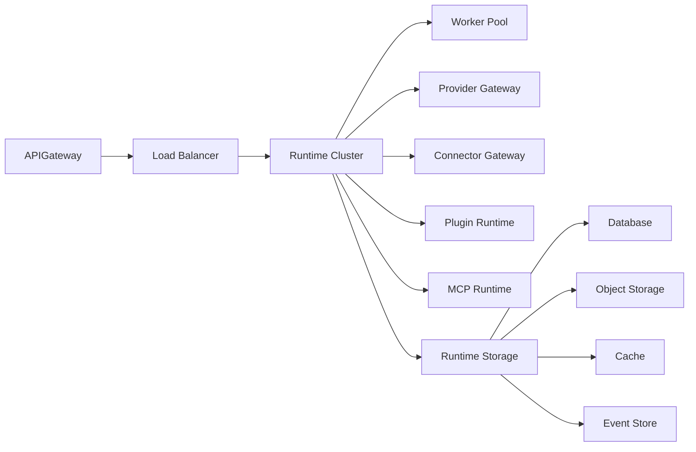
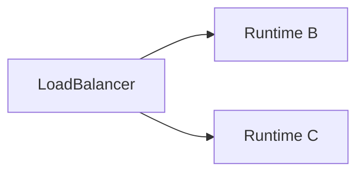
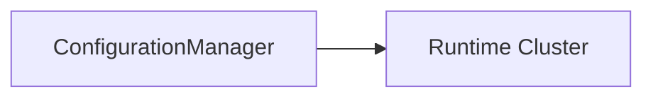
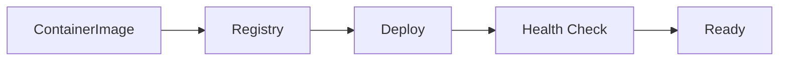
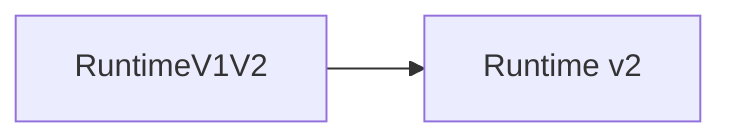
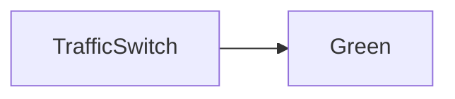
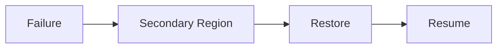
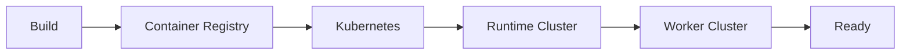

# Runtime Deployment

> AI Social OS Runtime Layer

Version: 2.0.0

Status: Draft

Last Updated: 2026-07-25

---

# Table of Contents

- Overview
- Goals
- Deployment Principles
- Deployment Architecture
- Deployment Models
- Runtime Components
- Infrastructure Topology
- High Availability
- Networking
- Service Discovery
- Configuration Management
- Deployment Workflow
- Rolling Updates
- Disaster Recovery
- Monitoring
- Design Decisions

---

# Overview

Runtime Deployment mô tả cách AI Social OS Runtime được triển khai trên môi trường thực tế.

Deployment không chỉ bao gồm Runtime Engine mà còn toàn bộ hệ sinh thái vận hành:

- Runtime Cluster
- Worker Pool
- Queue
- Storage
- Provider Gateway
- Connector Gateway
- Plugin Runtime
- MCP Runtime
- Monitoring
- Security

Deployment được thiết kế để hỗ trợ:

- Cloud
- On-Premise
- Hybrid Cloud
- Kubernetes
- Docker

---

# Goals

Deployment hướng tới các mục tiêu.

- High Availability
- Horizontal Scalability
- Fault Tolerance
- Easy Upgrades
- Secure Networking
- Zero Downtime Deployment
- Infrastructure Agnostic

---

# Deployment Principles

Runtime Deployment được xây dựng theo các nguyên tắc:

- Container First
- Stateless Services
- Immutable Infrastructure
- Infrastructure as Code
- Auto Recovery
- Self Healing
- Declarative Deployment

---

# Deployment Architecture



---

# Deployment Models

Runtime hỗ trợ nhiều mô hình triển khai.

## Development

```mermaid
flowchart LR
```

Phù hợp cho phát triển và thử nghiệm.

---

## Staging

```mermaid
flowchart LR
```

Phù hợp kiểm thử trước Production.

---

## Production

```mermaid
flowchart LR
```

Phù hợp môi trường thực tế.

---

## Enterprise

```mermaid
flowchart LR
```

Phục vụ doanh nghiệp lớn.

---

# Runtime Components

Một cụm Runtime bao gồm.

```text
Runtime Cluster

├── Runtime Engine

├── Scheduler

├── Dispatcher

├── Queue

├── Runtime State

├── Event Bus

├── Progress Tracker

├── Result Aggregator

├── API

└── Configuration Manager
```

---

# Worker Cluster

Worker được triển khai riêng.

```text
Worker Cluster

├── LLM Workers

├── Browser Workers

├── Image Workers

├── Video Workers

├── Data Workers

└── Automation Workers
```

Worker có thể Scale độc lập với Runtime.

---

# Shared Infrastructure

Các thành phần dùng chung.

```text
Shared Infrastructure

├── PostgreSQL

├── Redis

├── Object Storage

├── Event Store

├── Search Engine

└── Metrics Database
```

---

# High Availability



Nếu một Runtime Node gặp sự cố.

Load Balancer tự động chuyển lưu lượng sang Node khác.

---

# Networking

Kiến trúc mạng.


Các dịch vụ nội bộ không được truy cập trực tiếp từ Internet.

---

# Service Discovery

Runtime Components sử dụng Service Discovery.

Ví dụ.

```mermaid
flowchart LR
```

không cần biết địa chỉ IP cụ thể.

Việc định tuyến được thực hiện thông qua hệ thống Discovery.

---

# Configuration Management

Mọi Runtime Node đều nhận cấu hình từ Configuration Manager.



Các Node luôn sử dụng cùng một phiên bản cấu hình.

---

# Deployment Workflow



Deployment chỉ hoàn tất khi Health Check thành công.

---

# Rolling Updates



Runtime hỗ trợ Rolling Update để tránh gián đoạn dịch vụ.

---

# Blue-Green Deployment



Cho phép chuyển đổi phiên bản với thời gian gián đoạn gần như bằng không.

---

# Canary Deployment

Một phần nhỏ lưu lượng được chuyển sang phiên bản mới.


Nếu ổn định.

Toàn bộ lưu lượng sẽ được chuyển sang phiên bản mới.

---

# Infrastructure as Code

Toàn bộ hạ tầng được mô tả bằng mã.

Ví dụ.

- Terraform
- OpenTofu
- Helm
- Kubernetes Manifests

Giúp tái tạo môi trường một cách nhất quán.

---

# Disaster Recovery



Deployment hỗ trợ Multi-Region khi cần yêu cầu tính sẵn sàng cao.

---

# Health Checks

Mỗi thành phần phải cung cấp.

- Liveness Probe
- Readiness Probe
- Startup Probe

Health Check được sử dụng bởi Orchestrator để tự động khôi phục dịch vụ.

---

# Monitoring

Theo dõi.

- Active Nodes
- Worker Count
- Resource Usage
- Deployment Status
- Failed Pods
- Restart Count
- Availability
- Upgrade Progress

---

# Deployment Events

Ví dụ.

- DeploymentStarted
- DeploymentCompleted
- DeploymentFailed
- RuntimeScaled
- RuntimeRestarted
- WorkerAdded
- WorkerRemoved
- HealthCheckFailed

---

# Design Decisions

| Decision | Reason |
|-----------|--------|
| Container First | Triển khai nhất quán |
| Stateless Runtime | Scale dễ dàng |
| Worker Cluster riêng | Tối ưu tài nguyên |
| Rolling Update | Không gián đoạn dịch vụ |
| Blue-Green Support | Giảm rủi ro nâng cấp |
| IaC | Tự động hóa hạ tầng |
| Multi Region Ready | High Availability |

---

# Deployment Flow



---

# Summary

Runtime Deployment mô tả cách triển khai AI Social OS Runtime trên các môi trường từ Development đến Enterprise Production.

Thông qua kiến trúc Container First, Stateless Runtime, Worker Cluster độc lập, Infrastructure as Code và các chiến lược triển khai như Rolling Update, Blue-Green và Canary Deployment, hệ thống có thể mở rộng linh hoạt, nâng cấp an toàn và duy trì khả năng hoạt động liên tục ngay cả khi xảy ra sự cố hạ tầng.