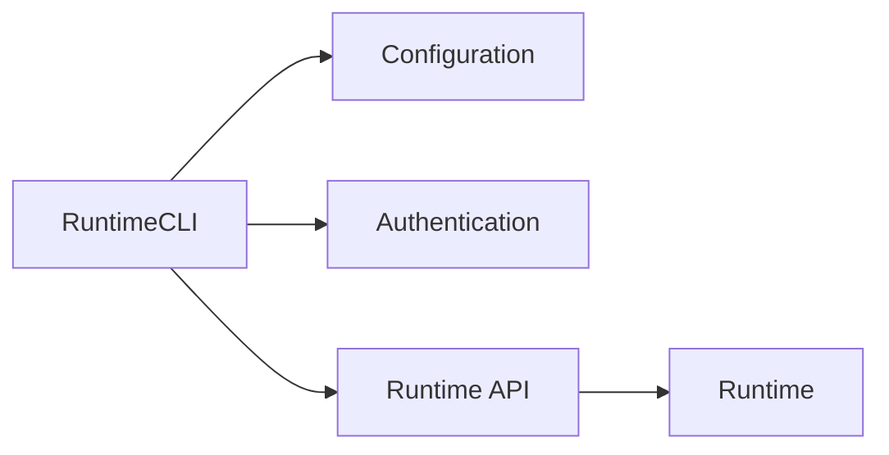
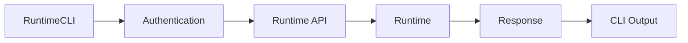

# Runtime CLI

> AI Social OS Runtime Layer

Version: 2.0.0

Status: Draft

Last Updated: 2026-07-25

---

# Table of Contents

- Overview
- Goals
- Design Principles
- Responsibilities
- CLI Architecture
- Command Structure
- Authentication
- Workspace Management
- Execution Commands
- Runtime Commands
- Worker Commands
- Queue Commands
- Monitoring Commands
- Configuration Commands
- Plugin Commands
- MCP Commands
- Automation
- Design Decisions

---

# Overview

Runtime CLI là giao diện dòng lệnh chính thức của AI Social OS Runtime.

CLI cho phép Developer, DevOps và Administrator quản lý Runtime mà không cần sử dụng Dashboard hoặc gọi trực tiếp Runtime API.

CLI hoạt động như một Client của Runtime API.

```mermaid
flowchart LR
```

CLI không truy cập trực tiếp Database hoặc Runtime Components.

---

# Goals

Runtime CLI hướng đến các mục tiêu.

- Simple
- Scriptable
- Secure
- Cross Platform
- Automation Friendly
- Human Readable
- Machine Readable

---

# Design Principles

Runtime CLI được xây dựng theo các nguyên tắc:

- API First
- Stateless
- Workspace Aware
- Secure by Default
- Idempotent
- Extensible
- Consistent UX

---

# Responsibilities

Runtime CLI chịu trách nhiệm.

- Authenticate User
- Execute Runtime Commands
- Query Runtime
- Display Results
- Export Data
- Stream Logs
- Manage Configuration
- Automate Operations

---

# CLI Architecture



---

# Command Structure

Runtime CLI sử dụng cấu trúc.

```text
runtime

├── auth

├── workspace

├── execution

├── task

├── worker

├── queue

├── runtime

├── config

├── logs

├── metrics

├── plugin

├── mcp

└── version
```

---

# Authentication

Đăng nhập.

```bash
runtime auth login
```

Đăng xuất.

```bash
runtime auth logout
```

Hiển thị thông tin.

```bash
runtime auth whoami
```

CLI lưu Session cục bộ và tự động gửi Access Token cho Runtime API.

---

# Workspace Management

Liệt kê Workspace.

```bash
runtime workspace list
```

Chuyển Workspace.

```bash
runtime workspace use marketing
```

Hiển thị Workspace hiện tại.

```bash
runtime workspace current
```

---

# Execution Commands

Tạo Execution.

```bash
runtime execution create workflow.yaml
```

Danh sách Execution.

```bash
runtime execution list
```

Chi tiết Execution.

```bash
runtime execution get exec-001
```

Theo dõi Progress.

```bash
runtime execution watch exec-001
```

Hủy Execution.

```bash
runtime execution cancel exec-001
```

---

# Task Commands

Danh sách Task.

```bash
runtime task list
```

Thông tin Task.

```bash
runtime task get task-012
```

Retry Task.

```bash
runtime task retry task-012
```

---

# Worker Commands

Danh sách Worker.

```bash
runtime worker list
```

Thông tin Worker.

```bash
runtime worker get llm-01
```

Drain Worker.

```bash
runtime worker drain llm-01
```

Restart Worker.

```bash
runtime worker restart llm-01
```

---

# Queue Commands

Thông tin Queue.

```bash
runtime queue status
```

Thống kê Queue.

```bash
runtime queue metrics
```

Replay Dead Letter Queue.

```bash
runtime queue replay
```

---

# Runtime Commands

Kiểm tra Runtime.

```bash
runtime status
```

Health Check.

```bash
runtime health
```

Reload Configuration.

```bash
runtime reload
```

---

# Monitoring Commands

Theo dõi Logs.

```bash
runtime logs
```

Theo dõi Metrics.

```bash
runtime metrics
```

Theo dõi Events.

```bash
runtime events
```

Theo dõi Trace.

```bash
runtime traces
```

---

# Configuration Commands

Xem cấu hình.

```bash
runtime config show
```

Kiểm tra cấu hình.

```bash
runtime config validate
```

Reload.

```bash
runtime config reload
```

---

# Plugin Commands

Danh sách Plugin.

```bash
runtime plugin list
```

Cài đặt.

```bash
runtime plugin install plugin-id
```

Gỡ bỏ.

```bash
runtime plugin uninstall plugin-id
```

---

# MCP Commands

Danh sách MCP.

```bash
runtime mcp list
```

Thông tin MCP.

```bash
runtime mcp get github
```

Kiểm tra kết nối.

```bash
runtime mcp health
```

---

# Output Formats

CLI hỗ trợ nhiều định dạng.

```bash
runtime execution list --output table
```

```bash
runtime execution list --output json
```

```bash
runtime execution list --output yaml
```

```bash
runtime execution list --output csv
```

---

# Streaming Mode

CLI hỗ trợ Streaming.

```bash
runtime execution watch exec-001
```

Hiển thị.

- Progress
- Logs
- Events
- ETA

theo thời gian thực.

---

# Exit Codes

| Code | Meaning |
|-------|---------|
| 0 | Success |
| 1 | General Error |
| 2 | Invalid Command |
| 3 | Authentication Failed |
| 4 | Permission Denied |
| 5 | Resource Not Found |
| 6 | Runtime Error |

---

# Automation

CLI được thiết kế để sử dụng trong.

- CI/CD
- Shell Scripts
- GitHub Actions
- Cron Jobs
- DevOps Pipelines

Ví dụ.

```bash
runtime execution create workflow.yaml \
    --wait \
    --output json
```

---

# Configuration File

CLI sử dụng cấu hình cục bộ.

```yaml
server:

https://runtime.example.com

workspace:

marketing

output:

table

timeout:

60s
```

---

# Monitoring

Theo dõi.

- CLI Version
- Active Sessions
- API Requests
- Failed Commands
- Authentication Status

---

# CLI Events

Ví dụ.

- LoginSucceeded
- LoginFailed
- CommandExecuted
- CommandFailed
- WorkspaceChanged
- ConfigurationReloaded

---

# Design Decisions

| Decision | Reason |
|-----------|--------|
| API First | Không phụ thuộc Runtime nội bộ |
| Workspace Aware | Hỗ trợ Multi-tenancy |
| Streaming Commands | Theo dõi Realtime |
| Structured Output | Phù hợp Automation |
| Stateless CLI | Đơn giản, dễ triển khai |
| Cross Platform | Windows, macOS, Linux |
| Script Friendly | Hỗ trợ DevOps |

---

# CLI Flow



---

# Summary

Runtime CLI là công cụ dòng lệnh chính thức của AI Social OS Runtime, cung cấp một giao diện thống nhất để quản lý Execution, Worker, Queue, Plugin, MCP và toàn bộ Runtime thông qua Runtime API.

Với thiết kế API First, Workspace Aware và hỗ trợ Streaming, Structured Output cùng Automation, Runtime CLI giúp Developer và DevOps dễ dàng vận hành, giám sát và tích hợp Runtime vào các quy trình CI/CD cũng như môi trường Production.