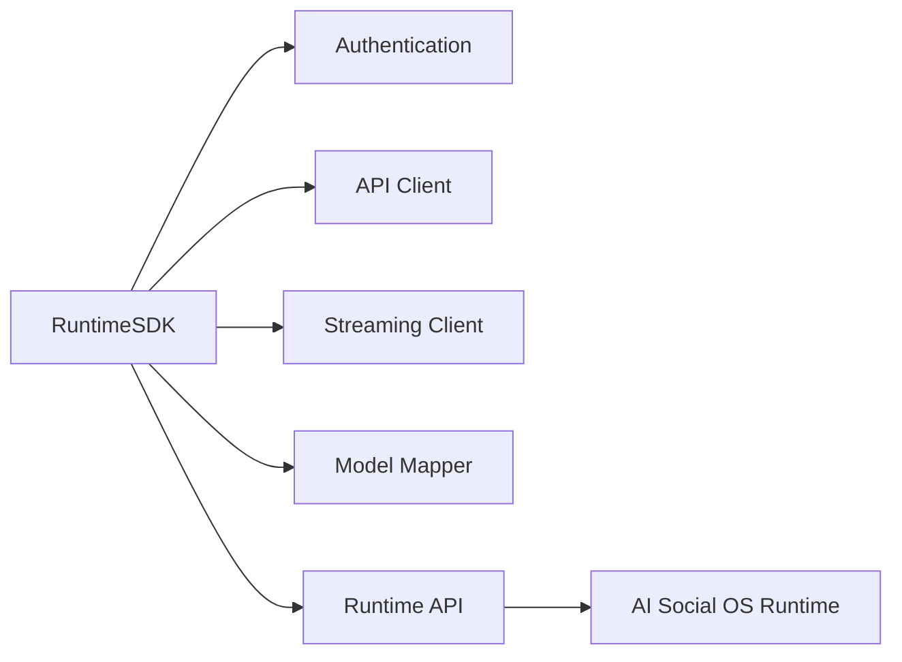
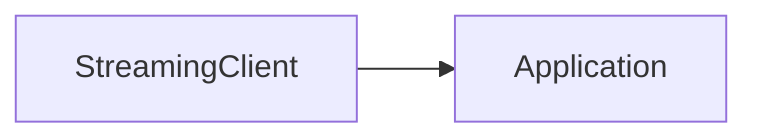
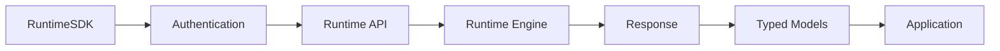

# Runtime SDK

> AI Social OS Runtime Layer

Version: 2.0.0

Status: Draft

Last Updated: 2026-07-25

---

# Table of Contents

- Overview
- Goals
- Design Principles
- Responsibilities
- SDK Architecture
- Supported Languages
- Authentication
- SDK Initialization
- Execution APIs
- Streaming APIs
- Runtime APIs
- Event APIs
- Error Handling
- Versioning
- Extensibility
- Monitoring
- Design Decisions

---

# Overview

Runtime SDK là bộ thư viện chính thức giúp các ứng dụng tích hợp với AI Social OS Runtime một cách đơn giản và nhất quán.

SDK đóng vai trò là lớp trừu tượng phía trên Runtime API, giúp lập trình viên không cần làm việc trực tiếp với HTTP Requests, Authentication hay Serialization.

```mermaid
flowchart LR
```

SDK không chứa Business Logic của Runtime.

Mọi xử lý đều được thực hiện bởi Runtime API.

---

# Goals

Runtime SDK hướng tới các mục tiêu.

- Developer Friendly
- Strongly Typed
- Cross Platform
- Easy Integration
- Consistent API
- Secure
- Extensible
- Backward Compatible

---

# Design Principles

Runtime SDK được xây dựng theo các nguyên tắc:

- API First
- Thin Client
- Typed Interface
- Async First
- Streaming Ready
- Workspace Aware
- Versioned
- Observable

---

# Responsibilities

Runtime SDK chịu trách nhiệm.

- Authenticate Client
- Call Runtime API
- Parse Responses
- Handle Streaming
- Retry Requests
- Manage Sessions
- Expose Typed Models
- Simplify Integration

---

# SDK Architecture



---

# Supported Languages

Runtime SDK được phát hành chính thức cho.

```text
TypeScript

Python

Go

Java

C#

Rust
```

Các SDK sử dụng cùng một Runtime API Specification.

---

# Package Structure

```text
runtime-sdk

├── auth

├── execution

├── task

├── runtime

├── worker

├── queue

├── events

├── streaming

├── models

├── errors

└── utils
```

---

# Authentication

SDK hỗ trợ.

- API Key
- OAuth 2.0
- JWT
- Service Account

Authentication được cấu hình khi khởi tạo SDK.

---

# SDK Initialization

Ví dụ.

```typescript
const runtime = new RuntimeClient({
    endpoint: "...",
    apiKey: "...",
    workspace: "marketing"
});
```

Sau khi khởi tạo.

SDK tự động quản lý.

- HTTP Client
- Authentication
- Retry
- Serialization

---

# Execution APIs

Tạo Execution.

```typescript
runtime.execution.create(...)
```

Lấy thông tin.

```typescript
runtime.execution.get(...)
```

Danh sách.

```typescript
runtime.execution.list(...)
```

Hủy.

```typescript
runtime.execution.cancel(...)
```

Theo dõi.

```typescript
runtime.execution.watch(...)
```

---

# Task APIs

```typescript
runtime.tasks.list()

runtime.tasks.get()

runtime.tasks.retry()
```

---

# Worker APIs

```typescript
runtime.workers.list()

runtime.workers.get()

runtime.workers.restart()
```

---

# Runtime APIs

```typescript
runtime.status()

runtime.health()

runtime.version()
```

---

# Streaming APIs

SDK hỗ trợ Streaming.



Streaming bao gồm.

- Progress
- Logs
- Events
- Notifications

---

# Event APIs

SDK có thể Subscribe Event.

```typescript
runtime.events.subscribe(...)
```

Ví dụ.

- Execution Started
- Execution Completed
- Task Failed
- Worker Added

---

# Typed Models

SDK cung cấp Model mạnh kiểu.

```typescript
Execution

Task

Worker

RuntimeStatus

QueueInfo

Event

LogEntry
```

Giúp giảm lỗi khi tích hợp.

---

# Error Handling

Mọi lỗi đều kế thừa.

```text
RuntimeError
```

Ví dụ.

```text
AuthenticationError

AuthorizationError

ValidationError

ExecutionError

NetworkError

TimeoutError
```

---

# Retry Strategy

SDK tự động Retry với.

- Network Failure
- Timeout
- Temporary Server Error

Không Retry với.

- Authentication Failed
- Validation Error
- Permission Denied

---

# Versioning

SDK sử dụng Semantic Versioning.

```text
Major.Minor.Patch
```

Ví dụ.

```
2.1.0
```

Breaking Changes chỉ xuất hiện khi thay đổi Major Version.

---

# Extensibility

SDK hỗ trợ.

- Custom Middleware
- Custom HTTP Client
- Custom Authentication
- Logging Hooks
- Request Interceptors
- Response Interceptors

Giúp tích hợp với hệ thống hiện có.

---

# Monitoring

SDK có thể ghi nhận.

- API Latency
- Retry Count
- Failed Requests
- Streaming Connections
- Active Sessions

Các thông tin này có thể được gửi đến hệ thống Observability.

---

# SDK Events

Ví dụ.

- ClientInitialized
- AuthenticationSucceeded
- AuthenticationFailed
- RequestStarted
- RequestCompleted
- StreamingConnected
- StreamingDisconnected

---

# Design Decisions

| Decision | Reason |
|-----------|--------|
| Thin Client | Logic tập trung tại Runtime |
| Strong Typing | Giảm lỗi tích hợp |
| Async First | Phù hợp Runtime bất đồng bộ |
| Streaming Ready | Hỗ trợ Realtime |
| Semantic Versioning | Dễ nâng cấp |
| Middleware Support | Linh hoạt mở rộng |
| Multi-language SDK | Phục vụ nhiều hệ sinh thái |

---

# SDK Flow



---

# Summary

Runtime SDK là bộ thư viện chính thức của AI Social OS Runtime, cung cấp giao diện lập trình thống nhất để các ứng dụng tích hợp với Runtime thông qua các API mạnh kiểu và hỗ trợ Streaming.

Thông qua kiến trúc Thin Client, Typed Models, Authentication tích hợp và khả năng mở rộng bằng Middleware, Runtime SDK giúp rút ngắn thời gian phát triển, giảm độ phức tạp khi tích hợp và đảm bảo trải nghiệm nhất quán trên nhiều ngôn ngữ lập trình.