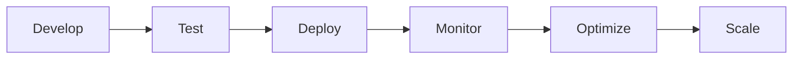

# Runtime Best Practices

> AI Social OS Runtime Layer

Version: 2.0.0

Status: Draft

Last Updated: 2026-07-25

---

# Table of Contents

- Overview
- Objectives
- Core Principles
- Runtime Design
- Execution Design
- Task Design
- Worker Design
- Queue Design
- State Management
- Error Handling
- Performance
- Security
- Observability
- Scalability
- Deployment
- Anti-patterns
- Design Decisions

---

# Overview

Tài liệu này tổng hợp các Best Practices khi xây dựng, mở rộng và vận hành AI Social OS Runtime.

Các nguyên tắc dưới đây được áp dụng cho toàn bộ Runtime Components nhằm đảm bảo:

- khả năng mở rộng
- hiệu năng
- tính ổn định
- khả năng bảo trì
- tính nhất quán

Đây là tài liệu hướng dẫn dành cho Developer, Architect và DevOps.

---

# Objectives

Runtime Best Practices hướng đến.

- High Performance
- High Availability
- Scalability
- Reliability
- Maintainability
- Security
- Observability
- Extensibility

---

# Core Principles

Mọi thành phần của Runtime nên tuân thủ các nguyên tắc sau.

- Stateless
- Event Driven
- Immutable Data
- Idempotent Operations
- Retry Safe
- Observable
- Loosely Coupled
- Versioned Interfaces

---

# Runtime Design

Khuyến nghị.

- Runtime không lưu State cục bộ.
- Runtime chỉ điều phối.
- Runtime không chứa Business Logic.
- Runtime luôn sử dụng Shared Runtime State.
- Runtime có thể Scale theo chiều ngang.

Không nên.

- Lưu dữ liệu trong Memory dài hạn.
- Chia sẻ State trực tiếp giữa các Node.
- Thực hiện xử lý nặng trong API Layer.

---

# Execution Design

Một Execution nên.

- Có ID duy nhất.
- Có trạng thái rõ ràng.
- Có thể Resume.
- Có thể Retry.
- Có thể Audit.
- Có thể Trace.

Execution không nên phụ thuộc vào Runtime Node cụ thể.

---

# Task Design

Task nên.

- Nhỏ.
- Độc lập.
- Có Input rõ ràng.
- Có Output rõ ràng.
- Có Timeout.
- Có Retry Policy.

Một Task nên thực hiện duy nhất một trách nhiệm.

---

# Worker Design

Worker nên.

- Stateless.
- Có Heartbeat.
- Có Health Check.
- Có Graceful Shutdown.
- Có giới hạn tài nguyên.
- Có khả năng Retry.

Worker không nên lưu dữ liệu lâu dài.

---

# Queue Design

Queue nên.

- Durable.
- Persistent.
- Partitioned.
- Observable.
- Retryable.

Dead Letter Queue nên được sử dụng cho các Task không thể xử lý.

---

# State Management

Runtime State nên.

- Được lưu tập trung.
- Có Version.
- Có Snapshot.
- Có Checkpoint.
- Có Audit.

Không nên lưu Runtime State trong RAM của Worker.

---

# Error Handling

Mọi lỗi nên.

- Có Error Code.
- Có Context.
- Có Correlation ID.
- Có Retry Strategy.
- Có Log.

Không sử dụng Exception chung chung.

Ví dụ không nên.

```
Something went wrong.
```

Nên.

```
PROVIDER_TIMEOUT

Execution: exec-001

Provider: OpenAI
```

---

# Retry Strategy

Chỉ Retry đối với lỗi tạm thời.

Ví dụ.

- Timeout
- Network Failure
- Rate Limit
- Temporary Provider Error

Không Retry.

- Validation Error
- Permission Denied
- Invalid Configuration

---

# Performance

Khuyến nghị.

- Batch Requests.
- Cache dữ liệu thường dùng.
- Tránh Blocking Operations.
- Streaming thay vì Polling.
- Async First.

Theo dõi.

- Throughput
- Latency
- Queue Length
- CPU
- Memory

---

# Security

Luôn.

- Mã hóa Secret.
- Xác thực mọi Request.
- Kiểm tra Permission.
- Sử dụng HTTPS.
- Audit mọi hành động quan trọng.

Không.

- Hardcode API Key.
- Ghi Secret vào Log.
- Chia sẻ Credential giữa Workspace.

---

# Observability

Mọi thành phần nên.

- Ghi Structured Logs.
- Gửi Metrics.
- Tạo Trace.
- Sử dụng Correlation ID.

Không ghi Log dạng Text tự do nếu có thể chuẩn hóa.

---

# Scalability

Ưu tiên.

- Horizontal Scaling.
- Stateless Services.
- Queue Partitioning.
- Shared Storage.
- Autoscaling.

Không thiết kế Runtime phụ thuộc vào một Node duy nhất.

---

# Deployment

Khuyến nghị.

- Container hóa toàn bộ Runtime.
- Sử dụng Rolling Update.
- Có Health Check.
- Có Backup.
- Có Disaster Recovery Plan.

Mỗi Deployment cần có khả năng Rollback.

---

# Configuration

Không.

- Hardcode Configuration.
- Đọc trực tiếp từ Source Code.

Nên.

- Centralized Configuration.
- Dynamic Reload.
- Feature Flags.
- Versioned Configuration.

---

# API Design

Runtime API nên.

- Có Version.
- Có Pagination.
- Có Idempotency.
- Có Authentication.
- Có Rate Limiting.

Response nên thống nhất.

```json
{
  "success": true,
  "data": {},
  "metadata": {}
}
```

---

# Storage

Khuyến nghị.

- Metadata riêng.
- Artifact riêng.
- Cache riêng.
- Search riêng.
- Metrics riêng.

Không lưu mọi dữ liệu trong cùng một Database.

---

# Plugin Development

Plugin nên.

- Chạy trong Sandbox.
- Có Version.
- Có Manifest.
- Có Permission.
- Có Timeout.

Plugin không nên truy cập trực tiếp Database.

---

# MCP Development

MCP Server nên.

- Stateless.
- Có Health Check.
- Có Version.
- Có Permission Model.
- Có Error Model chuẩn.

---

# Monitoring Checklist

Nên theo dõi.

- Runtime Health
- Queue Health
- Worker Health
- Provider Status
- Connector Status
- Storage Usage
- Error Rate
- Recovery Count

---

# Anti-patterns

Các thiết kế cần tránh.

- Stateful Runtime Node
- Shared Global Memory
- Hardcoded Secrets
- Infinite Retry
- Synchronous Long-running Requests
- Monolithic Workers
- Direct Database Access từ Plugin
- Không có Audit Log
- Không có Correlation ID
- Không có Versioning

---

# Design Decisions

| Decision | Reason |
|-----------|--------|
| Stateless Runtime | Scale dễ dàng |
| Event-driven | Giảm Coupling |
| Shared Runtime State | Đồng bộ hệ thống |
| Structured Logging | Debug nhanh |
| Versioned Components | Dễ nâng cấp |
| Centralized Configuration | Quản lý thống nhất |
| Least Privilege | Bảo mật tốt hơn |

---

# Runtime Development Checklist

```text
✓ Stateless

✓ Versioned

✓ Observable

✓ Retry Safe

✓ Secure

✓ Configurable

✓ Testable

✓ Scalable

✓ Recoverable

✓ Auditable
```

---

# Runtime Flow



---

# Summary

Runtime Best Practices tổng hợp các nguyên tắc thiết kế và vận hành cốt lõi của AI Social OS Runtime, từ Runtime Engine, Execution, Worker, Queue đến Storage, Security và Deployment.

Việc tuân thủ các Best Practices này giúp hệ thống duy trì tính nhất quán, khả năng mở rộng, độ ổn định và bảo mật trong suốt vòng đời phát triển cũng như vận hành, đồng thời tạo nền tảng chung cho mọi thành phần của AI Social OS Runtime.