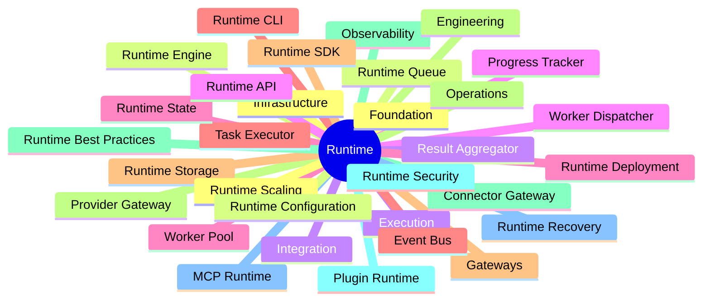
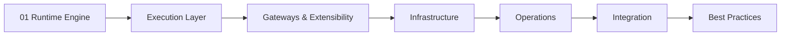
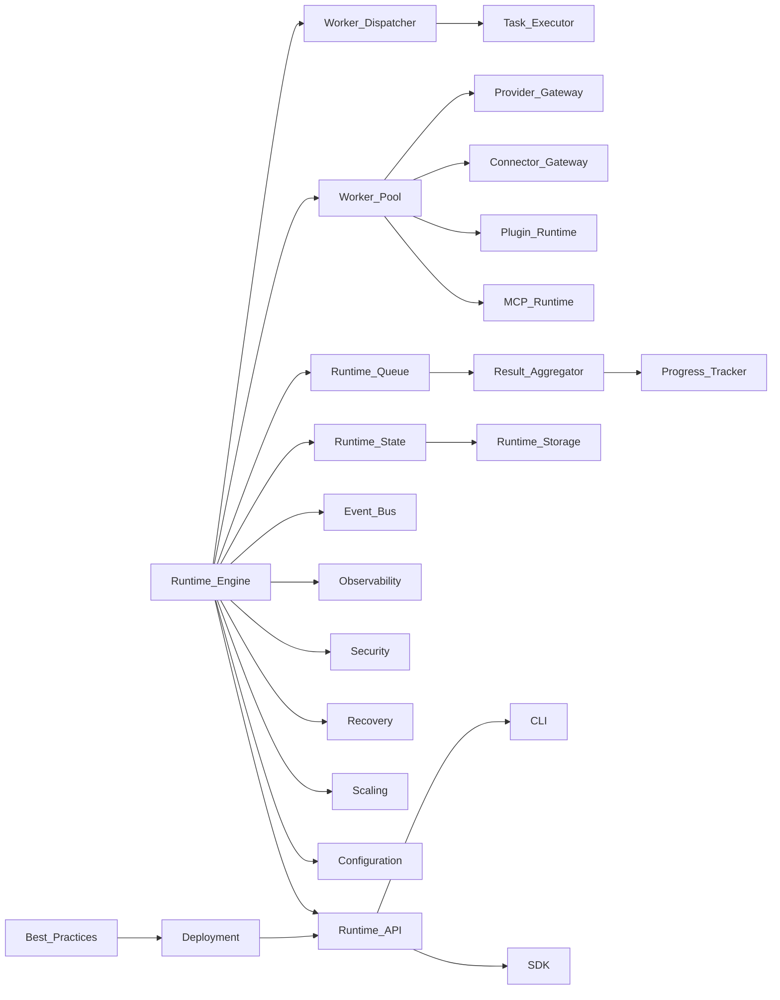

# Runtime Documentation Index

> AI Social OS Runtime Layer

Version: 2.0.0

Status: Stable

Last Updated: 2026-07-25

---

# Overview

Bộ tài liệu Runtime mô tả toàn bộ kiến trúc và cơ chế vận hành của AI Social OS Runtime.

Runtime là nền tảng thực thi trung tâm của AI Social OS, chịu trách nhiệm điều phối Workflow, Agent, Automation và toàn bộ vòng đời của Execution.

Các tài liệu được tổ chức từ kiến trúc cốt lõi đến hạ tầng vận hành và hướng dẫn phát triển.

---

# Documentation Map

---

# Foundation

| File | Description |
|------|-------------|
| 01_RUNTIME_ENGINE.md | Runtime Engine |

---

# Execution Layer

| File | Description |
|------|-------------|
| 02_WORKER_DISPATCHER.md | Worker Dispatcher |
| 03_WORKER_POOL.md | Worker Pool |
| 04_TASK_EXECUTOR.md | Task Executor |

---

# Gateways & Extensibility

| File | Description |
|------|-------------|
| 05_PROVIDER_GATEWAY.md | Provider Gateway |
| 06_CONNECTOR_GATEWAY.md | Connector Gateway |
| 07_PLUGIN_RUNTIME.md | Plugin Runtime |
| 08_MCP_RUNTIME.md | MCP Runtime |

---

# Runtime Infrastructure

| File | Description |
|------|-------------|
| 09_RUNTIME_QUEUE.md | Runtime Queue |
| 10_RESULT_AGGREGATOR.md | Result Aggregator |
| 11_PROGRESS_TRACKER.md | Progress Tracker |
| 12_RUNTIME_STATE.md | Runtime State |
| 13_EVENT_BUS.md | Event Bus |
| 14_RUNTIME_STORAGE.md | Runtime Storage |

---

# Runtime Operations

| File | Description |
|------|-------------|
| 15_OBSERVABILITY.md | Observability |
| 16_RUNTIME_SECURITY.md | Runtime Security |
| 17_RUNTIME_RECOVERY.md | Runtime Recovery |
| 18_RUNTIME_SCALING.md | Runtime Scaling |
| 19_RUNTIME_CONFIGURATION.md | Runtime Configuration |

---

# Runtime Integration

| File | Description |
|------|-------------|
| 20_RUNTIME_API.md | Runtime API |
| 21_RUNTIME_DEPLOYMENT.md | Runtime Deployment |
| 22_RUNTIME_CLI.md | Runtime CLI |
| 23_RUNTIME_SDK.md | Runtime SDK |

---

# Engineering

| File | Description |
|------|-------------|
| 24_RUNTIME_BEST_PRACTICES.md | Best Practices |

---

# Learning Path

---

# Dependency Graph

---

# Summary

Bộ Runtime Documentation bao gồm 24 tài liệu chuyên sâu và 2 tài liệu điều hướng (`README.md` và `INDEX.md`), mô tả toàn bộ kiến trúc, vòng đời thực thi, hạ tầng, vận hành, tích hợp và các nguyên tắc kỹ thuật của AI Social OS Runtime.

Các tài liệu được thiết kế theo hướng độc lập nhưng có liên kết chặt chẽ, giúp người đọc có thể tiếp cận từng chủ đề riêng lẻ hoặc nghiên cứu toàn bộ Runtime như một nền tảng điều phối AI hoàn chỉnh.