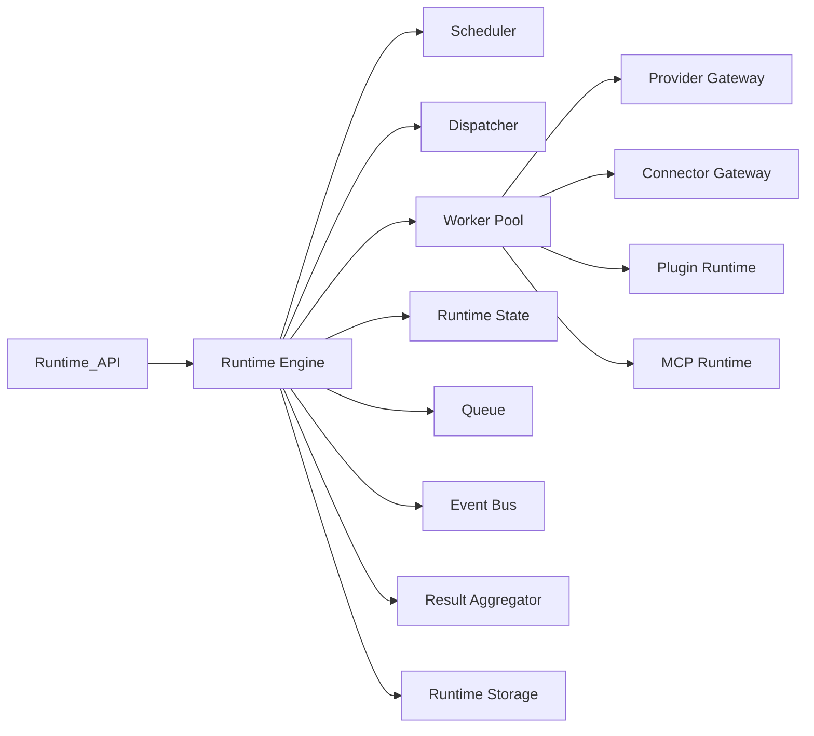
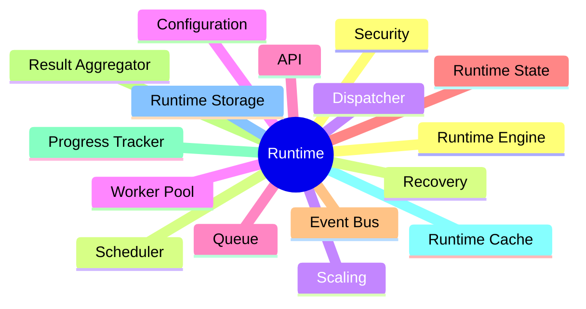
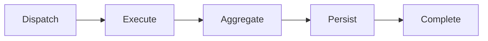
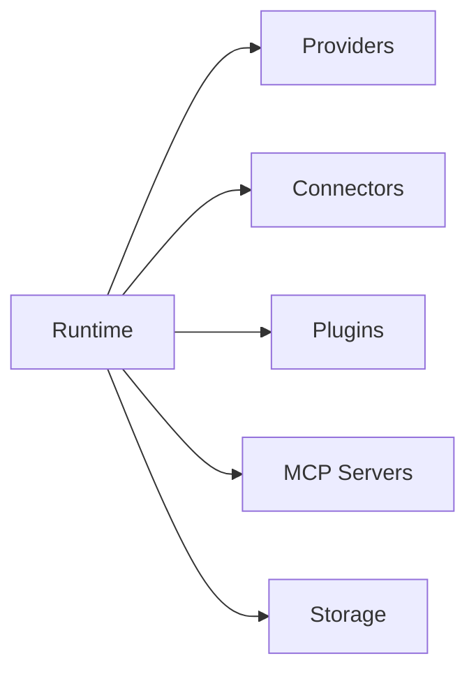

# AI Social OS Runtime

> Runtime Layer Documentation

Version: 2.0.0

Status: Stable

Last Updated: 2026-07-25

---

# Overview

Runtime là trái tim của AI Social OS.

Đây là tầng chịu trách nhiệm thực thi toàn bộ Workflow, Agent, Automation và AI Pipeline của hệ thống.

Runtime không chỉ là một Workflow Engine, mà là một nền tảng điều phối (Orchestration Platform) có khả năng:

- Scheduling
- Execution
- Distributed Computing
- State Management
- Event Processing
- Multi-Agent Coordination
- Tool Invocation
- Provider Routing
- Connector Orchestration
- Runtime Recovery

Toàn bộ các thành phần khác của AI Social OS đều tương tác với Runtime thông qua Runtime API.

---

# Runtime Architecture



---

# Documentation Structure

```
runtime/

├── README.md
│
├── 01_RUNTIME_OVERVIEW.md
├── 02_EXECUTION_MODEL.md
├── 03_RUNTIME_ENGINE.md
├── 04_EXECUTION_GRAPH.md
├── 05_TASK_MODEL.md
├── 06_SCHEDULER.md
├── 07_DISPATCHER.md
├── 08_WORKER_POOL.md
├── 09_RUNTIME_STATE.md
├── 10_EVENT_BUS.md
├── 11_RESULT_AGGREGATOR.md
├── 12_PROGRESS_TRACKER.md
├── 13_RUNTIME_CACHE.md
├── 14_RUNTIME_STORAGE.md
├── 15_OBSERVABILITY.md
├── 16_RUNTIME_SECURITY.md
├── 17_RUNTIME_RECOVERY.md
├── 18_RUNTIME_SCALING.md
├── 19_RUNTIME_CONFIGURATION.md
├── 20_RUNTIME_API.md
├── 21_RUNTIME_DEPLOYMENT.md
├── 22_RUNTIME_CLI.md
├── 23_RUNTIME_SDK.md
├── 24_RUNTIME_BEST_PRACTICES.md
```

---

# Reading Order

Để hiểu đầy đủ Runtime, nên đọc theo thứ tự sau.

## Phase 1 — Foundation

1. Runtime Overview
2. Execution Model
3. Runtime Engine

---

## Phase 2 — Execution

4. Execution Graph
5. Task Model
6. Scheduler
7. Dispatcher
8. Worker Pool

---

## Phase 3 — Runtime Infrastructure

9. Runtime State
10. Event Bus
11. Result Aggregator
12. Progress Tracker
13. Runtime Cache
14. Runtime Storage

---

## Phase 4 — Operations

15. Observability
16. Runtime Security
17. Runtime Recovery
18. Runtime Scaling
19. Runtime Configuration

---

## Phase 5 — Integration

20. Runtime API
21. Runtime Deployment
22. Runtime CLI
23. Runtime SDK

---

## Phase 6 — Engineering

24. Runtime Best Practices

---

# Runtime Responsibilities

Runtime chịu trách nhiệm.

- Execute Workflows
- Execute Agents
- Schedule Tasks
- Dispatch Workers
- Manage Runtime State
- Persist Execution
- Route Provider Requests
- Execute Connectors
- Execute Plugins
- Execute MCP Servers
- Aggregate Results
- Report Progress
- Recover Failed Executions
- Scale Workers
- Secure Runtime
- Expose Runtime APIs

---

# Runtime Components



---

# Runtime Lifecycle



---

# Design Principles

Runtime được xây dựng theo các nguyên tắc.

- Event Driven
- Stateless Runtime
- Distributed Execution
- Shared Runtime State
- Polyglot Storage
- Secure by Default
- Observable
- Recoverable
- Horizontally Scalable
- API First

---

# Relationship With Other Layers



---

# Intended Audience

Bộ tài liệu Runtime dành cho.

- Software Architects
- Backend Engineers
- AI Engineers
- Platform Engineers
- DevOps Engineers
- SRE Engineers
- Plugin Developers
- SDK Developers

---

# Summary

Runtime là nền tảng điều phối và thực thi của AI Social OS, chịu trách nhiệm quản lý toàn bộ vòng đời của Execution từ Scheduling, Dispatching, Processing đến Aggregation và Persistence.

Bộ tài liệu Runtime được chia thành 24 tài liệu độc lập, bao quát từ kiến trúc cốt lõi, hạ tầng vận hành, bảo mật, mở rộng, triển khai cho đến các hướng dẫn tích hợp và Best Practices, tạo thành tài liệu tham chiếu hoàn chỉnh cho việc thiết kế, phát triển và vận hành AI Social OS Runtime.