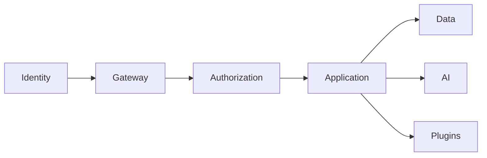

# Security Overview

> AI Social OS Security Layer

Version: 2.0.0

Status: Stable

Last Updated: 2026-07-25

---

# Table of Contents

- Overview
- Security Vision
- Objectives
- Security Scope
- Security Principles
- Security Domains
- Shared Responsibility
- Security Lifecycle
- Security Architecture
- Threat Model
- Security Standards
- Design Principles
- Summary

---

# Overview

Security là một năng lực (Capability) xuyên suốt toàn bộ AI Social OS.

Security không phải là một module riêng lẻ mà được tích hợp vào mọi tầng của hệ thống.

- Infrastructure
- Platform
- Runtime
- AI
- Social
- Plugin
- API
- Frontend
- Data

---

# Security Vision

AI Social OS được thiết kế theo mô hình.

Security by Design

Mọi thành phần đều được xây dựng với bảo mật ngay từ đầu thay vì bổ sung sau.

---

# Objectives

Security hướng tới.

- Confidentiality
- Integrity
- Availability
- Accountability
- Privacy
- Compliance
- Zero Trust

---

# Security Scope

Security bao phủ.

- Users
- APIs
- AI Models
- Infrastructure
- Kubernetes
- Plugins
- Data
- Secrets
- Workflows
- MCP Servers

---

# Security Principles

Nguyên tắc cốt lõi.

- Zero Trust
- Least Privilege
- Defense in Depth
- Secure Defaults
- Continuous Verification
- Complete Auditability

---

# Security Domains

```text
Identity

Authentication

Authorization

Application

Infrastructure

Data

AI

Privacy

Monitoring

Incident Response
```

---

# Shared Responsibility

| Layer | Responsibility |
|---------|---------------|
| Platform | Security Framework |
| Service | Business Security |
| User | Credential Protection |
| Administrator | Policy Enforcement |

---

# Security Lifecycle

```mermaid
flowchart LR
```

Security diễn ra xuyên suốt SDLC.

---

# High-Level Security Architecture



---

# Threat Model

Hệ thống cần phòng chống.

- Credential Theft
- API Abuse
- Prompt Injection
- Data Leakage
- Supply Chain Attack
- Insider Threat
- Container Escape
- DDoS

---

# Security Standards

Hướng tới tuân thủ.

- ISO 27001
- SOC 2
- OWASP ASVS
- OWASP Top 10
- NIST CSF
- GDPR

---

# Design Principles

- Security by Design
- Zero Trust
- Continuous Validation
- Least Privilege
- Encryption Everywhere

---

# Summary

Security Layer cung cấp kiến trúc bảo mật tổng thể cho AI Social OS, bảo vệ toàn bộ hệ thống từ người dùng, API, AI Runtime đến Infrastructure và Data thông qua mô hình Zero Trust và Security by Design.