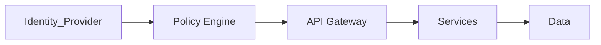

# Zero Trust Architecture

> AI Social OS Security Layer

Version: 2.0.0

Status: Stable

---

# Table of Contents

- Overview
- Objectives
- Zero Trust Principles
- Architecture
- Identity Verification
- Device Trust
- Network Trust
- Service Trust
- Continuous Verification
- Policy Engine
- Design Principles
- Summary

---

# Overview

AI Social OS áp dụng Zero Trust Architecture.

Không có User, Device hay Service nào được mặc định tin cậy.

Mọi Request đều phải được xác minh.

---

# Objectives

Zero Trust hướng tới.

- Verify Everything
- Trust Nothing
- Least Privilege
- Continuous Authentication
- Risk-based Decisions

---

# Zero Trust Principles

- Never Trust
- Always Verify
- Least Privilege
- Continuous Monitoring
- Micro Segmentation

---

# Architecture

---

# Identity Verification

Mỗi Request kiểm tra.

- User Identity
- Device Identity
- Session
- MFA
- Token

---

# Device Trust

Thiết bị được đánh giá.

- Managed Device
- Device Certificate
- Risk Score
- Compliance

---

# Network Trust

Không tin tưởng Network.

Ngay cả Internal Network cũng phải.

- Authenticate
- Encrypt
- Authorize

---

# Service Trust

Microservices sử dụng.

- mTLS
- SPIFFE
- Service Identity

---

# Continuous Verification

Không xác thực một lần.

Mỗi Request được đánh giá lại.

---

# Policy Engine

Policy Engine sử dụng.

- User
- Role
- Tenant
- Resource
- Context
- Risk Score

để đưa ra quyết định.

---

# Design Principles

- Never Trust
- Verify Every Request
- Encrypt Everything
- Least Privilege
- Policy Driven

---

# Summary

Zero Trust Architecture loại bỏ khái niệm mạng tin cậy, yêu cầu mọi User, Service và Device đều phải được xác minh liên tục trước khi truy cập bất kỳ tài nguyên nào.