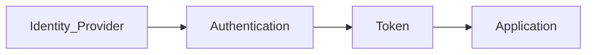

# Authentication

> AI Social OS Security Layer

Version: 2.0.0

Status: Stable

Last Updated: 2026-07-25

---

# Table of Contents

- Overview
- Objectives
- Authentication Flow
- Identity Providers
- Authentication Methods
- Session Management
- Multi-Factor Authentication
- Passwordless Authentication
- Service Authentication
- Token Management
- Security Controls
- Design Principles
- Summary

---

# Overview

Authentication xác minh danh tính của User, Service hoặc AI Agent trước khi cho phép truy cập hệ thống.

Authentication không quyết định quyền truy cập.

Việc đó thuộc Authorization.

---

# Objectives

Authentication hướng tới.

- Strong Identity Verification
- Passwordless Support
- Multi-Factor Authentication
- Secure Sessions
- Low User Friction

---

# Authentication Flow

---

# Identity Providers

Hỗ trợ.

- Internal Identity
- Google
- Microsoft
- GitHub
- Apple
- Enterprise SSO

---

# Authentication Methods

## Email + Password

Password được Hash bằng.

- Argon2id (Preferred)
- bcrypt (Legacy)

---

## OAuth 2.1

Hỗ trợ.

- Authorization Code + PKCE
- Device Flow
- Client Credentials

---

## OpenID Connect

OIDC được sử dụng để.

- Login
- User Identity
- Enterprise SSO

---

## SAML 2.0

Dành cho.

- Enterprise Customers

---

# Session Management

Session bao gồm.

- Session ID
- Refresh Token
- Access Token
- Device Information

Session có thời hạn.

---

# Multi-Factor Authentication

Hỗ trợ.

- TOTP
- Passkeys
- Security Keys
- Push Notification

SMS OTP không được khuyến nghị.

---

# Passwordless Authentication

Cho phép.

- WebAuthn
- Passkeys
- FIDO2

Ưu tiên hơn Password.

---

# Service Authentication

Service xác thực bằng.

- mTLS
- JWT
- SPIFFE Identity
- Service Account

---

# Token Management

Token.

- Signed
- Short-lived
- Rotatable
- Revocable

Không lưu Access Token lâu dài.

---

# Security Controls

Bao gồm.

- Rate Limiting
- Account Lockout
- CAPTCHA
- Device Verification
- Risk-based Authentication

---

# Design Principles

- Passwordless First
- MFA Everywhere
- Short-lived Tokens
- Secure Sessions
- Identity Federation

---

# Summary

Authentication đảm bảo mọi User, Service và AI Agent đều được xác minh danh tính thông qua các phương thức hiện đại như OAuth 2.1, OIDC, Passkeys và MFA trước khi truy cập AI Social OS.