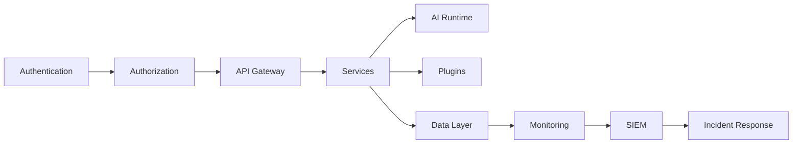

# Security Layer Summary

> AI Social OS Security Layer

Version: 2.0.0

Status: Stable

Last Updated: 2026-07-25

---

# Security Domains

## Identity

- Zero Trust
- IAM
- Authentication
- Authorization

---

## Data Protection

- Encryption
- Privacy
- Data Security
- Key Management

---

## Runtime Protection

- Application Security
- Infrastructure Security
- AI Security
- Plugin Security

---

## Operations

- Security Monitoring
- Incident Response
- Compliance
- Governance

---

# Security Architecture



---

# Security Controls

AI Social OS áp dụng.

- Zero Trust
- Least Privilege
- Defense in Depth
- MFA
- Encryption
- Audit Logging
- Policy Engine
- Continuous Monitoring

---

# Security Lifecycle

```mermaid
flowchart LR
```

---

# Compliance Coverage

Hệ thống hỗ trợ.

- ISO 27001
- SOC 2
- GDPR
- CCPA
- OWASP ASVS
- NIST CSF
- HIPAA (Optional)
- PCI DSS (Optional)

---

# Security Metrics

Theo dõi.

- Mean Time to Detect (MTTD)
- Mean Time to Respond (MTTR)
- Incident Count
- Vulnerability Density
- Patch Compliance
- Authentication Success Rate

---

# Technology Stack

| Domain | Technologies |
|---------|--------------|
| IAM | Keycloak, Auth0, Cognito |
| Secrets | Vault, AWS Secrets Manager |
| Monitoring | Prometheus, Grafana |
| SIEM | Splunk, Elastic, Microsoft Sentinel |
| Container Security | Trivy, Falco |
| Policy | OPA, Kyverno |
| Encryption | KMS, HSM |

---

# Design Principles

- Security by Design
- Zero Trust
- Privacy by Design
- Defense in Depth
- Continuous Verification
- Automation First

---

# Future Evolution

Security Layer có thể mở rộng thêm.

- AI-powered Threat Detection
- Autonomous Incident Response
- Continuous Adaptive Trust
- Behavioral Authentication
- Confidential Computing
- Post-Quantum Cryptography

---

# Summary

Security Layer là nền tảng bảo vệ toàn diện của AI Social OS, bao phủ từ danh tính, dữ liệu, ứng dụng, AI Runtime đến hạ tầng. Thông qua Zero Trust Architecture, Security by Design và giám sát liên tục, hệ thống đảm bảo tính bảo mật, quyền riêng tư và khả năng chống chịu trước các mối đe dọa hiện đại ở quy mô doanh nghiệp.