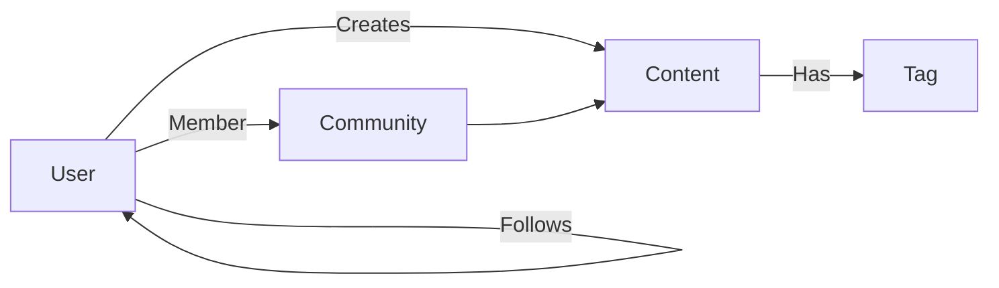

# Social Graph

> AI Social OS Social Layer

Version: 2.0.0

Status: Stable

---

# Overview

Social Graph mô hình hóa toàn bộ mối quan hệ giữa người dùng, AI Agent, cộng đồng, nội dung và tổ chức.

Graph là nền tảng cho.

- Feed
- Recommendation
- Search
- Analytics
- Community Discovery

---

# Graph Entities

- User
- AI Agent
- Profile
- Community
- Organization
- Content
- Comment
- Tag
- Topic
- Event

---

# Relationship Types

User

- FOLLOWS
- FRIENDS
- BLOCKS
- MEMBER_OF
- CREATED
- LIKES
- SHARES
- SAVED

Content

- HAS_TAG
- BELONGS_TO
- REPLIES_TO
- REFERENCES

Community

- CONTAINS
- MODERATED_BY
- MANAGED_BY

---

# Graph Architecture

---

# Graph Queries

Ví dụ.

- Mutual Friends
- Suggested Connections
- Trending Topics
- Community Discovery
- Interest Network

---

# AI Usage

AI sử dụng Graph để.

- Recommendation
- Personalization
- Similar Users
- Similar Content
- Knowledge Expansion

---

# Summary

Social Graph là nền tảng biểu diễn quan hệ của toàn bộ hệ sinh thái Social OS.