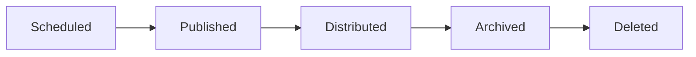

# Content Model

> AI Social OS Social Layer

Version: 2.0.0

---

# Overview

Content là thực thể trung tâm của Social Layer.

Mọi tương tác đều xoay quanh Content.

---

# Content Types

- Text
- Image
- Video
- Audio
- Document
- Live Stream
- AI Generated
- Poll
- Story
- Thread

---

# Content Structure

```yaml
id:
author:
workspace:
visibility:
title:
body:
media:
tags:
mentions:
status:
createdAt:
updatedAt:
```

---

# Content Lifecycle



---

# Visibility

- Public
- Followers
- Community
- Workspace
- Private

---

# Metadata

- Language
- Topic
- Category
- AI Score
- Moderation Status
- Embedding
- Version

---

# Versioning

Content hỗ trợ.

- Edit History
- Rollback
- Audit

---

# Summary

Content Model chuẩn hóa mọi loại nội dung trong nền tảng.