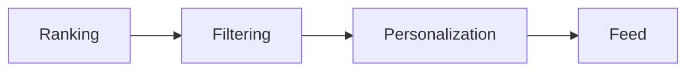
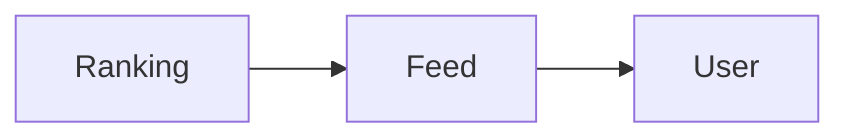

# Feed Engine

> AI Social OS Social Layer

Version: 2.0.0

---

# Overview

Feed Engine chịu trách nhiệm xây dựng dòng nội dung cá nhân hóa.

---

# Pipeline

---

# Feed Sources

- Following
- Communities
- AI Recommendations
- Trending
- Saved
- Sponsored

---

# Ranking Signals

- Freshness
- Engagement
- Similarity
- User Preference
- Relationship Strength
- AI Score

---

# Feed Types

- Home
- Community
- Trending
- AI Feed
- Following
- Workspace

---

# Architecture

---

# Summary

Feed Engine tạo dòng nội dung phù hợp cho từng người dùng.