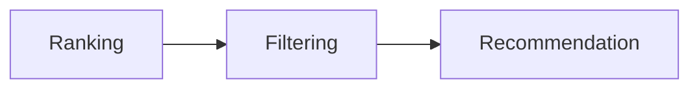

# Recommendation Engine

> AI Social OS

---

# Overview

Recommendation Engine đề xuất.

- Users
- Communities
- Content
- AI Agents
- Events
- Topics

---

# Recommendation Sources

- Social Graph
- Embeddings
- User History
- Similarity
- AI Models

---

# Recommendation Types

- Collaborative Filtering
- Content Based
- Graph Based
- Embedding Based
- Hybrid

---

# Pipeline

---

# Metrics

- CTR
- Dwell Time
- Watch Time
- Conversion
- Satisfaction

---

# Summary

Recommendation Engine cá nhân hóa toàn bộ trải nghiệm Social OS.