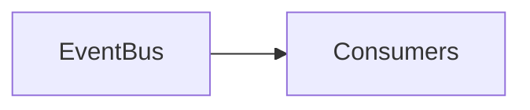

# Social Events

---

# Overview

Mọi hành động đều sinh Event.

---

# Core Events

- UserCreated
- UserFollowed
- PostCreated
- PostUpdated
- CommentAdded
- ReactionAdded
- CommunityJoined
- FeedViewed
- NotificationSent

---

# Event Consumers

- Feed
- Analytics
- Recommendation
- AI
- Notification

---

# Architecture

---

# Summary

Social Events là nền tảng của kiến trúc Event-driven.