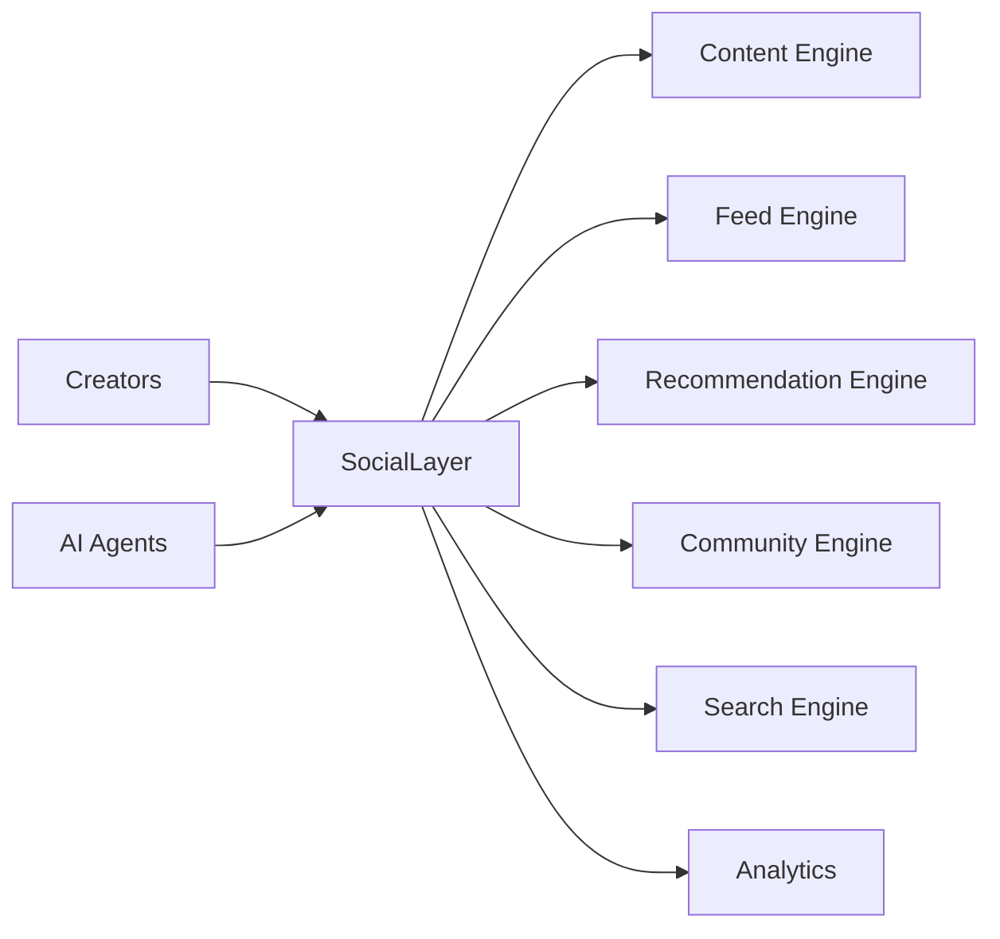
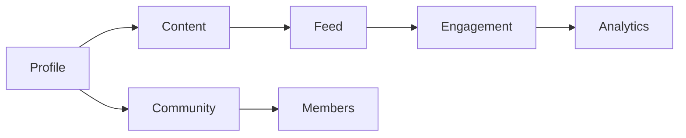
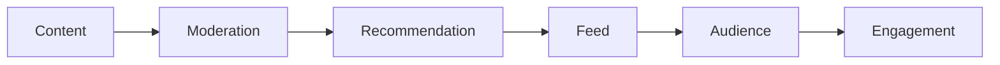
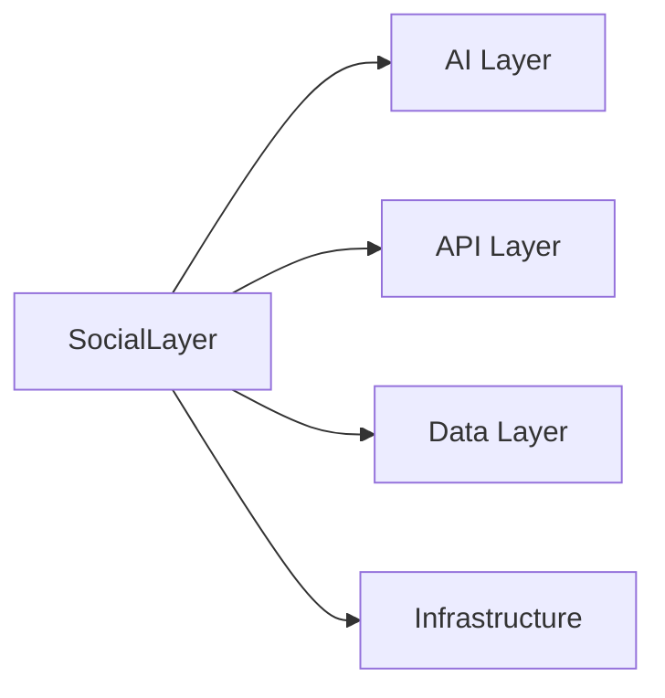

# Social Architecture

> AI Social OS Social Layer

Version: 2.0.0

Status: Stable

Last Updated: 2026-07-25

---

> **Trạng thái phạm vi:** Tài liệu này mô tả mạng xã hội nội bộ (native) của nền tảng — Social Graph, Feed, Recommendation Engine, Community System và Creator Economy riêng — đây là hạng mục tầm nhìn dài hạn (long-term / future-vision), **không** thuộc MVP hiện tại và **không** thuộc 6 Phase trong `docs/ROADMAP.md`. Đừng nhầm với Integration Layer (kết nối và đăng bài ra nền tảng bên ngoài như Facebook, Instagram, TikTok, v.v. — xem `docs/03_DOMAIN_MODEL.md` và `docs/04_ARCHITECTURE.md`).

---

# Table of Contents

- Overview
- Objectives
- Why Social Layer
- Design Principles
- High-Level Architecture
- Core Components
- Social Domain Model
- Content Flow
- User Interaction Flow
- AI Integration
- Event Flow
- Scalability
- Design Decisions
- Summary

---

# Overview

Social Layer là tầng chịu trách nhiệm xây dựng toàn bộ hệ sinh thái mạng xã hội của AI Social OS.

Đây không chỉ là nơi lưu trữ bài viết.

Social Layer quản lý.

- Users
- Communities
- Pages
- Profiles
- Content
- Feed
- Engagement
- Relationships
- Recommendation
- Discovery

AI Layer hoạt động phía trên Social Layer để tạo nên Social AI Platform.

---

# Objectives

Social Layer hướng tới.

- AI-native Social Network
- Content-centric Architecture
- Creator Economy
- Community First
- Event Driven
- Highly Scalable
- Enterprise Ready
- Extensible

---

# Why Social Layer

Trong mạng xã hội truyền thống.

```mermaid
flowchart LR
```

Trong AI Social OS.

```mermaid
flowchart LR
```

AI không chỉ tiêu thụ dữ liệu.

AI tham gia trực tiếp vào hệ sinh thái.

---

# Design Principles

Social Layer được xây dựng theo.

- User First
- AI Native
- Content Driven
- Event Driven
- Domain Oriented
- Distributed
- Observable
- Extensible

---

# High-Level Architecture



---

# Core Components

Social Layer gồm các thành phần.

```text
Profiles

Relationships

Content

Communities

Feed

Recommendation

Messaging

Notifications

Search

Analytics

Moderation
```

Mỗi thành phần hoạt động độc lập thông qua Event Bus.

---

# Social Domain Model



---

# Social Entities

Các thực thể chính.

```text
User

Profile

Organization

Page

Community

Content

Comment

Reaction

Media

Notification

Message

Feed Item
```

Mỗi Entity có vòng đời riêng.

---

# Content Flow



---

# User Interaction Flow

```mermaid
flowchart LR
```

---

# AI Integration

AI Layer tích hợp trực tiếp.

Ví dụ.

```text
Content Generation

Recommendation

Moderation

Summarization

Translation

Auto Reply

Trend Detection
```

AI không thay thế Social Layer.

AI chỉ mở rộng khả năng của Social Layer.

---

# Event-driven Architecture

Mọi hành động đều tạo Event.

Ví dụ.

```text
PostCreated

CommentAdded

ReactionAdded

Followed

Shared

Viewed
```

Các Event được sử dụng bởi.

- Feed Engine
- Analytics
- Recommendation
- AI Layer
- Notification

---

# Scalability

Social Layer được thiết kế theo.

```mermaid
flowchart LR
```

Có thể mở rộng.

- hàng triệu người dùng
- hàng tỷ bài viết
- hàng chục tỷ sự kiện

---

# Relationship with Other Layers



Social Layer là trung tâm của toàn bộ nền tảng.

---

# Design Principles

Social Layer tuân theo.

- Event Driven
- Domain Driven
- AI Native
- Scalable
- Modular
- Observable
- Secure
- Extensible

---

# Design Decisions

| Decision | Reason |
|-----------|--------|
| Social Layer độc lập | Có thể sử dụng không cần AI |
| AI tích hợp theo Capability | Không phụ thuộc Model |
| Event-first Architecture | Đồng bộ toàn hệ thống |
| Domain-driven Design | Dễ mở rộng |
| Feed và Recommendation tách riêng | Dễ tối ưu |
| Analytics độc lập | Không ảnh hưởng Runtime |
| Community là First-class Entity | Hỗ trợ hệ sinh thái Creator |

---

# Summary

Social Layer là nền tảng của AI Social OS, chịu trách nhiệm quản lý toàn bộ dữ liệu và hành vi của hệ sinh thái mạng xã hội.

Thông qua kiến trúc hướng sự kiện, các Domain độc lập và khả năng tích hợp chặt chẽ với AI Layer, Social Layer tạo nên một nền tảng mạng xã hội thế hệ mới, nơi AI và người dùng cùng tham gia tạo ra, phân phối và tương tác với nội dung ở quy mô doanh nghiệp.