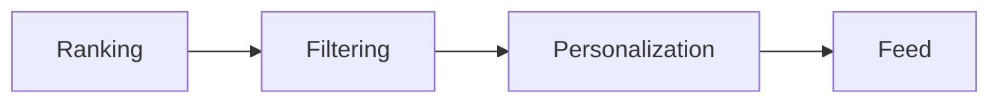
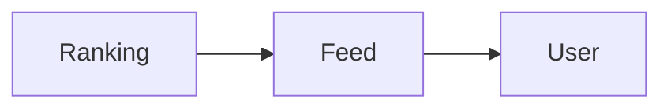

# Feed Engine

> AI Social OS Social Layer

Version: 2.0.0

---

> **Trạng thái phạm vi:** Tài liệu này mô tả mạng xã hội nội bộ (native) của nền tảng — Social Graph, Feed, Recommendation Engine, Community System và Creator Economy riêng — đây là hạng mục tầm nhìn dài hạn (long-term / future-vision), **không** thuộc MVP hiện tại và **không** thuộc 6 Phase trong `docs/ROADMAP.md`. Đừng nhầm với Integration Layer (kết nối và đăng bài ra nền tảng bên ngoài như Facebook, Instagram, TikTok, v.v. — xem `docs/03_DOMAIN_MODEL.md` và `docs/04_ARCHITECTURE.md`).

---

# Overview

Feed Engine chịu trách nhiệm xây dựng dòng nội dung cá nhân hóa.

---

# Pipeline

---

# Feed Sources

- Following
- Communities
- AI Recommendations
- Trending
- Saved
- Sponsored

---

# Ranking Signals

- Freshness
- Engagement
- Similarity
- User Preference
- Relationship Strength
- AI Score

---

# Feed Types

- Home
- Community
- Trending
- AI Feed
- Following
- Workspace

---

# Architecture

---

# Summary

Feed Engine tạo dòng nội dung phù hợp cho từng người dùng.