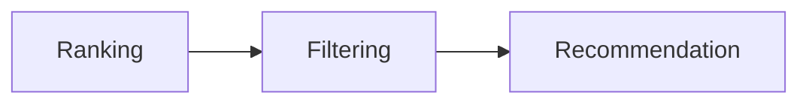

# Recommendation Engine

> AI Social OS

---

> **Trạng thái phạm vi:** Tài liệu này mô tả mạng xã hội nội bộ (native) của nền tảng — Social Graph, Feed, Recommendation Engine, Community System và Creator Economy riêng — đây là hạng mục tầm nhìn dài hạn (long-term / future-vision), **không** thuộc MVP hiện tại và **không** thuộc 6 Phase trong `docs/ROADMAP.md`. Đừng nhầm với Integration Layer (kết nối và đăng bài ra nền tảng bên ngoài như Facebook, Instagram, TikTok, v.v. — xem `docs/03_DOMAIN_MODEL.md` và `docs/04_ARCHITECTURE.md`).

---

# Overview

Recommendation Engine đề xuất.

- Users
- Communities
- Content
- AI Agents
- Events
- Topics

---

# Recommendation Sources

- Social Graph
- Embeddings
- User History
- Similarity
- AI Models

---

# Recommendation Types

- Collaborative Filtering
- Content Based
- Graph Based
- Embedding Based
- Hybrid

---

# Pipeline

---

# Metrics

- CTR
- Dwell Time
- Watch Time
- Conversion
- Satisfaction

---

# Summary

Recommendation Engine cá nhân hóa toàn bộ trải nghiệm Social OS.