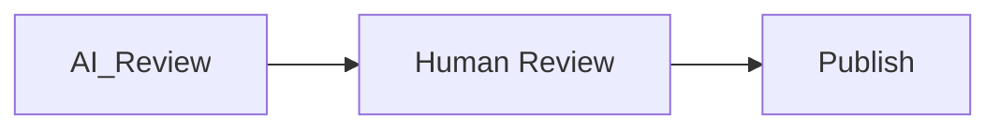

# Moderation System

> **Trạng thái phạm vi:** Tài liệu này mô tả mạng xã hội nội bộ (native) của nền tảng — Social Graph, Feed, Recommendation Engine, Community System và Creator Economy riêng — đây là hạng mục tầm nhìn dài hạn (long-term / future-vision), **không** thuộc MVP hiện tại và **không** thuộc 6 Phase trong `docs/ROADMAP.md`. Đừng nhầm với Integration Layer (kết nối và đăng bài ra nền tảng bên ngoài như Facebook, Instagram, TikTok, v.v. — xem `docs/03_DOMAIN_MODEL.md` và `docs/04_ARCHITECTURE.md`).

---

# Overview

Moderation bảo đảm nội dung an toàn.

---

# Moderation Types

- AI
- Human
- Community
- Hybrid

---

# Detection

- Spam
- Toxicity
- NSFW
- Copyright
- Violence
- Fraud

---

# Workflow

---

# Actions

- Approve
- Reject
- Shadow Ban
- Delete
- Escalate

---

# Summary

Moderation bảo vệ chất lượng của nền tảng.