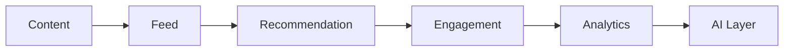

# Social Layer Summary

> **Trạng thái phạm vi:** Tài liệu này mô tả mạng xã hội nội bộ (native) của nền tảng — Social Graph, Feed, Recommendation Engine, Community System và Creator Economy riêng — đây là hạng mục tầm nhìn dài hạn (long-term / future-vision), **không** thuộc MVP hiện tại và **không** thuộc 6 Phase trong `docs/ROADMAP.md`. Đừng nhầm với Integration Layer (kết nối và đăng bài ra nền tảng bên ngoài như Facebook, Instagram, TikTok, v.v. — xem `docs/03_DOMAIN_MODEL.md` và `docs/04_ARCHITECTURE.md`).

---

# Components

Core

- Moderation
- Content
- Feed
- Recommendation
- Engagement
- Analytics

---

# High-Level Flow

---

# Summary

Social Layer là nền tảng vận hành của AI Social OS.

Layer này quản lý toàn bộ người dùng, nội dung, cộng đồng, mối quan hệ, feed, recommendation, moderation và analytics thông qua kiến trúc Event-driven. Đây là lớp kết nối giữa AI Layer và người dùng cuối, tạo nên một nền tảng Social AI có khả năng mở rộng tới quy mô hàng triệu người dùng và hàng tỷ sự kiện mỗi ngày.